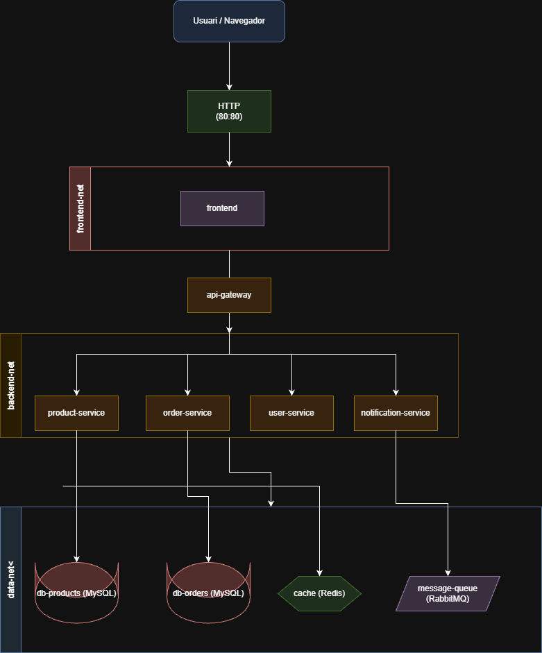

# Projecte Docker  
## Orquestradors: Docker Swarm i Kubernetes  
### Plataforma e-Commerce Microserveis  

---

**Oleguer Esteo Martínez**  
**Sergi Gallart Fanlo**  
**Àlex Marqués Comas**

---

# Índex


---

# Fase 1: Docker Compose — Entorn de Desenvolupament

## Introducció Docker Compose

Docker Compose és una eina oficial de Docker que permet definir i executar aplicacions formades per múltiples contenidors. La seva funcionalitat es basa en un únic fitxer de configuració en format YAML, en el qual es descriuen tots els serveis, xarxes i volums necessaris per a una aplicació. Aquest enfocament facilita la gestió de l’aplicació com una unitat, en comptes de gestionar cada contenidor de manera individual.

Docker Compose està dissenyat per simplificar el desplegament i l’administració de conjunts de contenidors que intervenen conjuntament en una aplicació. Això es tradueix en la possibilitat d’arrencar, aturar, reconstruir i obtenir informació de tots els serveis definits de forma coordinada a través d’una sola comanda des de la línia d’ordres.

---

## Arquitectura i funcionament de Docker Compose

La forma de treballar amb Docker Compose es basa en la interacció de diversos components:

### Fitxer de configuració (YAML)

La base de Docker Compose és el fitxer de configuració, anomenat `docker-compose.yml`. Aquest fitxer utilitza la sintaxi YAML per descriure tots els serveis que formen part de l’aplicació, així com les xarxes i volums que cal crear. L’especificació d’aquest fitxer segueix el *Compose Specification* recomanat per Docker.

### CLI de Docker Compose

La interfície de línia d’ordres de Docker Compose s’utilitza per executar ordres com ara:

- `docker compose up`
- `docker compose down`
- `docker compose logs`
- `docker compose ps`

Aquestes ordres interpreten el fitxer de configuració i executen les accions corresponents sobre el conjunt de contenidors i recursos definits.

### Docker Engine

El Docker Engine, que representa el motor de contenidors de Docker, és l’encarregat d’arrencar, executar i gestionar els contenidors a partir de la configuració proporcionada per Docker Compose. Quan s’executa una comanda de Compose, el motor crea les xarxes, assigna els volums i arrenca els serveis tal com s’ha definit en el fitxer YAML.

Aquest model permet que els serveis puguin comunicar-se entre si mitjançant xarxes gestionades internament i que comparteixin dades persistents a través de volums, fet que facilita la construcció d’entorns complexos amb components interconnectats.

---

## Sintaxi del fitxer `docker-compose.yml`

El fitxer `docker-compose.yml` utilitza la sintaxi YAML per descriure l’estructura i la configuració de l’aplicació. La secció principal del fitxer és la directiva `services`, que conté tots els serveis que componen l’aplicació.

Per exemple, un fragment bàsic del fitxer podria ser:

```yaml
services:
  frontend:
    image: myapp/frontend
    ports:
      - "3000:3000"
````

En aquest cas, s’està declarant un servei anomenat `frontend`, que utilitza una imatge anomenada `myapp/frontend` i exposa el port 3000 des del contenidor cap al sistema amfitrió.

Els serveis també poden definir altres paràmetres com variables d’entorn, volums, xarxes i dependències entre serveis. Això permet configurar de forma declarativa com s’ha d’executar cada component de l’aplicació.

---

## Diferències entre `docker compose` i `docker run`

Docker proporciona dues formes principals per crear i executar contenidors:

### `docker run`

La comanda `docker run` és la manera tradicional de crear i iniciar un contenidor de manera individual. Per cada contenidor que es vol executar cal especificar tots els paràmetres necessaris (com ara ports, volums o variables d’entorn) de forma explícita en la línia d’ordres. Aquest enfocament pot resultar repetitiu i difícil de mantenir quan es tracta de múltiples serveis.

### `docker compose`

Docker Compose, en canvi, està orientat a la definició d’aplicacions multi-contenidor. Mitjançant un sol fitxer YAML és possible expressar la configuració de tots els serveis, les xarxes i els recursos compartits. Amb una sola comanda (`docker compose up`) es pot iniciar tota l’aplicació amb tots els serveis i dependències definits de forma automàtica.

---

## Disseny d’arquitectura

L’arquitectura de ShopMicro en entorn Docker Compose està estructurada en tres capes: accés, backend i persistència. El frontend és l’únic servei exposat al port 80, mentre que la resta de microserveis es comuniquen a través de xarxes internes. Les bases de dades, Redis i RabbitMQ es troben a la capa de dades, garantint l’aïllament i la seguretat del sistema.

---

# Webgrafia

* Documentació oficial de Docker Compose:
  [https://docs.docker.com/compose/](https://docs.docker.com/compose/)

* Referència del fitxer Compose:
  [https://docs.docker.com/reference/compose-file/](https://docs.docker.com/reference/compose-file/)

* Model d’aplicació de Docker Compose:
  [https://docs.docker.com/compose/intro/compose-application-model/](https://docs.docker.com/compose/intro/compose-application-model/)

* Referència de la CLI de Docker Compose:
  [https://docs.docker.com/reference/cli/docker/compose/](https://docs.docker.com/reference/cli/docker/compose/)

* Documentació oficial de Docker Engine:
  [https://docs.docker.com/engine/](https://docs.docker.com/engine/)
