# Projecte Docker  
## Orquestradors: Docker Swarm i Kubernetes  
### Plataforma e-Commerce Microserveis  

---

**Oleguer Esteo Martínez**  
**Sergi Gallart Fanlo**  
**Àlex Marqués Comas**

# Fase 1: Docker Compose — Entorn de Desenvolupament

## Introducció Docker Compose

Docker Compose és una eina oficial de Docker que permet definir i executar aplicacions formades per múltiples contenidors. La seva funcionalitat es basa en un únic fitxer de configuració en format YAML, en el qual es descriuen tots els serveis, xarxes i volums necessaris per a una aplicació. Aquest enfocament facilita la gestió de l’aplicació com una unitat, en comptes de gestionar cada contenidor de manera individual.

Docker Compose està dissenyat per simplificar el desplegament i l’administració de conjunts de contenidors que intervenen conjuntament en una aplicació. Això es tradueix en la possibilitat d’arrencar, aturar, reconstruir i obtenir informació de tots els serveis definits de forma coordinada a través d’una sola comanda des de la línia d’ordres.

---

## Arquitectura i funcionament de Docker Compose

La forma de treballar amb Docker Compose es basa en la interacció de diversos components:

### Fitxer de configuració (YAML)

La base de Docker Compose és el fitxer de configuració, anomenat `docker-compose.yml`. Aquest fitxer utilitza la sintaxi YAML per descriure tots els serveis que formen part de l’aplicació, així com les xarxes i volums que cal crear. L’especificació d’aquest fitxer segueix el *Compose Specification* recomanat per Docker.

### CLI de Docker Compose

La interfície de línia d’ordres de Docker Compose s’utilitza per executar ordres com ara:

- `docker compose up`
- `docker compose down`
- `docker compose logs`
- `docker compose ps`

Aquestes ordres interpreten el fitxer de configuració i executen les accions corresponents sobre el conjunt de contenidors i recursos definits.

### Docker Engine

El Docker Engine, que representa el motor de contenidors de Docker, és l’encarregat d’arrencar, executar i gestionar els contenidors a partir de la configuració proporcionada per Docker Compose. Quan s’executa una comanda de Compose, el motor crea les xarxes, assigna els volums i arrenca els serveis tal com s’ha definit en el fitxer YAML.

Aquest model permet que els serveis puguin comunicar-se entre si mitjançant xarxes gestionades internament i que comparteixin dades persistents a través de volums, fet que facilita la construcció d’entorns complexos amb components interconnectats.

---

## Sintaxi del fitxer `docker-compose.yml`

El fitxer `docker-compose.yml` utilitza la sintaxi YAML per descriure l’estructura i la configuració de l’aplicació. La secció principal del fitxer és la directiva `services`, que conté tots els serveis que componen l’aplicació.

Per exemple, un fragment bàsic del fitxer podria ser:

```yaml
services:
  frontend:
    image: myapp/frontend
    ports:
      - "3000:3000"
````

En aquest cas, s’està declarant un servei anomenat `frontend`, que utilitza una imatge anomenada `myapp/frontend` i exposa el port 3000 des del contenidor cap al sistema amfitrió.

Els serveis també poden definir altres paràmetres com variables d’entorn, volums, xarxes i dependències entre serveis. Això permet configurar de forma declarativa com s’ha d’executar cada component de l’aplicació.

---

## Diferències entre `docker compose` i `docker run`

Docker proporciona dues formes principals per crear i executar contenidors:

### `docker run`

La comanda `docker run` és la manera tradicional de crear i iniciar un contenidor de manera individual. Per cada contenidor que es vol executar cal especificar tots els paràmetres necessaris (com ara ports, volums o variables d’entorn) de forma explícita en la línia d’ordres. Aquest enfocament pot resultar repetitiu i difícil de mantenir quan es tracta de múltiples serveis.

### `docker compose`

Docker Compose, en canvi, està orientat a la definició d’aplicacions multi-contenidor. Mitjançant un sol fitxer YAML és possible expressar la configuració de tots els serveis, les xarxes i els recursos compartits. Amb una sola comanda (`docker compose up`) es pot iniciar tota l’aplicació amb tots els serveis i dependències definits de forma automàtica.

---

## Disseny d’arquitectura
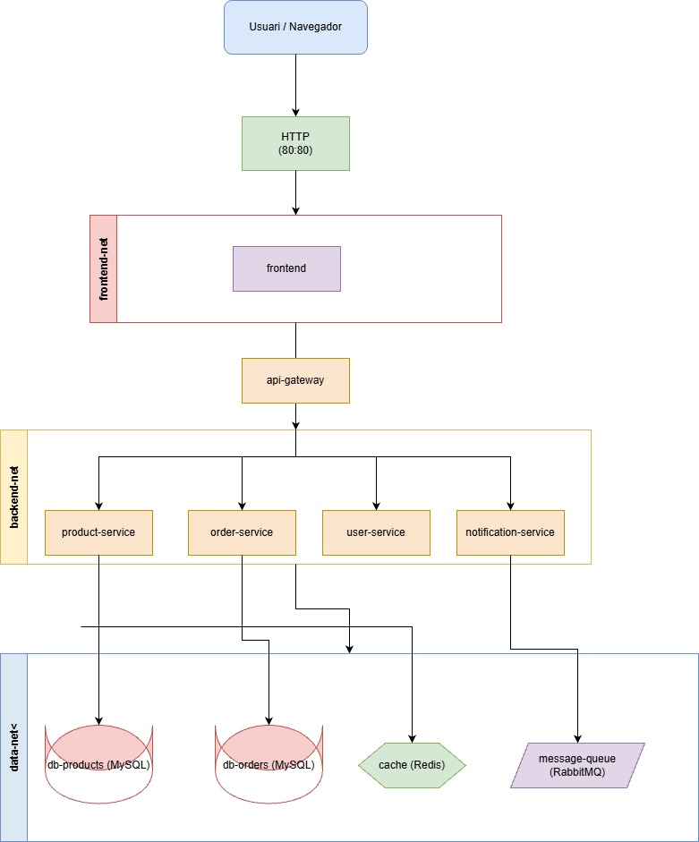

L’arquitectura de ShopMicro en entorn Docker Compose està estructurada en tres capes: accés, backend i persistència. El frontend és l’únic servei exposat al port 80, mentre que la resta de microserveis es comuniquen a través de xarxes internes. Les bases de dades, Redis i RabbitMQ es troben a la capa de dades, garantint l’aïllament i la seguretat del sistema.

---
## Creació Docker-Compose

El codi complet del fitxer `docker-compose.yml` utilitzat en aquesta fase del projecte es troba disponible al repositori de GitHub següent:  
--> [Docker-compose](https://github.com/Sgallartfanlo/Projecte-Intermodular-ASIX/blob/main/Kubernetes%20B%C3%A0sic/fase%201/docker-compose.yml)

El fitxer `docker-compose.yml` defineix de forma declarativa tots els **serveis** que formen part de la plataforma **ShopMicro**, així com les xarxes i volums necessaris per al seu funcionament. Dins la secció `services` es configuren les bases de dades **MySQL**, el sistema de cache **Redis**, la cua de missatges **RabbitMQ**, els **microserveis** de negoci, l’`api-gateway` i el `frontend`.

Les bases de dades i serveis de persistència s’executen a la xarxa `data-net` i disposen de **volums** per garantir la persistència de les dades. Els microserveis es connecten tant a `backend-net`, per comunicar-se entre ells, com a `data-net`, per accedir als serveis de dades. S’utilitza la directiva `depends_on` amb la condició `service_healthy` per assegurar que els serveis crítics estiguin operatius abans d’iniciar els microserveis dependents.

L’`api-gateway` actua com a punt d’entrada únic cap als microserveis, mentre que el `frontend` és l’únic servei que exposa el port 80 al sistema amfitrió, permetent l’accés des del navegador. La segmentació en **tres xarxes** (`frontend-net`, `backend-net` i `data-net`) permet millorar l’aïllament, l’organització i la seguretat de l’arquitectura.

---


## Desplegament i verificació

Abans de desplegar, hem creat la estructura de MicroShop bàsica per tal de poder desplegar els serveis sense problemes.  
→ [Directoris](https://github.com/Sgallartfanlo/Projecte-Intermodular-ASIX/tree/main/Kubernetes%20B%C3%A0sic/fase%201)

Per desplegar el `docker-compose.yml` que hem creat, s’ha de fer servir la comanda:

```bash
docker compose up -d
````

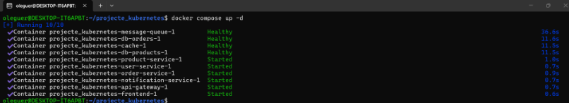


---

Per verificar que tot el desplegament ha sortit correcte, utilitzarem la comanda:

```bash
docker compose ps
```

On podem veure que estan en **“Healthy”** gràcies al Docker Compose que hem fet.

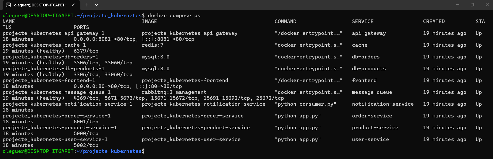

---

Una altre manera de veure que tot ha sortit bé, és mirant els logs. Per fer-ho farem servir la comanda:

```bash
docker compose logs
```

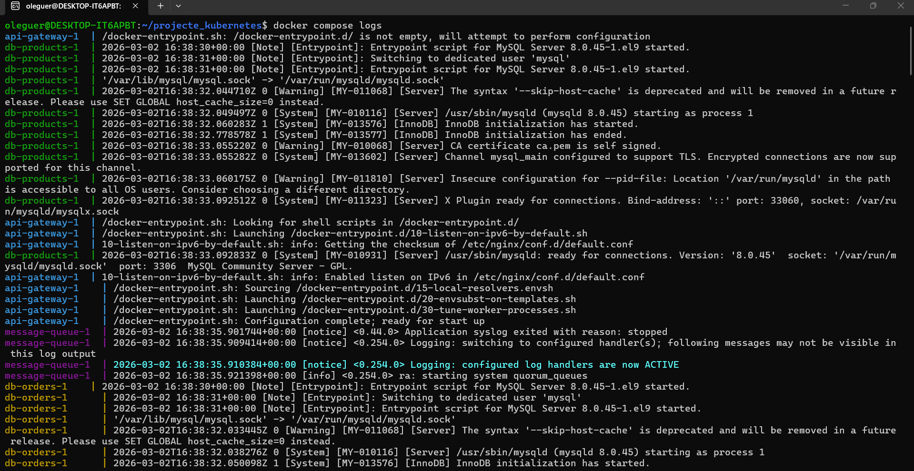

---

## Flux de consulta de productes

Primer de tot, per comprovar aquest flux accedirem al frontend:

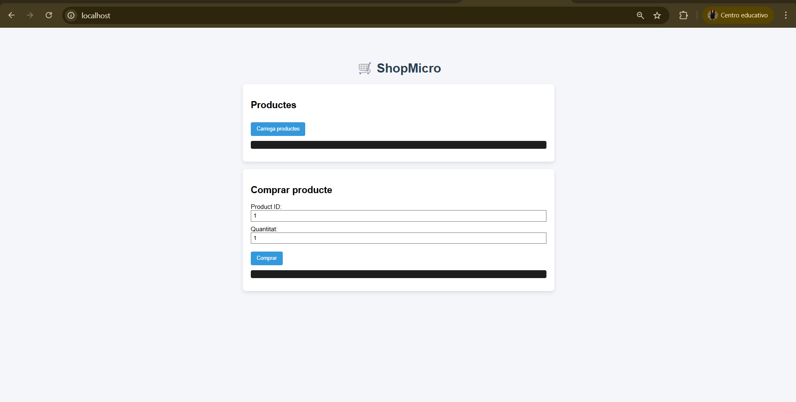

Tot seguit, li donarem un cop al botó de “Carrega productes” i veurem que ens mostra un json de el Mysql:

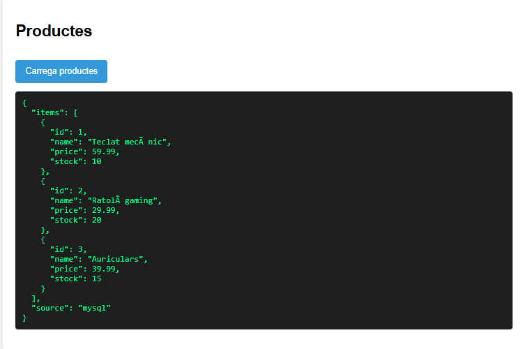

Ara si li tornem a clicar al botó, ens mostrarà el mateix, però en comptes de amb el mysql, serà amb el Redis. Ja que el mysql haurà guardat el contingut dins el Redis. És a dir que el sistema buscarà al cache per tal de evitar tornar a accedir dins la base de dades.

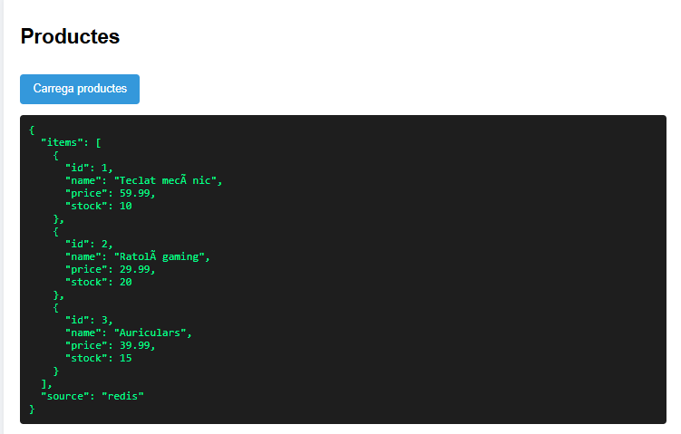

## Flux de creació de comanda

Per començar aquesta proba, haurem de obrir dos terminals per captar els logs de “order-service” i “notification-service”.

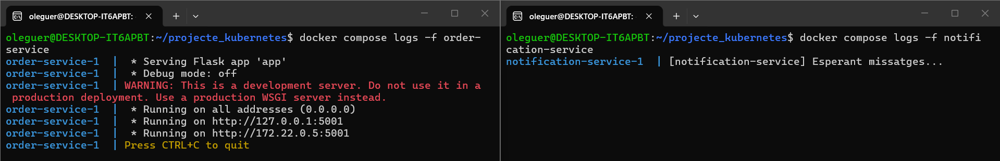

Tot seguit, tornem a obrir la web per comprar el producte amb id 1 i de quantitat 1.

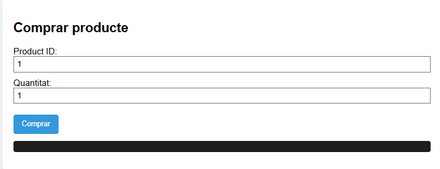

Just després de clicar el botó de compra, ens sortirà un altre json on ens indica el número de ordre:

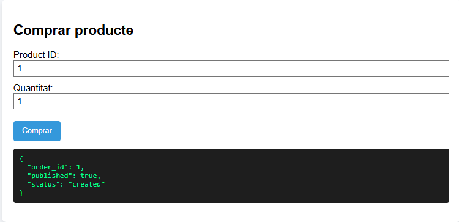

També ara els logs ens mostraran que s’ha efectuat la comanda amb més informació addicional, com per exemple la hora i el id.

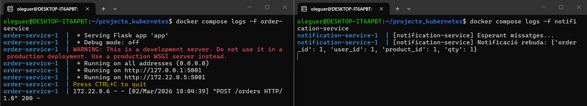

# Fase 2: Docker Swarm — Clúster d'Alta Disponibilitat

## Inicialitzar clúster swarm al manager i unir els workers

Primer de tot hem de instalar el Docker a les tres màquines.

### Actualitzem paquets:

```bash
sudo apt update
````

### Instal·lem les dependències necessàries:

```bash
sudo apt install ca-certificates curl gnupg -y
```

### Creo el directori per guardar les claus del repositori:

```bash
sudo install -m 0755 -d /etc/apt/keyrings
```

### Afegim la clau GPG oficial de Docker:

```bash
curl -fsSL https://download.docker.com/linux/ubuntu/gpg | \
sudo gpg --dearmor -o /etc/apt/keyrings/docker.gpg
```

### Afegim el repositori oficial de Docker:

```bash
echo \
"deb [arch=$(dpkg --print-architecture) \
signed-by=/etc/apt/keyrings/docker.gpg] \
https://download.docker.com/linux/ubuntu \
$(. /etc/os-release && echo "$VERSION_CODENAME") stable" | \
sudo tee /etc/apt/sources.list.d/docker.list > /dev/null
```

### Ara ja podem instal·lar amb la següent comanda el Docker:

```bash
sudo apt update
sudo apt install docker-ce docker-ce-cli containerd.io docker-buildx-plugin docker-compose-plugin -y
```

### Comprovem que s’ha instal·lat correctament:

```bash
docker --version
```

### Permetre utilitzar Docker sense sudo:

```bash
sudo usermod -aG docker $USER
newgrp docker
```

---

## Comprovació de connectivitat entre màquines

Abans de començar amb el Swarm, hem de comprovar que les diferents màquines es veuen entre elles:

```bash
ping IP_DE_LA_ALTRA_MAQUINA
```

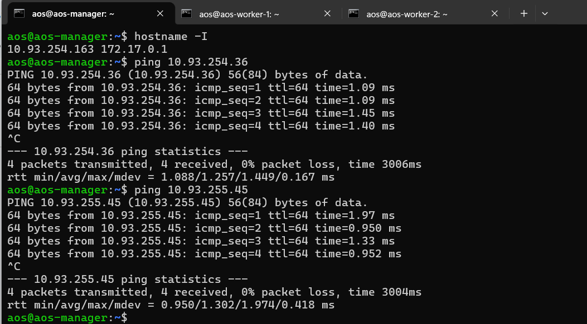

---

## Inicialització del node manager

El primer pas és inicialitzar el clúster des de la màquina que actuarà com a manager. El manager és el node encarregat de controlar el clúster, gestionar els serveis i decidir en quin node s’executaran els contenidors.

Per iniciar el clúster es fa servir la següent comanda:

```bash
docker swarm init
```

Aquesta comanda converteix la màquina actual en el node manager del clúster Docker Swarm.

Quan s’executa, Docker crea automàticament la configuració del clúster i genera un token d’unió que permetrà que altres nodes s’afegeixin al clúster com a workers.

---

## Afegir els nodes workers al clúster

Un cop el manager ha estat inicialitzat, el següent pas és afegir les màquines workers al clúster. Els nodes workers són les màquines que executen els contenidors i serveis distribuïts pel manager.

Per unir un node worker al clúster, cal executar a la màquina worker la comanda que ha proporcionat el manager:

```bash
docker swarm join --token TOKEN_DEL_MANAGER IP_DEL_MANAGER:2377
```

---

## Verificació del clúster

Per comprovar que totes les màquines s’han afegit correctament al clúster, es pot executar la següent comanda al node manager:

```bash
docker node ls
```

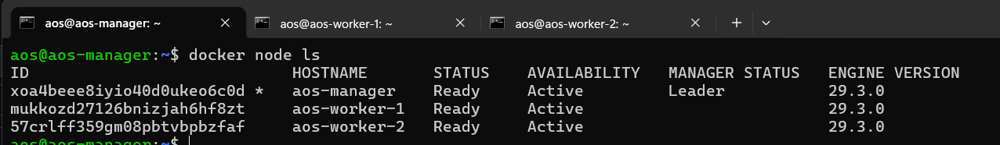

---

## Creació Docker-Stack

El codi complet del fitxer **docker-stack.yml** utilitzat en aquesta fase del projecte es troba disponible al repositori de GitHub següent: 
--> [Docker-stack](https://github.com/Sgallartfanlo/Projecte-Intermodular-ASIX/blob/main/Kubernetes%20B%C3%A0sic/fase%202/docker-stack.yml)

El fitxer **docker-stack.yml** defineix de forma declarativa tots els serveis que formen part de la plataforma ShopMicro adaptats per funcionar en un clúster de **Docker Swarm**. Dins la secció *services* es configuren les bases de dades MySQL, el sistema de cache Redis, la cua de missatges RabbitMQ, els microserveis de negoci, l’api-gateway i el frontend, igual que en la fase anterior amb Docker Compose.

En aquesta fase s’han afegit directives pròpies de **Docker Swarm** dins la secció *deploy*. En primer lloc, s’ha configurat **deploy.replicas** per executar diverses instàncies dels microserveis, garantint així una major disponibilitat del sistema. També s’ha utilitzat **deploy.placement.constraints** per assegurar que els serveis de bases de dades s’executin sempre al node manager del clúster.

A més, s’ha configurat **deploy.restart_policy** per reiniciar automàticament els contenidors en cas d’error i **deploy.update_config** per permetre actualitzacions progressives dels serveis mitjançant un sistema de *rolling update* amb paral·lelisme d’una rèplica cada vegada.

La segmentació en tres xarxes (**frontend-net**, **backend-net** i **data-net**) es manté igual que en la fase anterior, permetent separar les capes de l’arquitectura i garantir una comunicació controlada entre els diferents serveis de la plataforma.

---

## Desplegament amb Docker Stack

Un cop creat el fitxer `docker-stack.yml`, el següent pas és desplegar l’aplicació dins el clúster **Docker Swarm**. Aquest fitxer és una adaptació del `docker-compose.yml` utilitzat a la fase anterior, però incorpora directives específiques de Swarm com la gestió de rèpliques, les polítiques de reinici automàtic i les restriccions de desplegament dels serveis.

Per desplegar la stack s’utilitza la següent comanda executada des del node **manager**:

```bash
docker stack deploy -c docker-stack.yml shopmicro
```

Aquesta comanda crea una stack anomenada **shopmicro** i desplega tots els serveis definits dins el fitxer `docker-stack.yml` al clúster Docker Swarm.

---

## Verificació dels serveis desplegats

Per comprovar que tots els serveis s’han desplegat correctament es pot utilitzar la següent comanda:

```bash
docker stack services shopmicro
```

Aquesta comanda mostra tots els serveis que formen part de la stack, així com el nombre de rèpliques actives i el port exposat per cadascun d’ells.

En aquesta sortida es pot observar que els microserveis disposen de múltiples rèpliques, tal com s’ha configurat dins del fitxer `docker-stack.yml`. Això permet millorar la disponibilitat del sistema i assegurar que el servei continuï funcionant encara que algun contenidor falli.

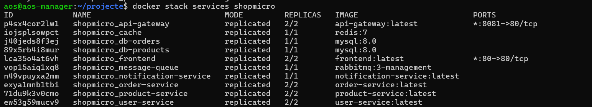

---

## Distribució dels serveis dins el clúster

Per veure en quin node del clúster s’està executant cada rèplica dels serveis, es pot utilitzar la següent comanda:

```bash
docker stack ps shopmicro
```

Aquesta comanda mostra totes les tasques associades als serveis de la stack, indicant el node on s’està executant cada contenidor.

Gràcies a Docker Swarm, els contenidors es distribueixen automàticament entre els diferents nodes del clúster (`aos-manager`, `aos-worker-1` i `aos-worker-2`). Això permet repartir la càrrega de treball i augmentar la tolerància a errors del sistema.

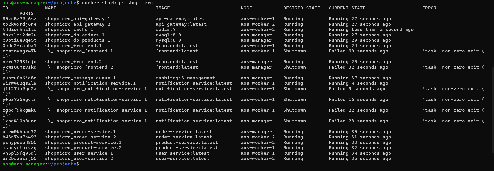

## Prova de tolerància a fallades

Per comprovar la tolerància a fallades del clúster Docker Swarm, es simula la caiguda d’un dels nodes worker. En aquest cas aturarem el node **Worker 2**.

Primer de tot aturem el **Worker 2**. Per fer-ho executem la següent comanda dins del node `aos-worker-2`:

```bash
sudo systemctl stop docker
```

---

### Comprovació de l'estat dels nodes

Ara, des del node **manager**, executem la següent comanda per veure l’estat dels nodes del clúster:

```bash
docker node ls
```

En aquest moment podem observar que el node **Worker 2** apareix amb estat **Down**, indicant que ha deixat de participar temporalment en el clúster.

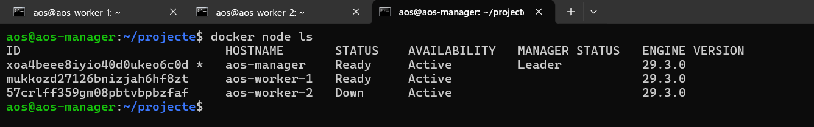

---

### Redistribució automàtica dels serveis

Si ara executem la següent comanda:

```bash
docker stack ps shopmicro
```

podem observar que els serveis que anteriorment s’estaven executant al **Worker 2** s’han redistribuït automàticament entre els altres nodes disponibles del clúster, és a dir, el **manager** i el **worker-1**.

Això demostra que Docker Swarm manté el nombre de rèpliques actives encara que un node deixi de funcionar.

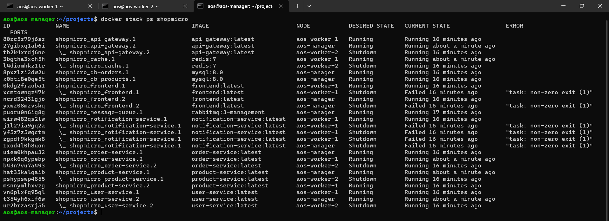

---

### Reincorporació del node al clúster

Ara tornem a encendre el **Worker 2** per comprovar què passa amb els serveis que s’han redistribuït.

Per fer-ho executem de nou la següent comanda dins del node `aos-worker-2`:

```bash
sudo systemctl start docker
```

Un cop fet això, tornem al node **manager** i executem:

```bash
docker node ls
```

Podem observar que el node **Worker 2** torna a aparèixer amb estat **Ready**, indicant que s’ha reincorporat correctament al clúster.

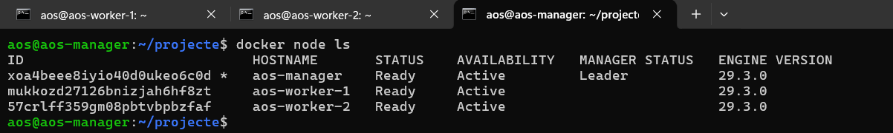

---

### Comportament dels serveis després de la recuperació

Tot i que el node **Worker 2** torna a estar actiu, els serveis que s’han redistribuït no tornen automàticament a aquest node.

Això és perquè Docker Swarm ja està complint amb el nombre de rèpliques configurades per als serveis en els nodes que continuen funcionant.

Els serveis només tornarien a redistribuir-se al **Worker 2** si es realitza una actualització del servei o si es modifica el nombre de rèpliques.

## Escalat en calent

En aquesta última prova es realitza un **escalat en calent** del servei `product-service`.
Això significa augmentar el nombre de rèpliques del servei mentre el sistema continua funcionant, sense necessitat d’aturar els contenidors existents.

Per augmentar a **4** les rèpliques del servei `product-service`, executem la següent comanda des del node **manager**:

```bash
docker service scale shopmicro_product-service=4
```

Aquesta comanda indica a Docker Swarm que augmenti el nombre de contenidors actius per aquest servei fins a quatre.

---

### Verificació de l’escalat

Per comprovar que el servei `product-service` s’ha escalat correctament a **4 rèpliques**, executem la següent comanda:

```bash
docker service ls
```

En aquesta sortida es pot observar que el servei `shopmicro_product-service` mostra **4/4 rèpliques actives**, indicant que els quatre contenidors estan en funcionament.

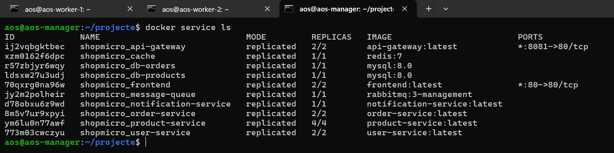

---

### Distribució de les noves rèpliques

Per veure com Docker Swarm ha distribuït les noves rèpliques entre els diferents nodes del clúster, utilitzem la comanda següent:

```bash
docker stack ps shopmicro
```

En aquesta sortida es pot observar que les quatre instàncies del servei `product-service` s’han repartit entre els nodes disponibles del clúster (`aos-manager`, `aos-worker-1` i `aos-worker-2`).

Aquesta distribució permet repartir la càrrega del servei entre diferents màquines, millorant l’escalabilitat i la disponibilitat del sistema.

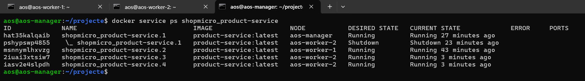

# Fase 3: Seguretat a Docker Swarm
## Anàlisi de vulnerabilitats del docker-stack.yml
[Docker-stack](https://github.com/Sgallartfanlo/Projecte-Intermodular-ASIX/blob/main/Kubernetes%20B%C3%A0sic/fase%202/docker-stack.yml)

Després de revisar el fitxer `docker-stack.yml`, s’han identificat diverses credencials i configuracions sensibles definides en clar, fet que representa un risc de seguretat dins del clúster Docker Swarm.

La primera vulnerabilitat detectada és l’ús de la contrasenya de root de MySQL directament al fitxer de configuració:

```yaml
MYSQL_ROOT_PASSWORD: rootpassword
```

Aquesta credencial apareix als serveis `db-products` i `db-orders`. El problema és que qualsevol usuari amb accés al fitxer podria veure la contrasenya, i a més també podria quedar exposada en inspeccions del servei o en l’historial del projecte.

També s’ha detectat que diversos microserveis utilitzen la mateixa contrasenya en clar per connectar-se a les bases de dades:

```yaml
DB_PASS: rootpassword
```

Això afecta els serveis `product-service`, `order-service` i `user-service`. Aquesta pràctica és insegura perquè distribueix la mateixa credencial sensible per diversos contenidors, augmentant la superfície d’exposició en cas de compromís d’algun servei.

Una altra vulnerabilitat és l’ús de l’usuari `root` com a usuari de connexió a la base de dades:

```yaml
DB_USER: root
```

Encara que funcionalment és vàlid, no és una bona pràctica de seguretat, ja que s’estan utilitzant privilegis massa elevats per a serveis d’aplicació. El recomanable seria utilitzar usuaris específics amb permisos limitats.

A més, el fitxer manté les credencials dins de la secció `environment`, la qual cosa implica que poden quedar visibles fàcilment en un `docker service inspect`, en logs o en configuracions exportades. En entorns reals això és especialment crític, ja que les credencials no haurien d’estar mai escrites en clar dins dels fitxers de desplegament.

## Credencials identificades

* `MYSQL_ROOT_PASSWORD: rootpassword` a `db-products`
* `MYSQL_ROOT_PASSWORD: rootpassword` a `db-orders`
* `DB_PASS: rootpassword` a `product-service`
* `DB_PASS: rootpassword` a `order-service`
* `DB_PASS: rootpassword` a `user-service`
* `DB_USER: root` a diversos serveis d’aplicació

---

# 14. Docker Secrets

En aquesta fase s’han migrat totes les credencials del fitxer `docker-stack.yml` a **Docker Secrets**.

L’objectiu és millorar la seguretat del clúster Docker Swarm evitant que les contrasenyes apareguin en text pla dins del fitxer de configuració o en variables d’entorn. Docker Secrets permet emmagatzemar informació sensible de forma segura i només la posa a disposició dels serveis que la necessiten.

---

## Creació del secret

Des del node **manager** es crea el secret que contindrà la contrasenya de la base de dades amb la següent comanda:

```bash
echo "rootpassword" | docker secret create db_root_password -
```

Aquesta comanda crea un secret anomenat `db_root_password` dins del clúster Docker Swarm.

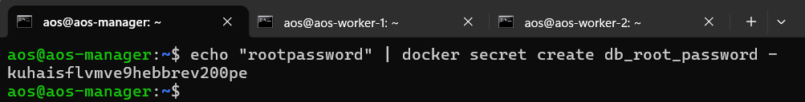

---

## Verificació del secret

Per comprovar que el secret s’ha creat correctament es pot utilitzar la comanda:

```bash
docker secret ls
```

Aquesta comanda mostra tots els secrets disponibles dins del clúster.

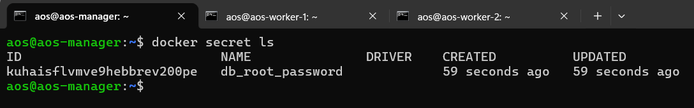

---

## Modificació del docker-stack.yml

Un cop creat el secret, es modifica el fitxer `docker-stack.yml` per substituir les contrasenyes en text pla per l’ús del secret.

Per exemple, en el servei de MySQL es substitueix la variable:

```yaml
MYSQL_ROOT_PASSWORD: rootpassword
```

per:

```yaml
MYSQL_ROOT_PASSWORD_FILE: /run/secrets/db_root_password
```

D’aquesta manera, el contenidor obté la contrasenya directament del secret gestionat per Docker.

També s’ha afegit la secció `secrets` als serveis que necessiten accedir a la contrasenya.

---

## Redeplegament del stack

Un cop modificat el fitxer de configuració, es torna a desplegar la stack amb la següent comanda:

```bash
docker stack deploy -c docker-stack.yml shopmicro
```

Aquesta comanda actualitza els serveis del clúster aplicant la nova configuració amb Docker Secrets.

---

## Verificació dels serveis

Per comprovar que tots els serveis continuen funcionant correctament després dels canvis, es pot utilitzar la comanda:

```bash
docker stack services shopmicro
```

Aquesta comanda mostra l’estat dels serveis desplegats i el nombre de rèpliques actives de cadascun.

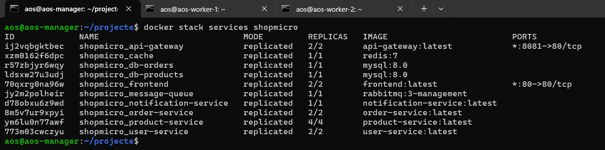

---

## Verificació de l’ús del secret

Finalment, es pot comprovar que la contrasenya ja no apareix en text pla inspeccionant un dels serveis amb la comanda:

```bash
docker service inspect shopmicro_db-products
```

En la configuració del servei es pot observar que la contrasenya es carrega des del fitxer del secret:

```
MYSQL_ROOT_PASSWORD_FILE=/run/secrets/db_root_password
```

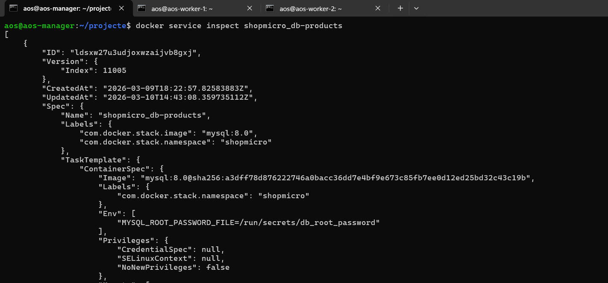

---

# Webgrafia

* Documentació oficial de Docker Compose:
  [https://docs.docker.com/compose/](https://docs.docker.com/compose/)

* Referència del fitxer Compose:
  [https://docs.docker.com/reference/compose-file/](https://docs.docker.com/reference/compose-file/)

* Model d’aplicació de Docker Compose:
  [https://docs.docker.com/compose/intro/compose-application-model/](https://docs.docker.com/compose/intro/compose-application-model/)

* Referència de la CLI de Docker Compose:
  [https://docs.docker.com/reference/cli/docker/compose/](https://docs.docker.com/reference/cli/docker/compose/)

* Documentació oficial de Docker Engine:
  [https://docs.docker.com/engine/](https://docs.docker.com/engine/)
