# Configuració de Notificacions de Zabbix via Telegram

## 1. Crear el bot de Telegram amb BotFather

Cerquem **@BotFather** a Telegram (compte verificat amb el tick blau) i fem clic a **START** per iniciar la conversa.

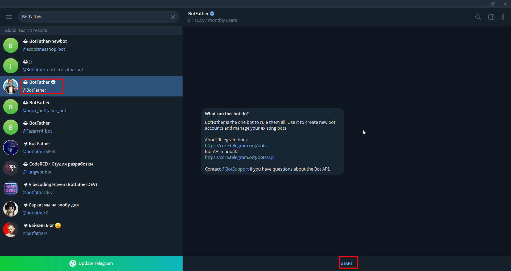

BotFather és el bot oficial de Telegram per crear i gestionar bots. Seleccionem el compte verificat `@BotFather`.

---

## 2. Obtenir el token del bot

Un cop iniciem BotFather, enviem `/newbot`, triem un **nom** per al bot (ex: `zabbix_notificationbot`) i un **username** que acabi en `_bot` (ex: `aos_zabbix_bot`). BotFather ens retornarà el **token HTTP API** necessari per a la integració.

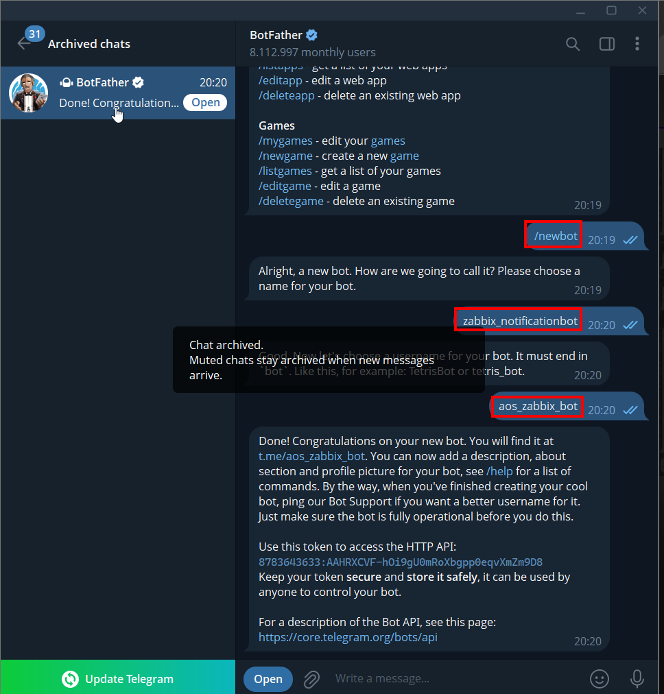

Guardem el token de forma segura. En aquest exemple: `8783643633:AAHRXCVF-h0i9gU0mRoXbgpp0eqvXmZm9D8`

---

## 3. Cercar i iniciar el bot creat

Cerquem el bot pel seu username (`aos_zabbix_bot`) i fem clic a **START** per activar-lo.

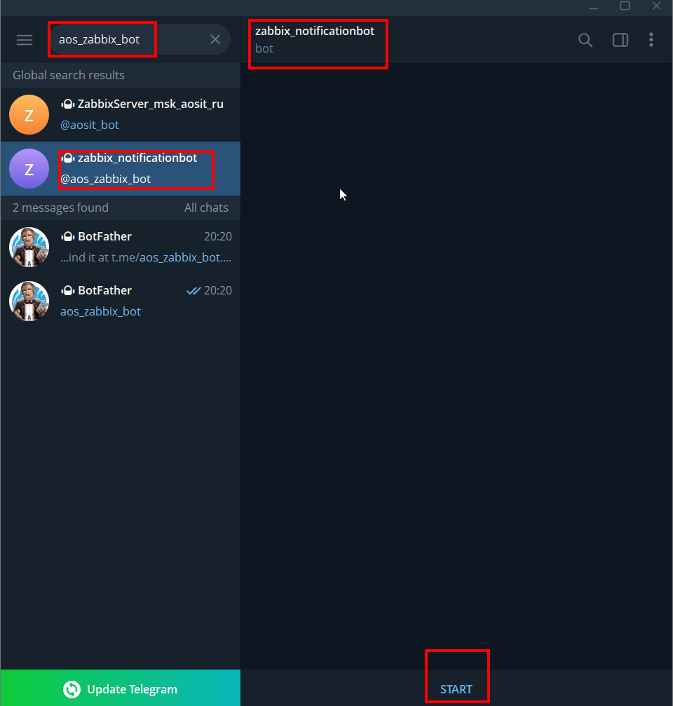

---

## 4. Crear el grup de notificacions

Creem un nou grup de Telegram anomenat **`zabbix_notification`**. Aquest grup rebrà totes les alertes de Zabbix.

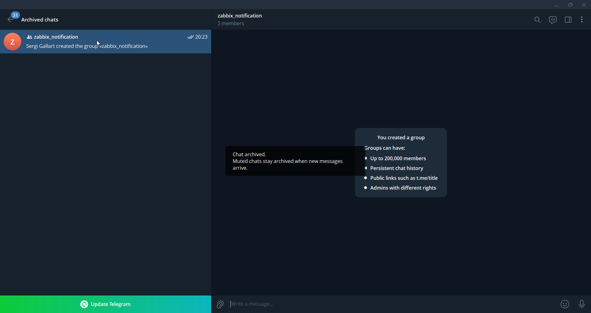

Telegram confirma la creació del grup i ens informa que pot tenir fins a 200.000 membres, historial persistent i administradors amb rols diferenciats.

---

## 5. Afegir el bot i IDBot al grup

Des de la configuració del grup, afegim el bot creat (`zabbix_notificationbot`) i també **@IDBot** (necessari per obtenir el Chat ID del grup).

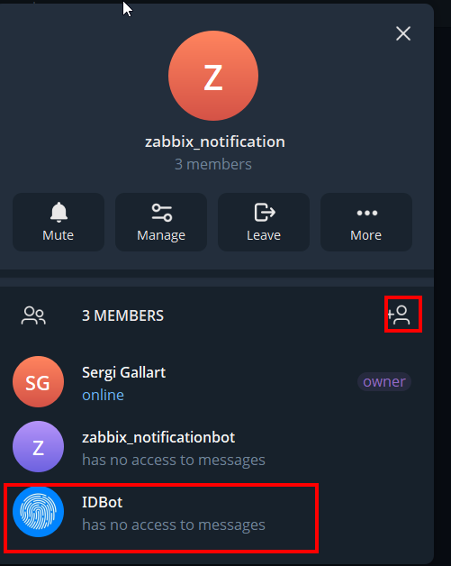

El grup ara té 3 membres: nosaltres (propietaris), `zabbix_notificationbot` i `IDBot`.

---

## 6. Obtenir el Chat ID del grup

Dins el grup, enviem la comanda `/getgroupid@myidbot`. IDBot ens respondrà amb el **Chat ID** del grup (en format negatiu per a grups).

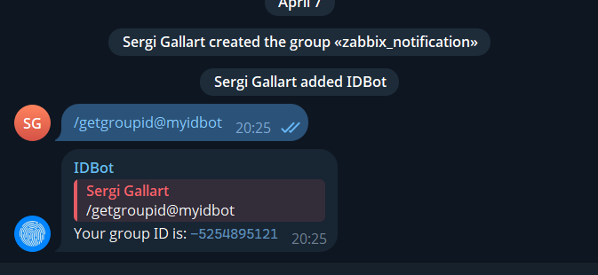

En aquest exemple el Chat ID és: **`-5254895121`**. Ens assegurem d’incloure el signe negatiu.

---

## 7. Configurar el Media Type a Zabbix

A Zabbix, anem a **Alertes → Tipus de medis** i obrim el tipus **Telegram** (Webhook). Omplim els paràmetres:

* `api_chat_id`: el Chat ID del grup (`-5254895121`)
* `api_token`: el token del bot
* `api_parse_mode`: mode de formatació del missatge

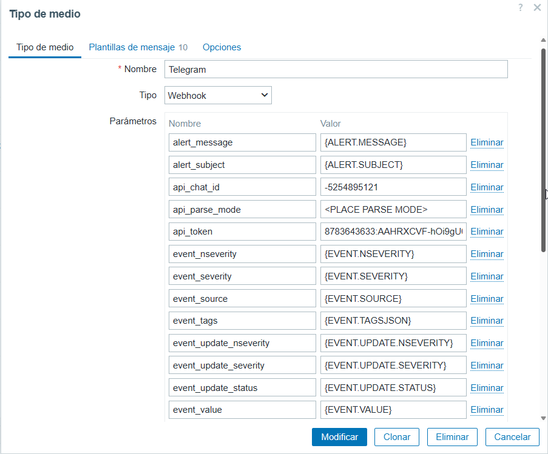

---

## 8. Provar el Media Type

Des del formulari del Media Type, fem clic a **Probar** i omplim els camps de prova (per exemple, `alert_message: Hola Telegram`). Si la configuració és correcta, apareixerà el missatge **"Prueba de tipo de medio exitosa"**.

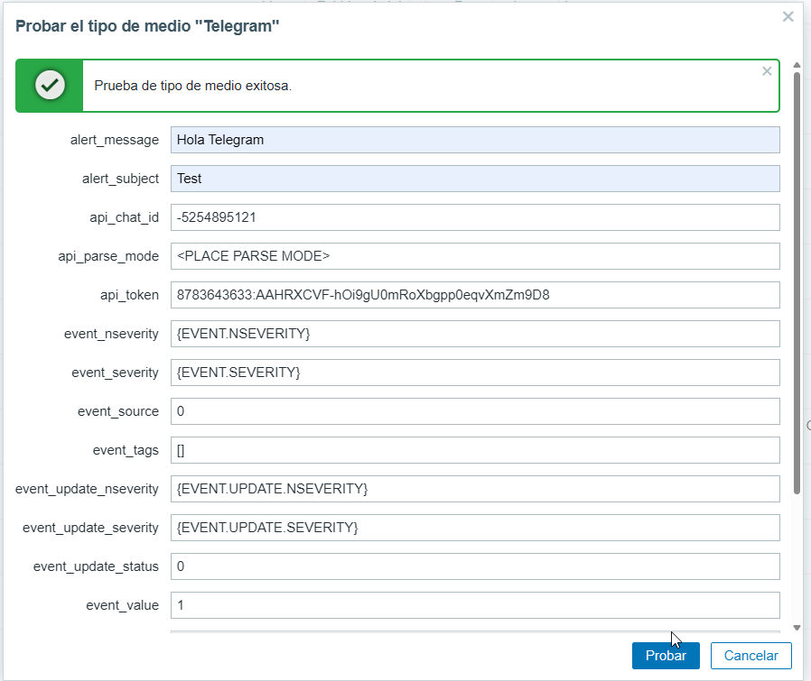

---

## 9. Verificar la recepció del missatge de prova

Comprovem al grup de Telegram que el bot ha enviat correctament el missatge de prova.

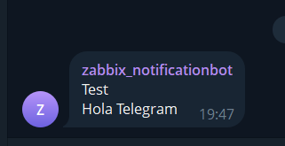

El bot `zabbix_notificationbot` ha enviat el missatge "Test / Hola Telegram" al grup, confirmant que la integració funciona.

---

## 10. Activar el Media Type a la llista

A la llista de **Tipus de medis**, confirmem que **Telegram** apareix amb l'estat **Activado**.

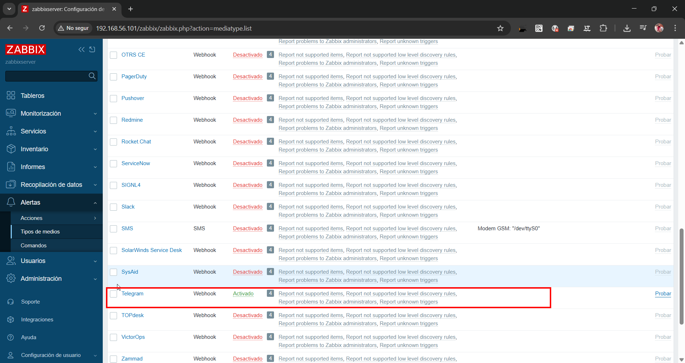

---

## 11. Configurar el medi a l'usuari

Anem a **Usuaris → Usuaris**, obrim l'usuari administrador i accedim a la pestanya **Medio**. Fem clic a **Agregar** per afegir Telegram com a medi de notificació.

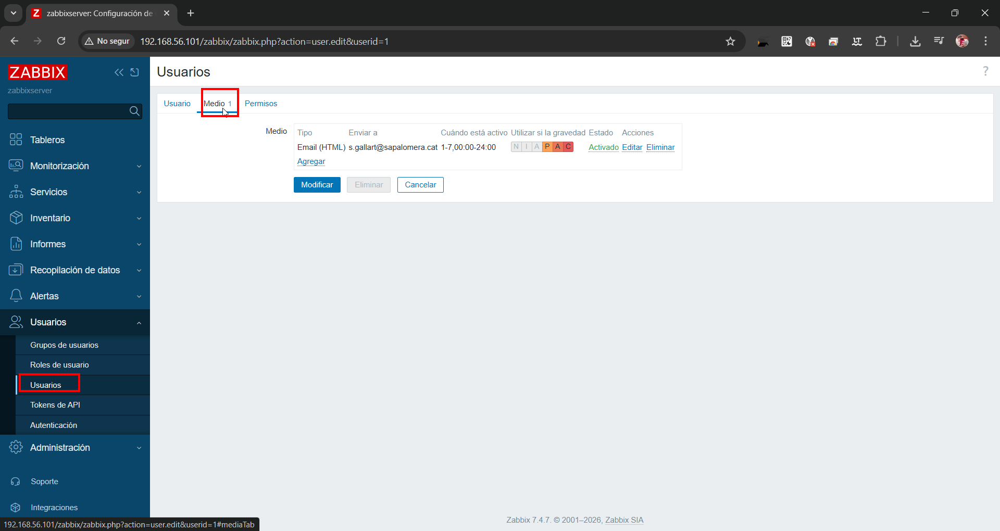

---

## 12. Afegir Telegram com a nou medi

Seleccionem el tipus **Telegram**, introduïm el Chat ID (`-5254895121`) al camp **Enviar a**, configurem l'horari d'activitat i marquem les gravetats desitjades (Promedio, Alta, Crítica).

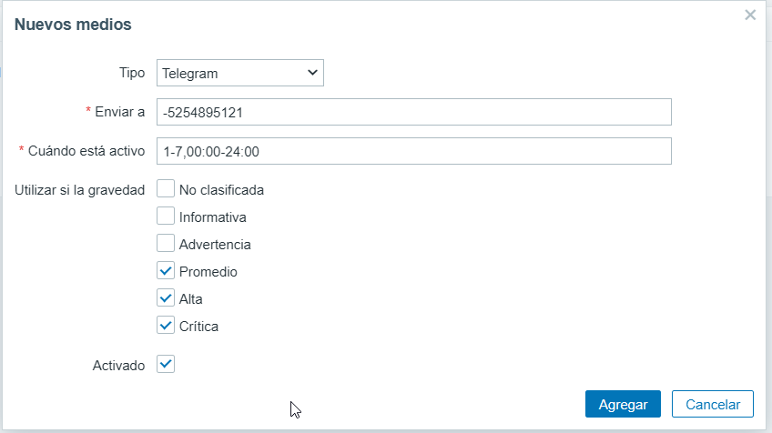

---

## 13. Verificar els medis de l'usuari

Confirmem que l'usuari té ara dos medis configurats: **Email (HTML)** i **Telegram**, ambdós actius.

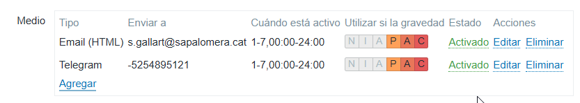

---

## 14. Crear l'acció de trigger

Anem a **Alertes → Accions → Acciones de iniciador** i fem clic a **Crear acción**. Li posem el nom `Trigger to Telegram` i afegim la condició: *Gravedad del iniciador es mayor o igual Alta*.

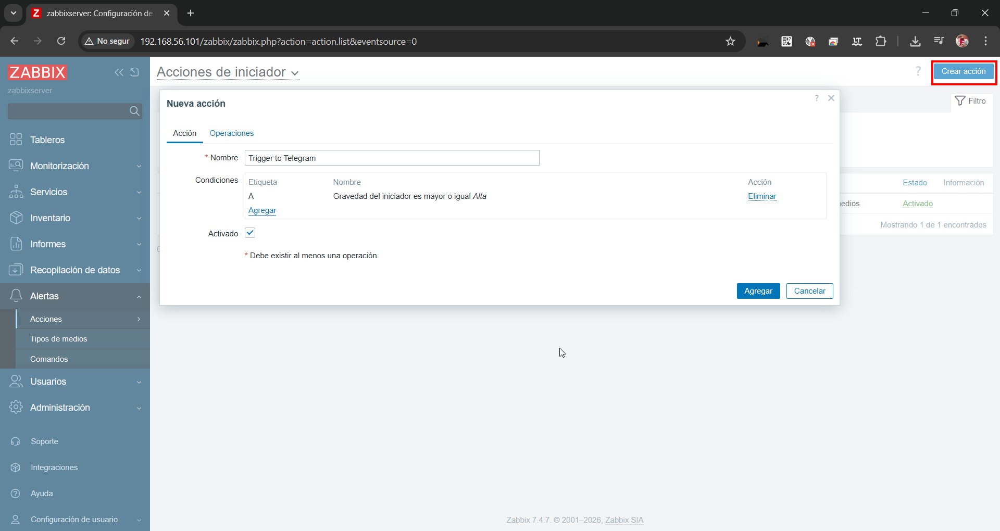

---

## 15. Configurar les operacions de l'acció

A la pestanya **Operaciones**, afegim tres operacions d'enviament de missatge a l'usuari Admin via Telegram:

* **Operació** (problema detectat): enviem missatge immediatament
* **Operació de recuperació**: enviem missatge quan el problema es resol
* **Operació d'actualització**: enviem missatge en cas d'actualització

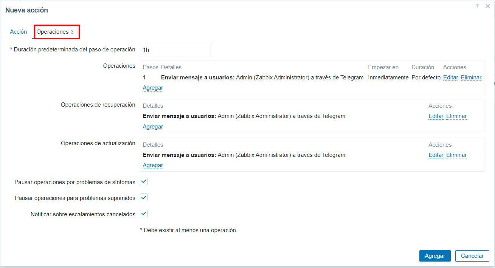

---

## 16. Verificar l'acció creada

Comprovem a la llista d'**Acciones de iniciador** que `Trigger to Telegram` apareix activa, amb la condició i les operacions correctes.

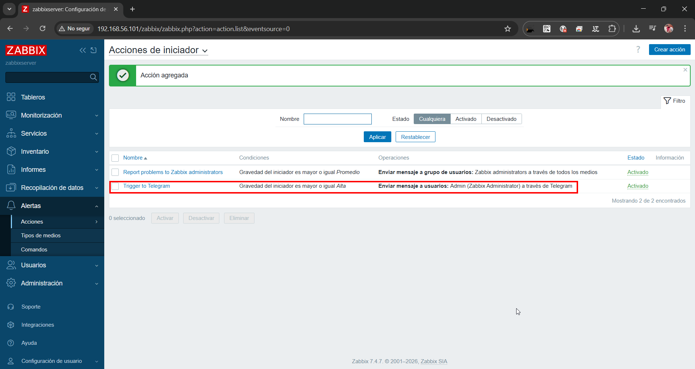

---

## 17. Comprovar problemes actius a Zabbix

Al tauler de **Problemes** de Zabbix visualitzem els incidents actius detectats (per exemple, agent no disponible, servei aturat, paquets instal·lats canviats).

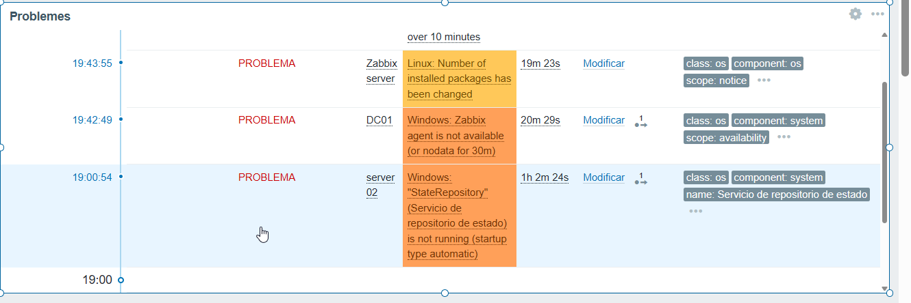

---

## 18. Rebre alertes al grup de Telegram

Quan Zabbix detecta un problema de gravetat Alta o superior, el bot envia automàticament un missatge al grup `zabbix_notification` amb tota la informació de l'alerta.

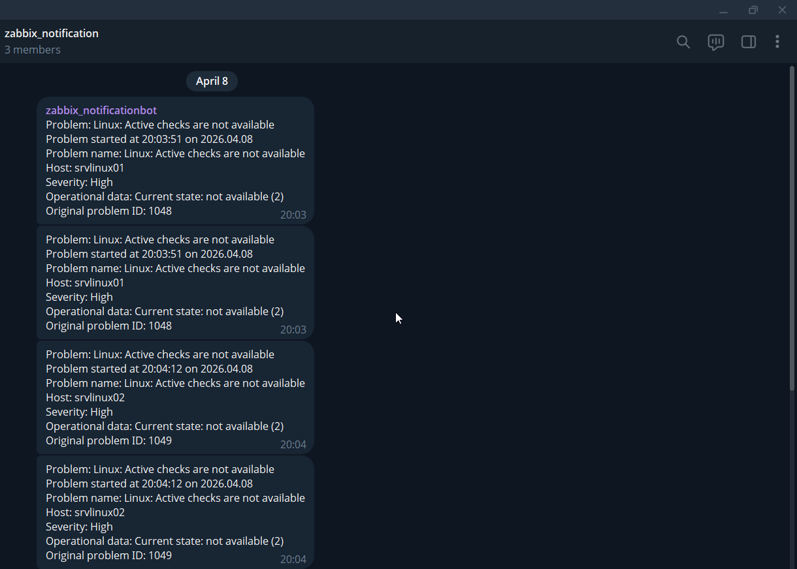

Cada missatge inclou: nom del problema, data i hora d'inici, host afectat, severitat, dades operacionals i ID del problema original.
