# Auto-registració i Descobriment de Hosts a Zabbix

Aquest document descriu el procés complet per configurar l’autoregistració automàtica de hosts Linux a Zabbix mitjançant **HostMetadata** i el descobriment de xarxa.

---

## Fase 0: Eliminació del host existent

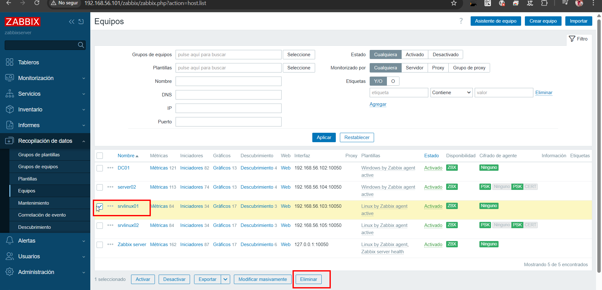

Abans de començar, eliminem el host `srvlinux01` per comprovar que es tornarà a crear automàticament.

Passos:

* Anar a **Recopilación de datos → Equipos**
* Seleccionar el host
* Fer clic a **Eliminar**

---

## Fase 1: Configuració de l’Agent Zabbix

### Pas 1: Editar el fitxer de configuració

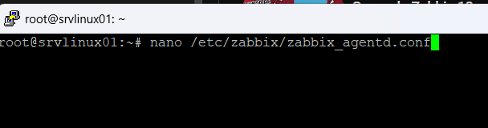

```bash
nano /etc/zabbix/zabbix_agentd.conf
```

Aquest fitxer controla la comunicació entre l’agent i el servidor Zabbix.

---

### Pas 2: Configurar connexió, identificació i metadata

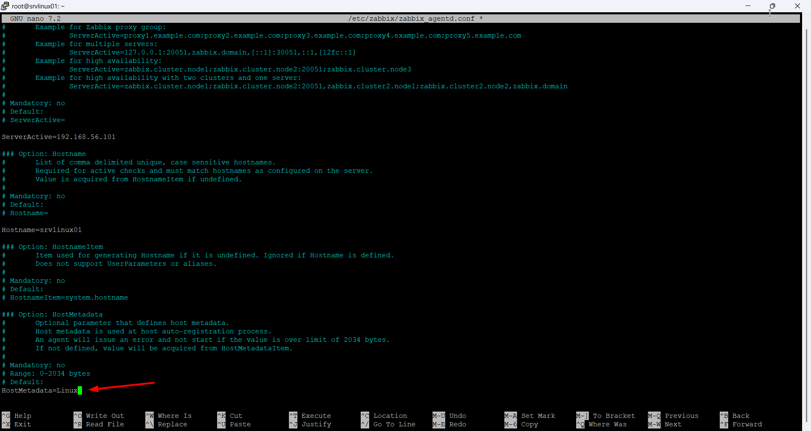

```bash
ServerActive=192.168.56.101
Hostname=srvlinux01
HostMetadata=Linux
```

En aquest pas definim:

* **ServerActive**: la IP del servidor Zabbix
* **Hostname**: el nom del host
* **HostMetadata**: la metadada que permet aplicar l’autoregistració automàtica als equips Linux

---

### Pas 3: Reiniciar el servei

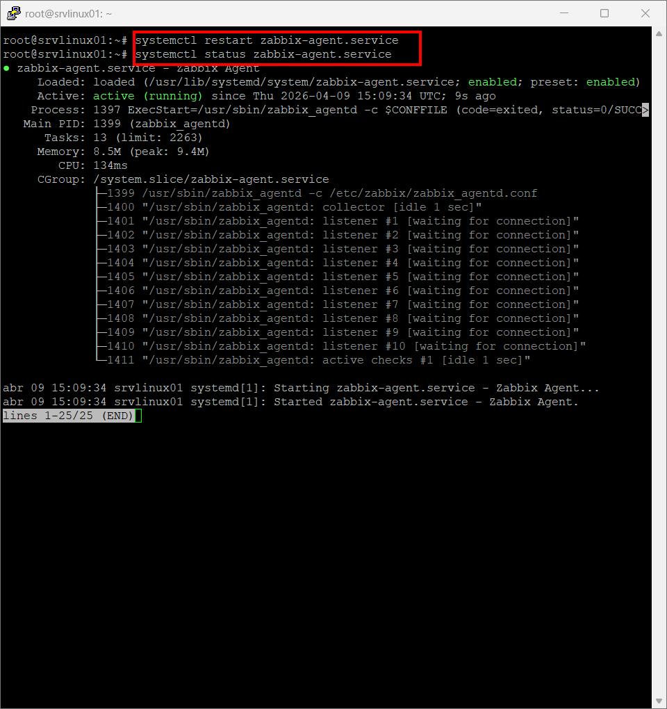

```bash
systemctl restart zabbix-agent.service
systemctl status zabbix-agent.service
```

Després de modificar la configuració, reiniciem el servei per aplicar els canvis i comprovem que l’estat sigui **active (running)**.

---

### Pas 4: Comprovar logs

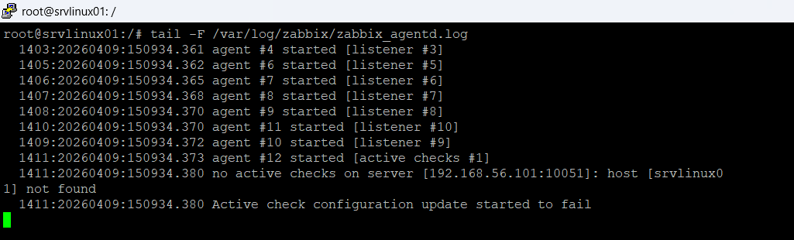

```bash
tail -f /var/log/zabbix/zabbix_agentd.log
```

Amb aquesta comanda podem revisar els logs de l’agent i comprovar si hi ha errors o si la comunicació amb el servidor funciona correctament.

---

## Fase 2: Configuració del Descobriment

### Pas 1: Accedir a descobriment

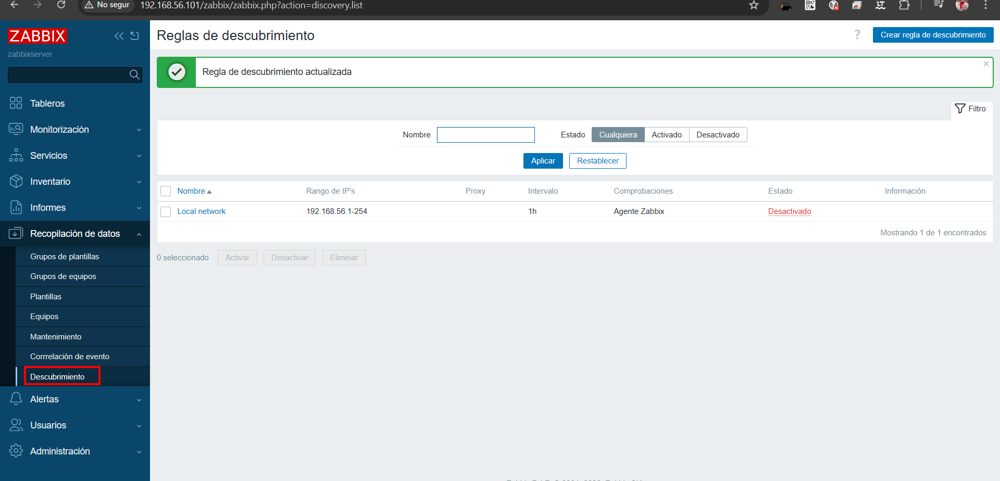

Anem a:

* **Recopilación de datos → Descubrimiento**

Aquí veurem la llista de regles de descobriment disponibles.

---

### Pas 2: Crear i configurar la regla de descobriment

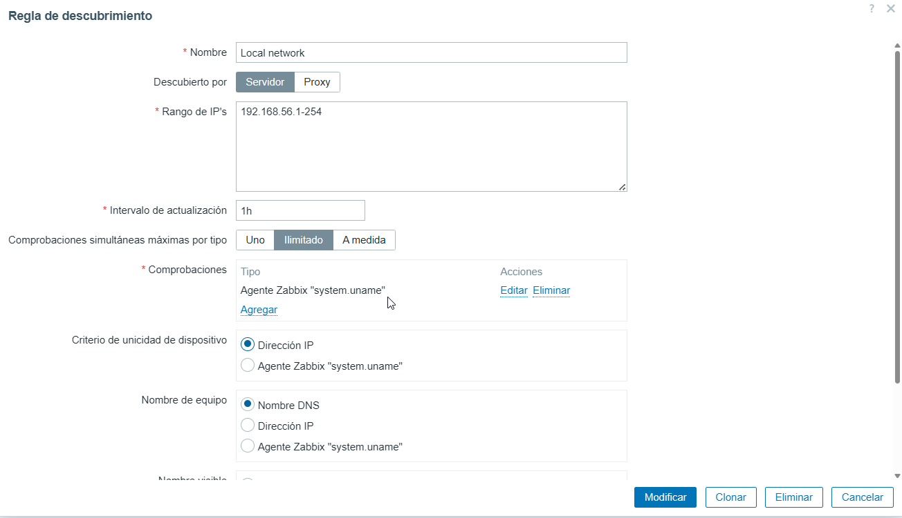

Configurem els valors principals de la regla:

* **Nom**: `Local network`
* **Descubierto por**: `Servidor`
* **Rango de IP's**: `192.168.56.1-254`
* **Intervalo de actualización**: `1h`
* **Comprobaciones**: `Agente Zabbix "system.uname"`

Aquesta regla permet que Zabbix revisi automàticament el rang d’adreces IP indicat.

---

### Pas 3: Configuració avançada de la regla


A la part inferior de la configuració establim:

* **Criterio de unicidad de dispositivo**: `Dirección IP`
* **Nombre de equipo**: `Nombre DNS`
* **Nombre visible**: `Nombre de equipo`
* **Activado**: marcat

Aquests paràmetres determinen com Zabbix identificarà i mostrarà els hosts descoberts.

---

## Fase 3: Configuració d’Autoregistració

### Pas 1: Crear acció d’autoregistre

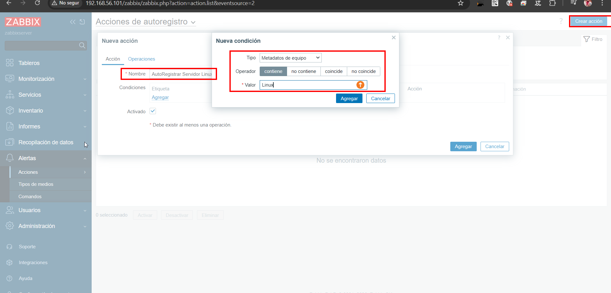

Anem a:

* **Alertas → Acciones → Autoregistro**

Creem una nova acció amb el nom:

```text
AutoRegistrar Servidor Linux
```

I afegim la condició:

```text
Metadatos de equipo contiene Linux
```

Això farà que l’acció només s’apliqui als hosts que tinguin `HostMetadata=Linux`.

---

### Pas 2: Verificar la condició afegida

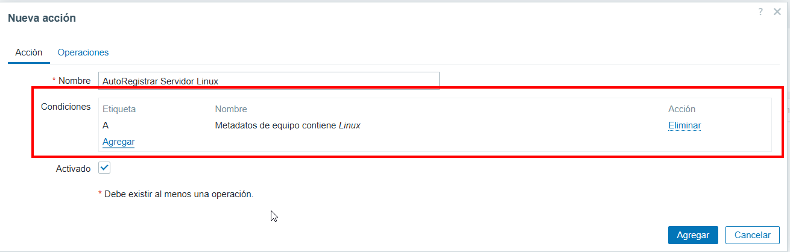

Comprovem que la condició hagi quedat registrada correctament dins l’acció:

* **Metadatos de equipo contiene Linux**

Aquesta serà la base per filtrar els equips Linux durant l’autoregistració.

---

### Pas 3: Configurar operacions

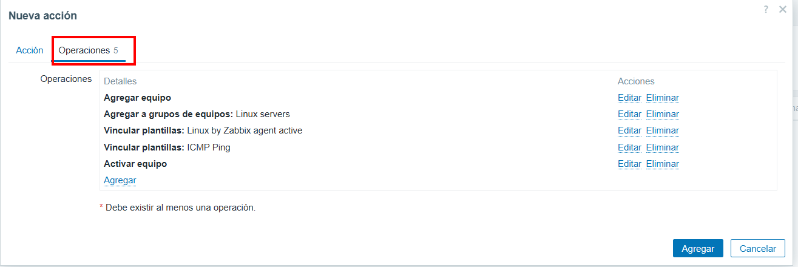

A la pestanya **Operaciones** afegim les accions següents:

* **Agregar equipo**
* **Agregar a grupos de equipos**: `Linux servers`
* **Vincular plantillas**: `Linux by Zabbix agent active`
* **Vincular plantillas**: `ICMP Ping`
* **Activar equipo**

Amb això, cada host Linux detectat quedarà creat, agrupat, activat i amb les plantilles corresponents.

---

### Pas 4: Verificar l’acció creada

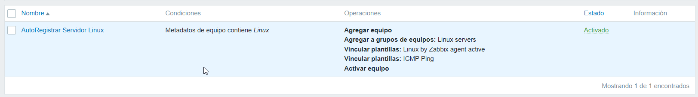

Un cop guardada, comprovem que l’acció apareix a la llista amb:

* La condició correcta
* Les operacions configurades
* L’estat **Activado**

---

## Fase 4: Verificació del sistema

### Pas 1: Comprovar l’estat del descobriment

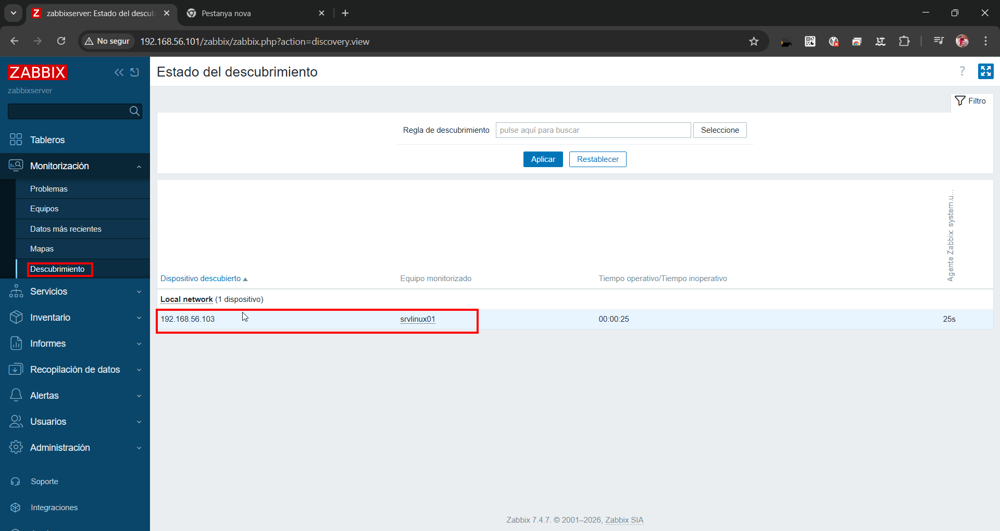

A **Monitorización → Descubrimiento** podem veure que el dispositiu ha estat detectat correctament.

Es mostra:

* La IP descoberta: `192.168.56.103`
* El host monitoritzat: `srvlinux01`

---

### Pas 2: Confirmar el host creat automàticament

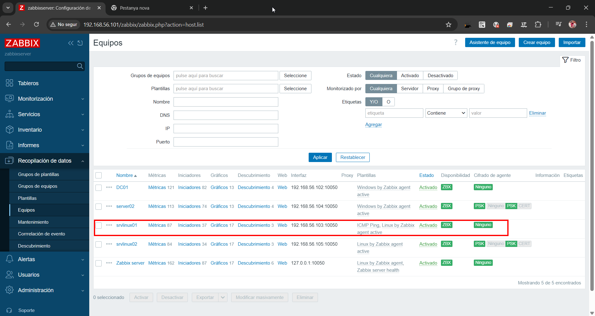

Finalment, a **Recopilación de datos → Equipos** comprovem que el host s’ha creat automàticament i que té configurades les plantilles corresponents.

Verifiquem:

* Host: `srvlinux01`
* Plantilles assignades:

  * `ICMP Ping`
  * `Linux by Zabbix agent active`
* Estat: **Activado**
