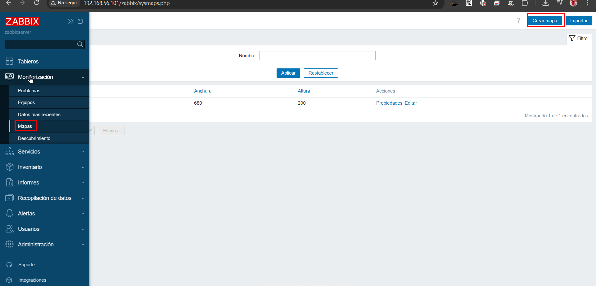
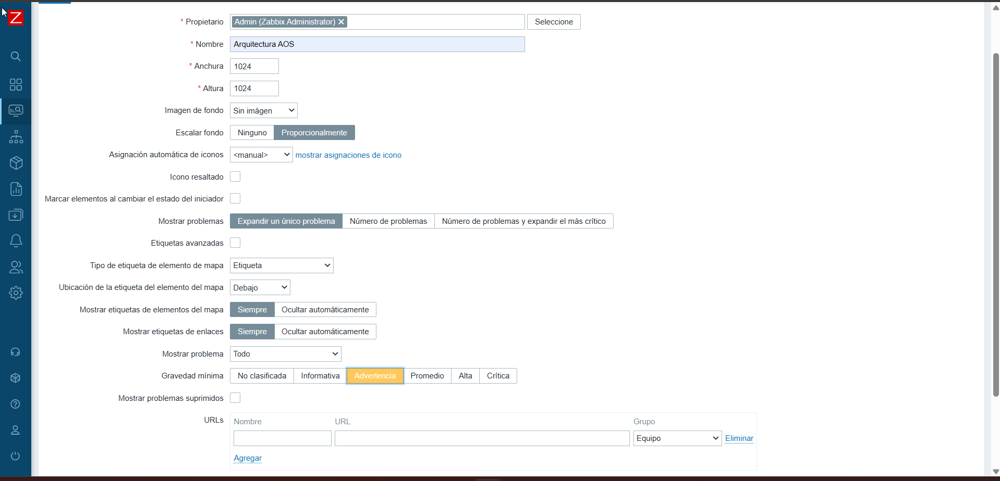
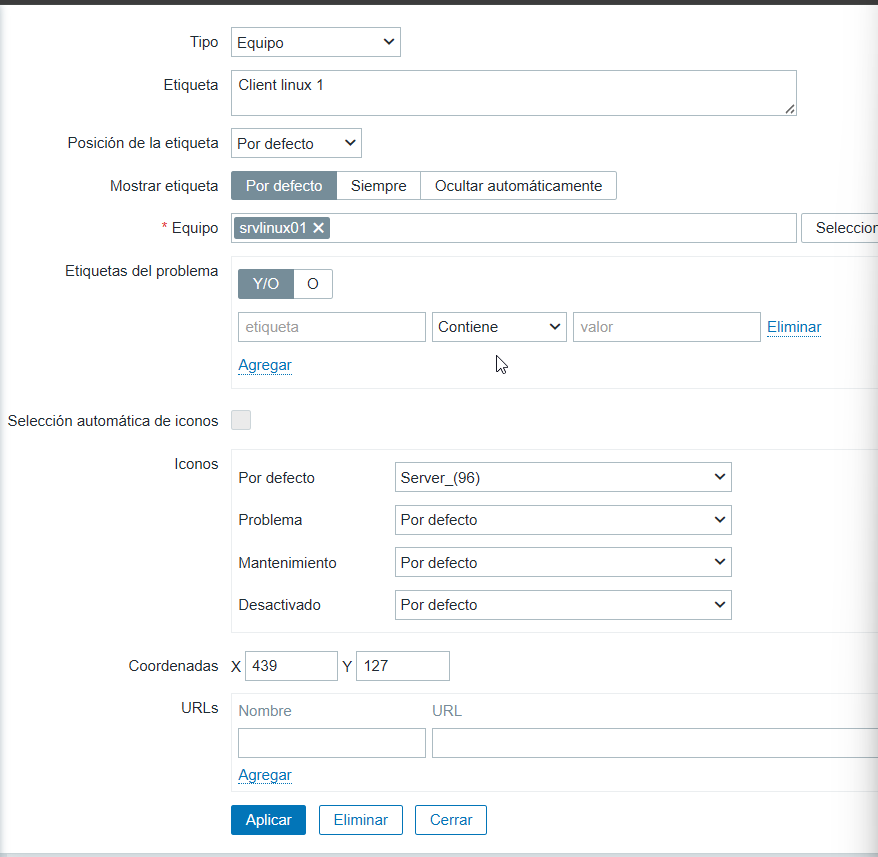
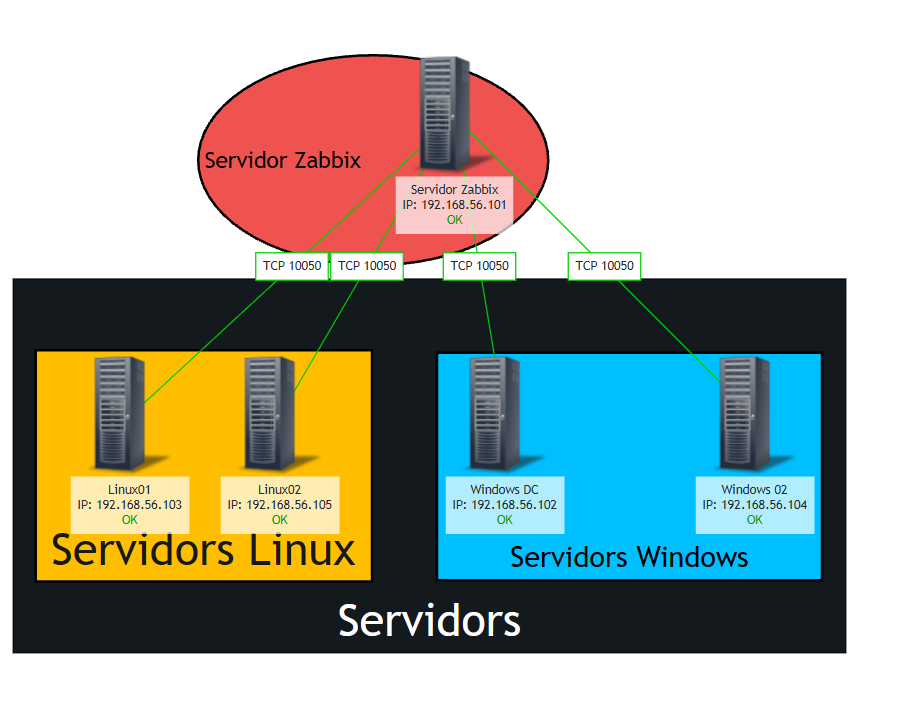

# Documentacio Completa: Creacio i Configuracio de Mapes en Zabbix

## Detall del Proces Configuratiu

### Fase 1: Acces i Seleccio del Modul de Mapes

El primer pas per treballar amb mapes consisteix a accedir a la secció corresponent dins de la interfície web de Zabbix. Com que els mapes són una forma de visualització de dades, es troben sota el menú principal de monitoratge. És crucial que l'usuari disposi de permisos d'escriptura per a la creació de nous elements gràfics.

 La captura mostra el menú lateral esquerre de Zabbix expandit, amb el focus sobre Monitoring i la subopció Maps seleccionada. Al panell central s'observa el llistat per defecte de mapes existents.

### Fase 2: Definicio de les Propietats del Mapa

Un cop s'ha seleccionat l'opció de crear un nou mapa (Create map), cal definir els seus paràmetres base. Aquesta configuració inicial determina l'aspecte i el comportament global del mapa.

 S'observa el formulari de propietats del mapa (Map properties). Els camps clau a omplir són:
* **Name:** Nom descriptiu.
* **Width/Height:** Dimensions en píxels de l'àrea de dibuix.
* **Background image:** Imatge de fons opcional.
* **Highlight options:** Configuració de com es mostren els canvis d'estat sobre els elements.

### Fase 3: Disseny de la Topologia i Elements del Mapa

Amb les propietats ja definides, s'entra en mode d'edició o constructor. Aquesta és la fase més creativa i tècnica, on s'afegeixen els elements reals que es volen monitorar i es defineix la seva posició.

 L'imatge mostra el Constructor (Constructor) de mapes. L'editor permet arrossegar i deixar anar icones. S'observen diferents elements que representen dispositius de xarxa. La barra d'eines superior mostra les opcions per afegir elements de mapa (Add Map element), com ara hosts, grups de hosts o altres submapes.

### Fase 4: Configuracio de Links, Triggers i Estat Final

L'últim pas és afegir "intel·ligència" al mapa. No n'hi ha prou amb tenir icones; aquestes han d'estar connectades per mostrar l'estat dels enllaços. Els "Links" es defineixen entre elements per representar connexions físiques o lògiques.

 Aquesta captura mostra un mapa finalitzat amb tots els elements i enllaços configurats. Es poden observar:
* **Línies de connexió (Links):** Que uneixen els dispositius.
* **Indicadors d'estat:** El color de les icones o les línies pot canviar (verda, groga, vermella) segons si hi ha un trigger actiu (un problema) associat a aquell dispositiu.
* **Etiquetes dinàmiques:** Que mostren informació en temps real com la IP o el nom del host.

---

## Consideracions Tecniques Addicionals

### Jerarquia i Submapes
Zabbix permet una funcionalitat molt útil: els elements del mapa poden ser un altre mapa (Map element type: Map). Això permet crear vistes niades. Per exemple, es pot tenir un mapa global de l'empresa on cada icona sigui un mapa de cada seu regional, facilitant un desglossament visual ràpid (drill-down).

### Actualitzacio i Refresc
Els mapes de Zabbix s'actualitzen automàticament per reflectir els problemes detectats. L'interval de refresc es pot configurar a nivell global del mapa o a nivell d'usuari, per adaptar-lo a les necessitats del centre d'operacions (NOC).

### Manteniment i Seguretat
* És recomanable fer servir icones i nomenclatures estandarditzades per a tot l'equip de monitoratge.
* Cal gestionar els permisos d'usuari per definir qui pot veure el mapa i qui el pot editar (Sharing tab dins de propietats del mapa).
