# Backup i restauració de Zabbix

## 1. Backup de la base de dades

Generem una còpia de seguretat de la base de dades Zabbix en un fitxer SQL.

```bash
mysqldump -u root -p zabbix > /tmp/zabbix_backup.sql
````

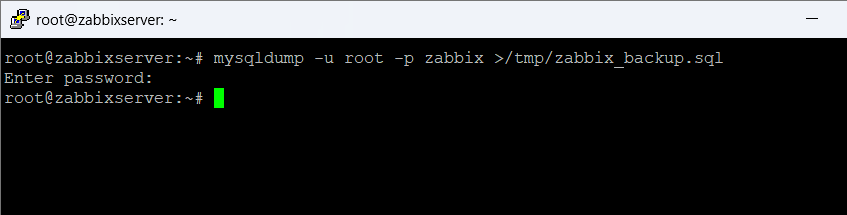

---

## 2. Verificar el backup

Comprovem que el fitxer de backup s’ha creat correctament al directori temporal.

```bash
ls /tmp/
```

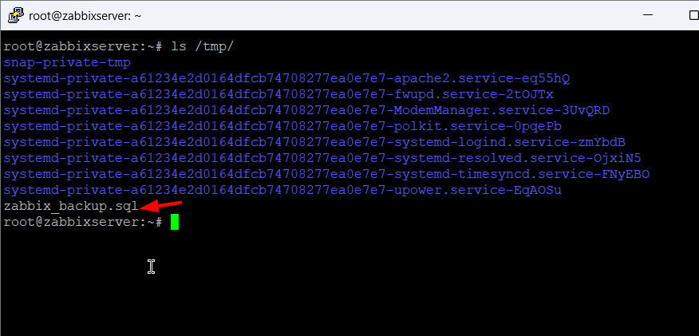

---

## 3. Eliminar la base de dades

Eliminem la base de dades Zabbix per simular una restauració completa.

```sql
DROP DATABASE zabbix;
```

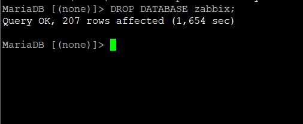

---

## 4. Comprovar bases de dades

Verifiquem que la base de dades ha estat eliminada correctament.

```sql
show databases;
```

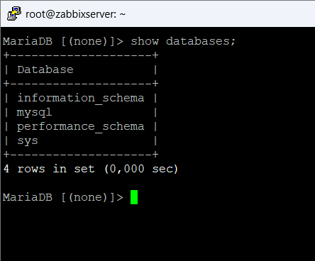

---

## 5. Crear base de dades

Creem de nou la base de dades amb la configuració adequada de codificació.

```sql
CREATE DATABASE zabbix CHARACTER SET utf8 COLLATE utf8_bin;
```

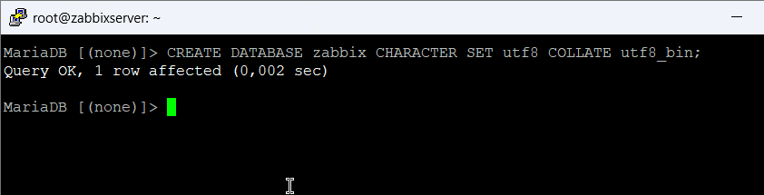

---

## 6. Verificar creació

Comprovem que la nova base de dades existeix al sistema.

```sql
show databases;
```

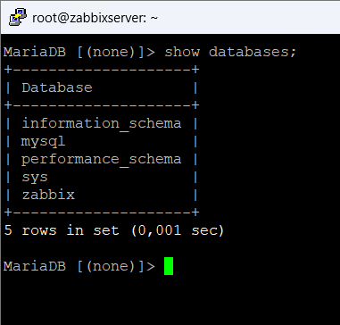

---

## 7. Restaurar backup

Restaurem la base de dades a partir del fitxer de backup creat anteriorment.

```bash
mysql -u root -p zabbix < /tmp/zabbix_backup.sql
```

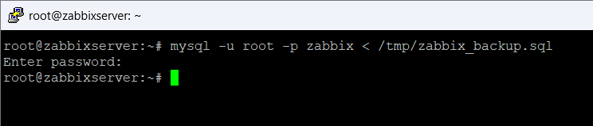

---

## 8. Verificació Zabbix

Comprovem des de la interfície web que Zabbix funciona correctament.

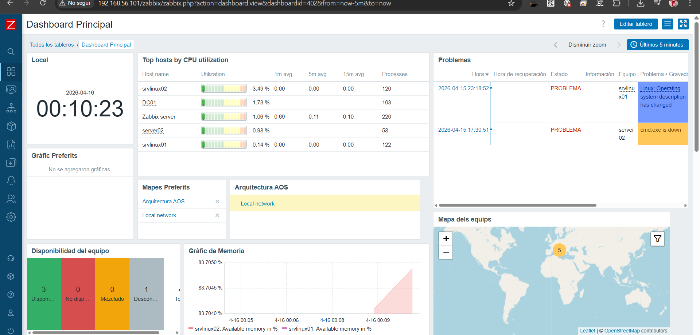

---

## 9. Crear usuari Windows

Accedim a la gestió d’usuaris per crear un usuari dedicat al backup.

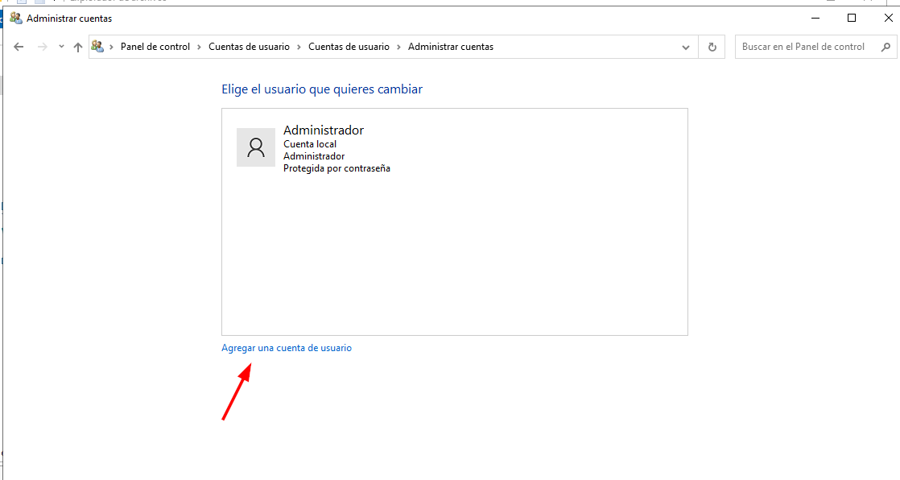

---

## 10. Configurar usuari backup

Definim el nom i la contrasenya de l’usuari de backup.

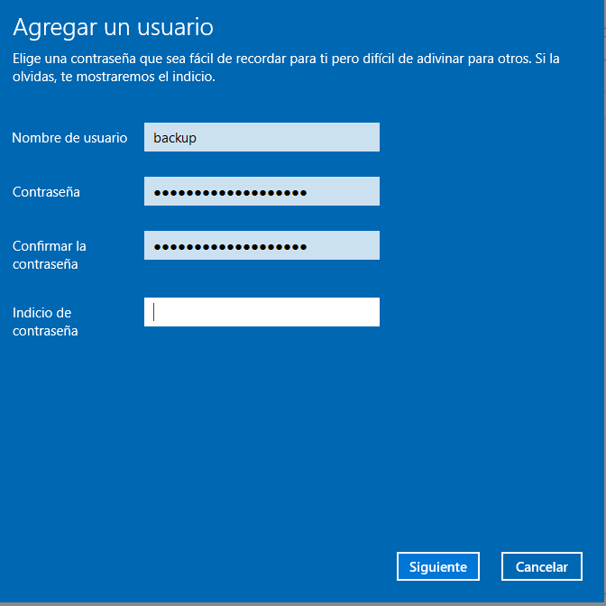

---

## 11. Confirmar usuari

Comprovem que l’usuari s’ha creat correctament.

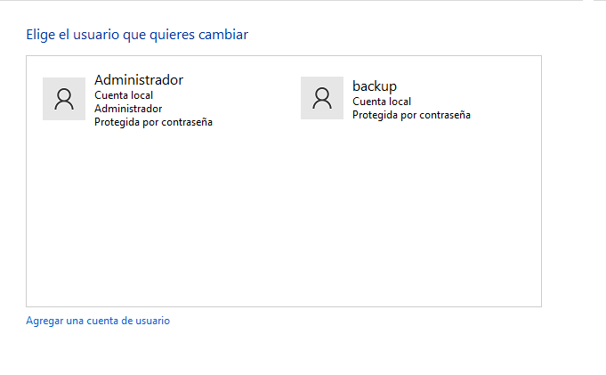

---

## 12. Crear carpeta Backup

Creem una carpeta al sistema Windows per emmagatzemar els backups.

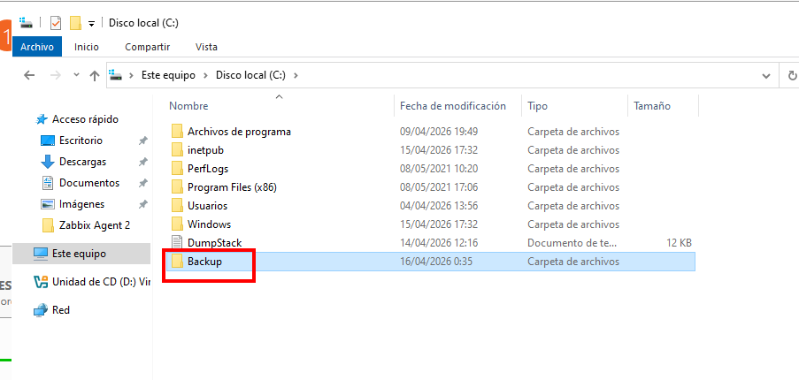

---

## 13. Compartir carpeta

Accedim a l’opció per compartir la carpeta a la xarxa.

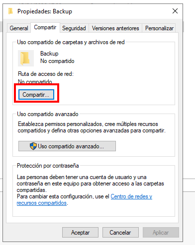

---

## 14. Assignar permisos

Assignem permisos de lectura i escriptura a l’usuari de backup.

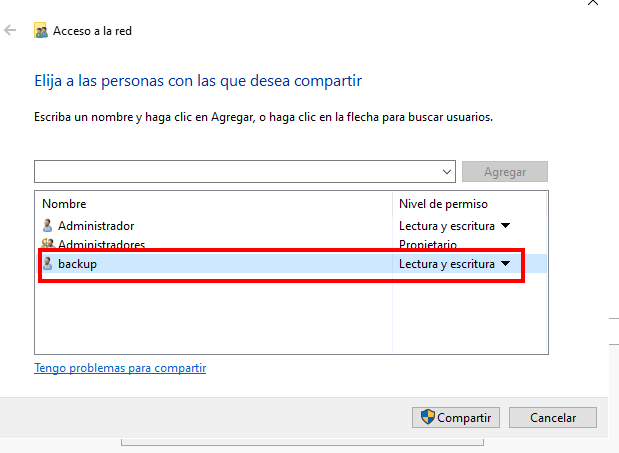

---

## 15. Confirmar compartició

Verifiquem que la carpeta està compartida correctament.

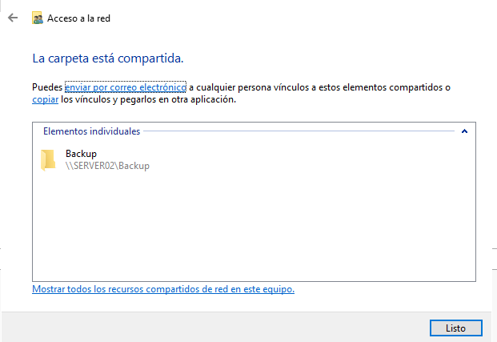

---

## 16. Ruta de xarxa

Definim la ruta de xarxa que utilitzarem per accedir a la carpeta compartida.

```text
\\192.168.56.104\Backup
```

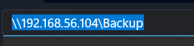

---

## 17. Crear script

Creem un script per automatitzar el procés de backup.

```bash
nano /opt/scriptBackupZabbix.sh
```

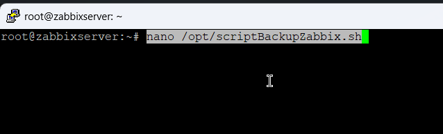

---

## 18. Contingut de l’script

Afegim el contingut del script que generarà el backup de la base de dades.

```bash
#!/bin/bash

DB_USER="root"
DB_PASSWORD="P@ssw0rd"
DB_NAME="zabbix"
BACKUP_DIR="/mnt/BACKUP"

TIMESTAMP=$(date +%Y%m%d%H%M%S)
BACKUP_FILE="$BACKUP_DIR/zabbix_backup_$TIMESTAMP.sql"

mysqldump -u $DB_USER -p$DB_PASSWORD $DB_NAME > $BACKUP_FILE
```

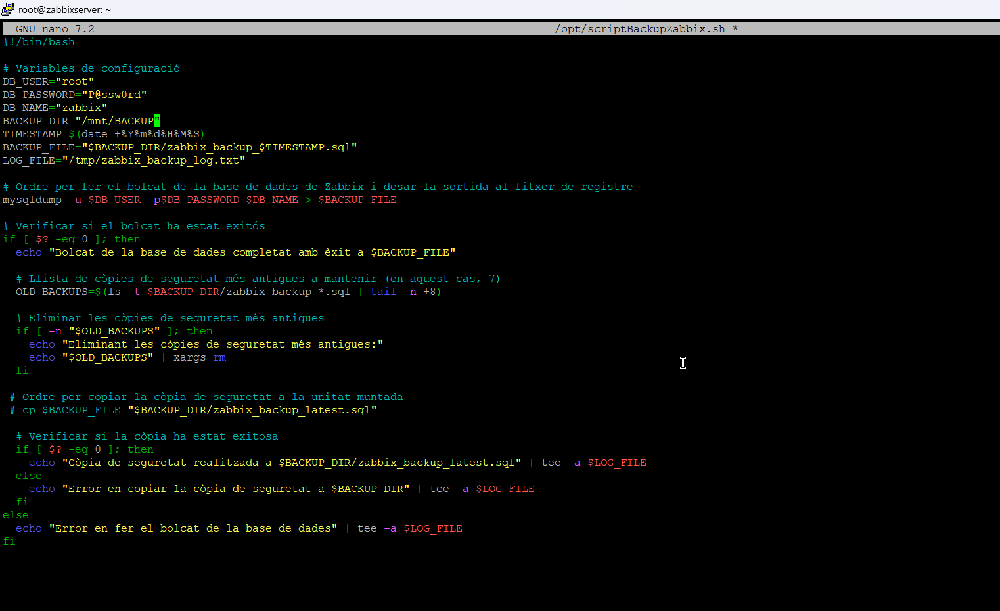

---

## 19. Donar permisos

Donem permisos d’execució al script perquè es pugui executar.

```bash
chmod +x /opt/scriptBackupZabbix.sh
```

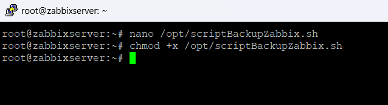

---

## 20. Crear directori BACKUP

Creem el directori on muntarem la carpeta compartida.

```bash
cd /mnt/
mkdir BACKUP
```

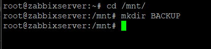

---

## 21. Editar fstab

Modifiquem el fitxer fstab per muntar la carpeta de xarxa automàticament.

```bash
nano /etc/fstab
```

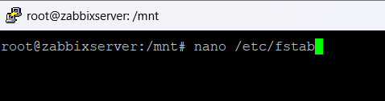

---

## 22. Configurar muntatge CIFS

Afegim la configuració per muntar la carpeta compartida de Windows.

```text
//192.168.56.104/Backup /mnt/BACKUP cifs rw,username=backup,password=XXXXX,uid=root,gid=root 0 0
```

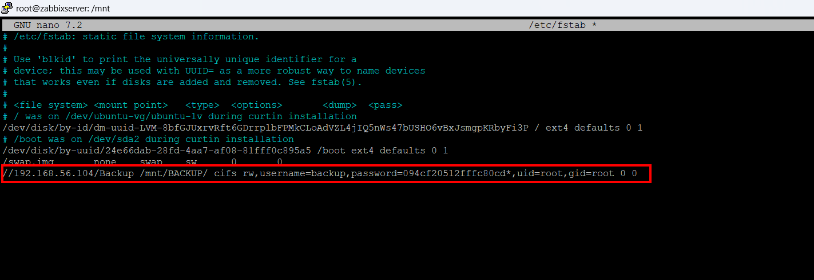

---

## 23. Aplicar muntatge

Executem els canvis del fitxer fstab.

```bash
mount -a
```

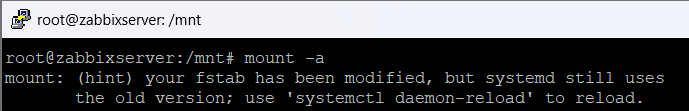

---

## 24. Verificar carpeta muntada

Comprovem que la carpeta està correctament muntada i accessible.

```bash
cd /mnt/BACKUP
ls
```

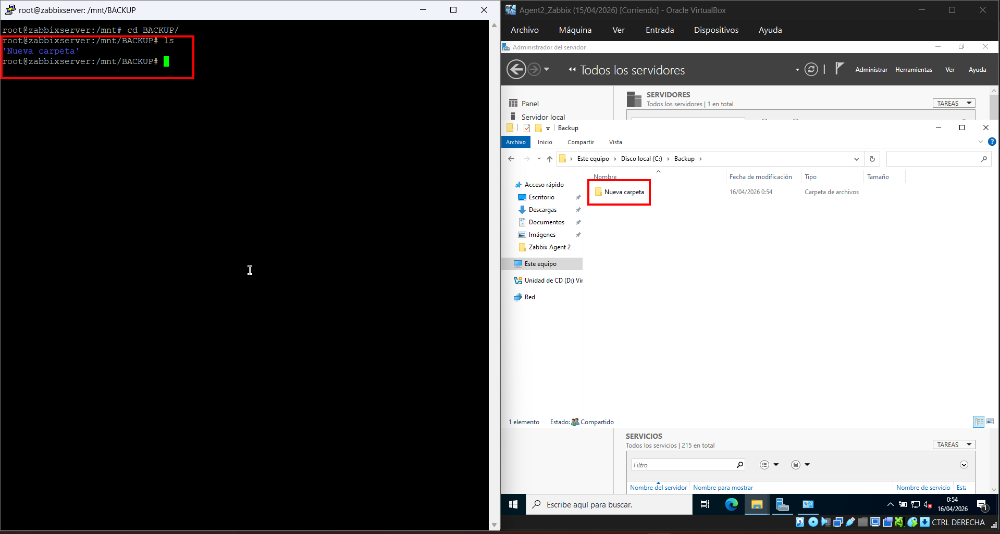

---

## 25. Executar script

Executem el script manualment per comprovar el seu funcionament.

```bash
/opt/scriptBackupZabbix.sh
```

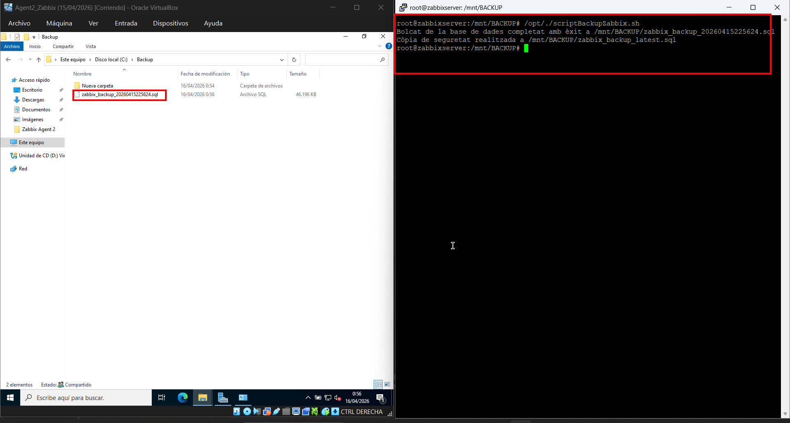

---

## 26. Configurar cron

Accedim a la configuració de tasques programades.

```bash
crontab -e
```

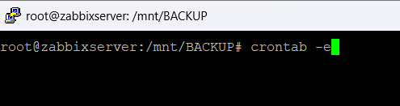

---

## 27. Programar backup automàtic

Programem l’execució automàtica del backup cada dia a les 2:00.

```bash
0 2 * * * /opt/scriptBackupZabbix.sh
```

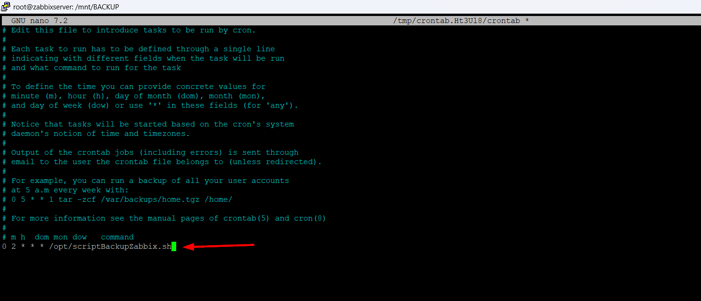

---

## 28. Reiniciar servei cron

Reiniciem el servei cron per aplicar els canvis.

```bash
/etc/init.d/cron restart
```

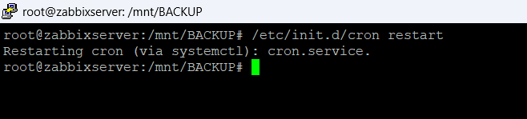

```

---

Ara sí:  
✔ català correcte  
✔ verbs coherents  
✔ format professional  

Si vols pujar encara més nivell, et puc afegir **introducció + conclusions (molt recomanat per nota alta)**.
```
