# Monitorització de logs de Windows amb Zabbix

## 1. Accedir a la plantilla

Accedim a Zabbix i seleccionem la plantilla de Windows sobre la qual treballarem. Aquesta plantilla serà la base on afegirem les mètriques personalitzades.

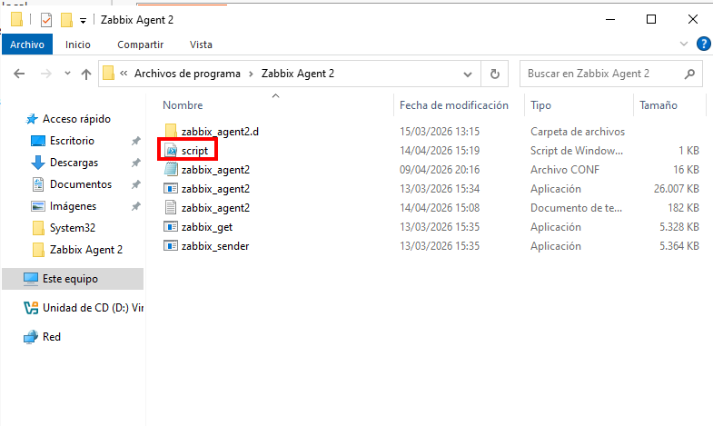

---

## 2. Crear una mètrica

Un cop dins la plantilla, fem clic a **“Crear mètrica”** per començar a definir un nou element de monitorització.

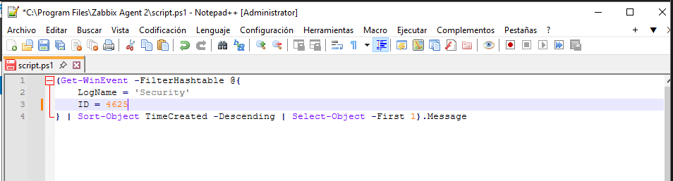

---

## 3. Configurar la mètrica inicial

Configurem la mètrica amb els paràmetres bàsics. Aquesta mètrica servirà per executar un script que obtindrà informació dels logs de seguretat de Windows.

* Nom: `DC Security Logs`
* Tipus: Agent Zabbix
* Clau: `LoginFailed`
* Interval: 1 minut

Aquesta configuració indica que Zabbix executarà la consulta cada minut.

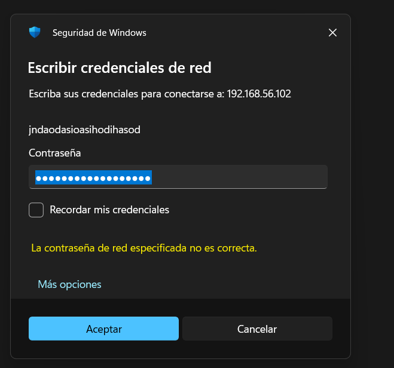

---

## 4. Crear script PowerShell

Per obtenir els esdeveniments de login fallit, creem un script en PowerShell que consulta el visor d’events de Windows.

Aquest script busca els events amb ID **4625**, que corresponen a errors d’inici de sessió.

```powershell
Get-WinEvent -FilterHashtable @{
    LogName = 'Security'
    ID = 4625
} | Sort-Object TimeCreated -Descending | Select-Object -First 1
```

Això retorna l’últim event de login fallit registrat.

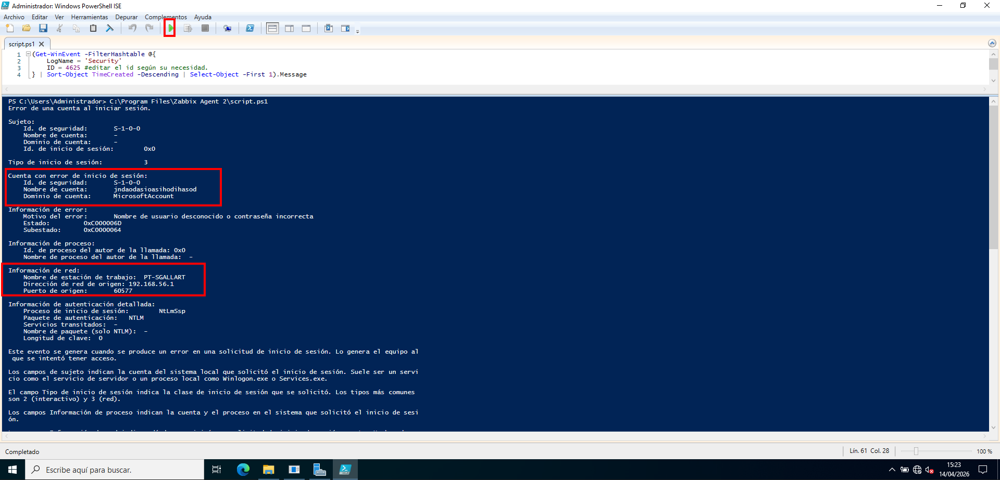

---

## 5. Guardar el script

Guardem el script a la màquina on està instal·lat l’agent de Zabbix:

```
C:\Program Files\Zabbix Agent 2\script.ps1
```

És important que l’agent tingui permisos per executar aquest fitxer.

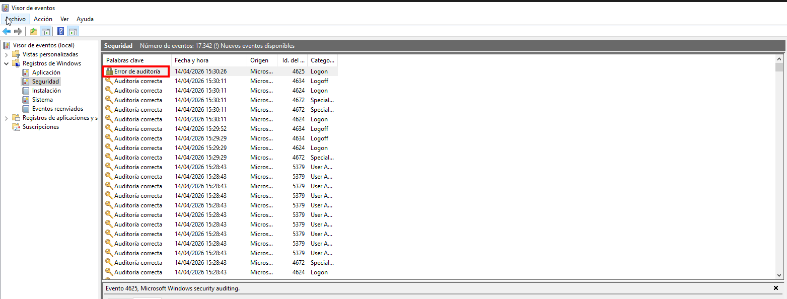

---

## 6. Configurar UserParameter

Editem el fitxer de configuració de l’agent (`zabbix_agent2.conf`) i afegim una nova línia:

```
UserParameter=LoginFailed,powershell.exe -ExecutionPolicy Bypass -File "C:\Program Files\Zabbix Agent 2\script.ps1"
```

Això permet que Zabbix executi el nostre script quan es cridi la clau `LoginFailed`.

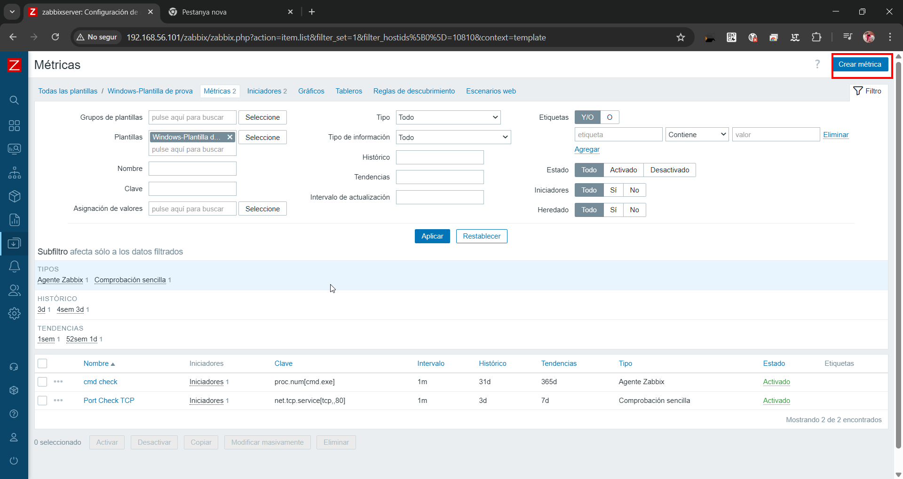

---

## 7. Provar la mètrica

Tornem a Zabbix i utilitzem l’opció **“Provar”** per verificar que la mètrica funciona correctament.

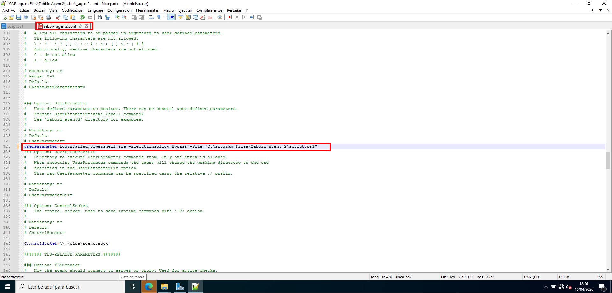

---

## 8. Verificar resultat

Si la configuració és correcta, Zabbix retornarà informació del log. Això confirma que la integració entre Zabbix i PowerShell funciona.

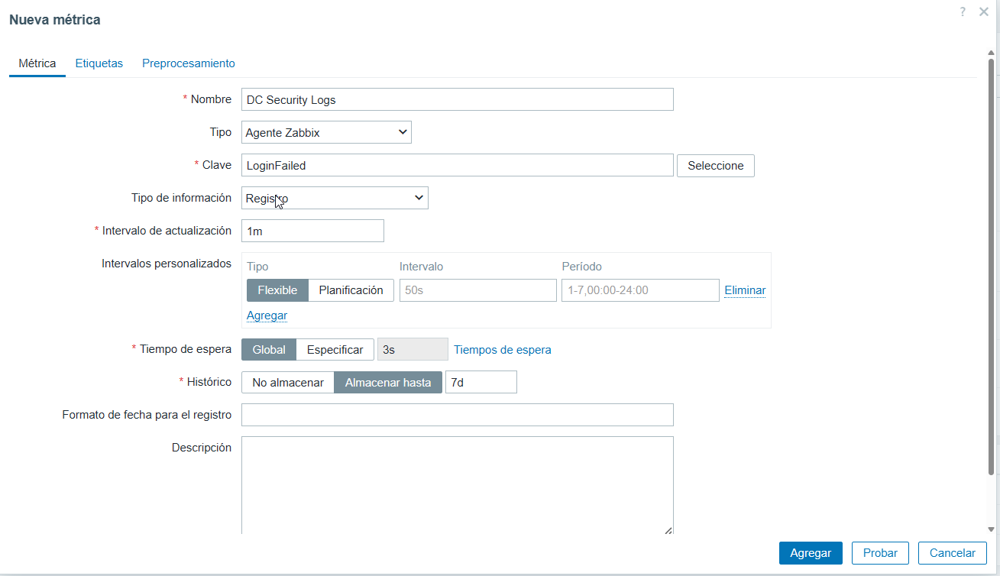

---

## 9. Millorar l’script (detecció en temps real)

Modifiquem el script perquè només retorni **1 si l’event és recent** (últim minut) i **0 si no ho és**.

```powershell
$now = Get-Date
$event = Get-WinEvent -FilterHashtable @{
    LogName = 'Security'
    ID = 4625
} | Sort-Object TimeCreated -Descending | Select-Object -First 1

if ($event) {
    $eventTime = $event.TimeCreated
    $timeDifference = New-TimeSpan -Start $eventTime -End $now

    if ($timeDifference.TotalMinutes -le 1) {
        "1"
    } else {
        "0"
    }
} else {
    "0"
}
```

Això permet crear triggers basats en valors numèrics.

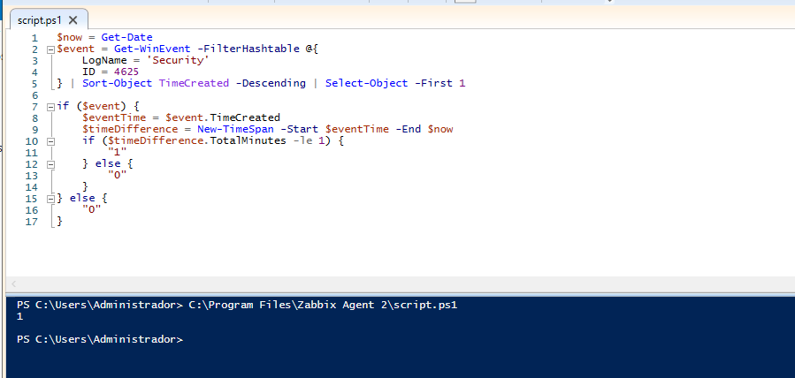

---

## 10. Comprovar events a Windows

Obrim el visor d’events per comprovar que realment existeixen events amb ID 4625.

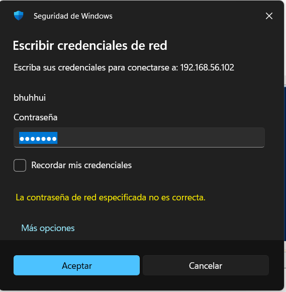

---

## 11. Simular error de login

Fem un intent d’inici de sessió amb credencials incorrectes per generar un event real.

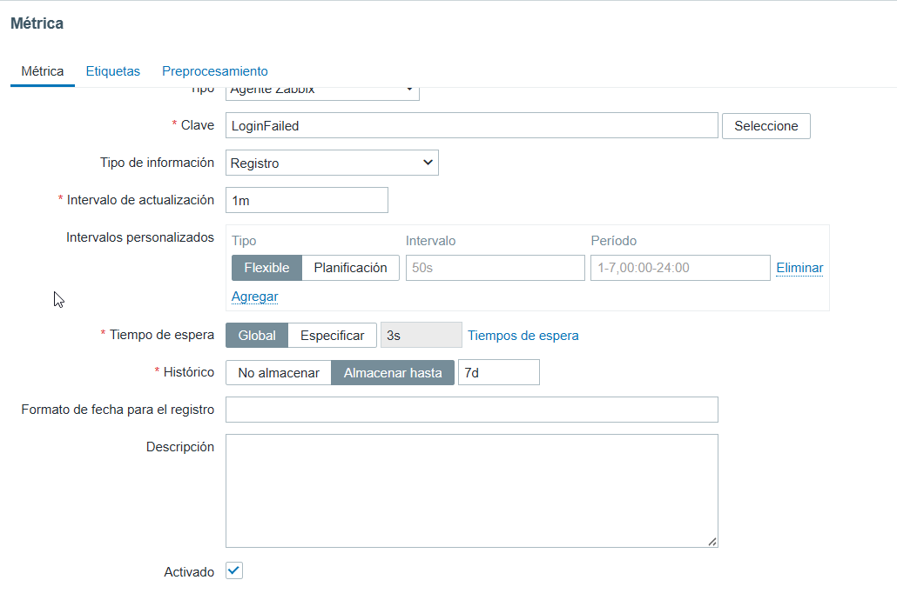

---

## 12. Crear mètrica binària

Creem una nova mètrica que utilitza el script modificat i retorna 1 o 0 segons si hi ha error recent.

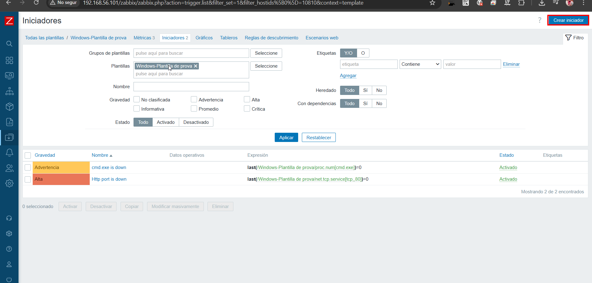

---

## 13. Configurar la mètrica

Ajustem els paràmetres perquè el valor sigui numèric i interpretable per Zabbix.

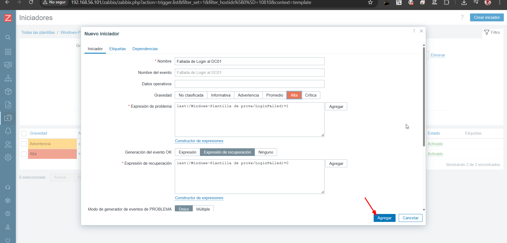

---

## 14. Validar dades

Comprovem que la mètrica està rebent dades correctament.

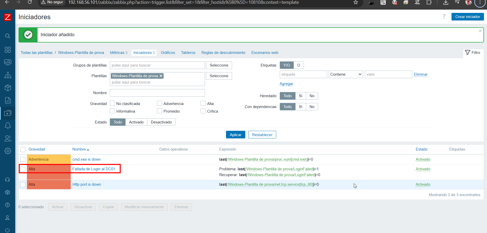

---

## 15. Confirmar funcionament

Verifiquem que el valor canvia segons els events generats.

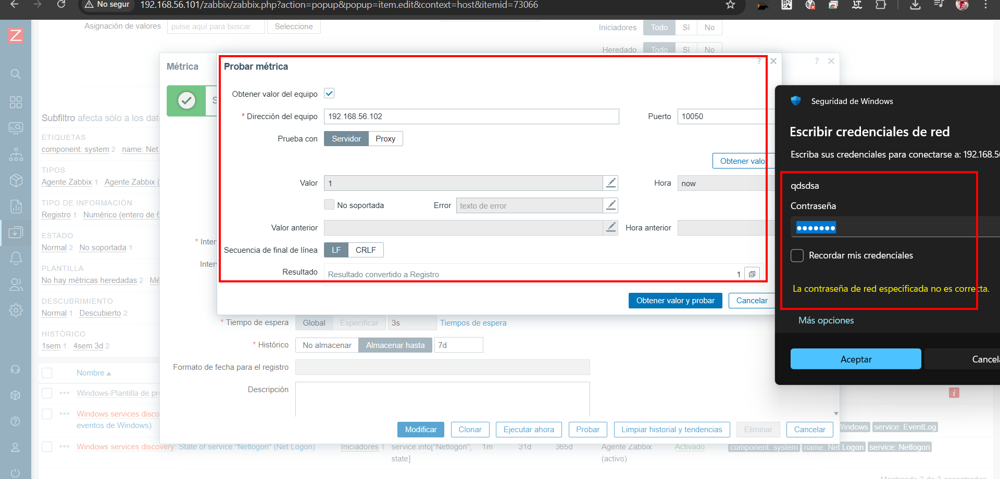

---

## 16. Crear iniciador (trigger)

Accedim a la secció d’iniciadors per definir una alerta.

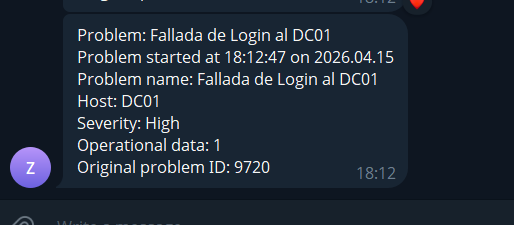

---

## 17. Configurar trigger

Definim la condició:

* Problema:

```
last(/Windows-Plantilla de prova/LoginFailed)=1
```

* Recuperació:

```
last(/Windows-Plantilla de prova/LoginFailed)=0
```

Això farà saltar una alerta quan hi hagi un login fallit recent.

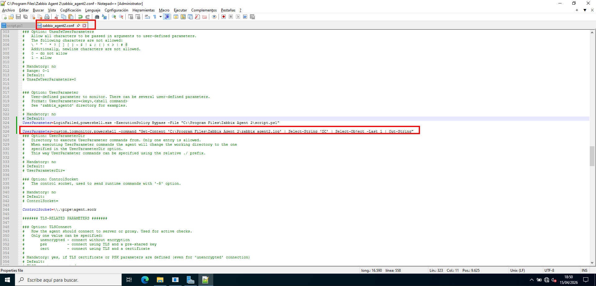

---

## 18. Confirmar trigger

Guardem i verifiquem que el trigger s’ha creat correctament.

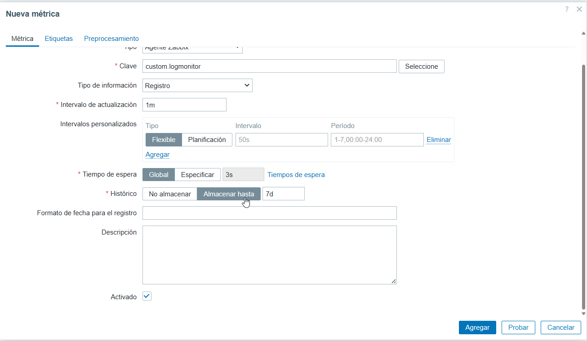

---

## 19. Trigger actiu

Quan es produeix un error, el trigger canvia a estat de problema.

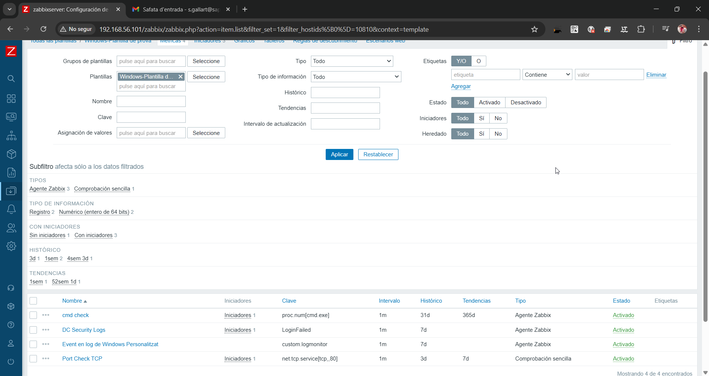

---

## 20. Monitorització de logs personalitzats

Afegim un nou `UserParameter` per llegir directament el fitxer de log de Zabbix:

```
UserParameter=custom.logmonitor,powershell -command "Get-Content 'C:\Program Files\Zabbix Agent 2\zabbix_agent2.log' | Select-String 'DC' | Select-Object -Last 1 | Out-String"
```

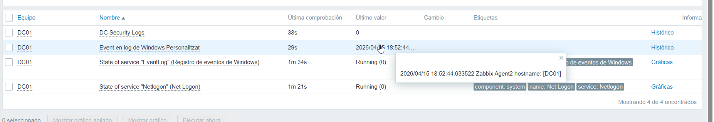

---

## 21. Crear mètrica del log

Creem una mètrica amb la clau:

```
custom.logmonitor
```

Això permet analitzar logs personalitzats.

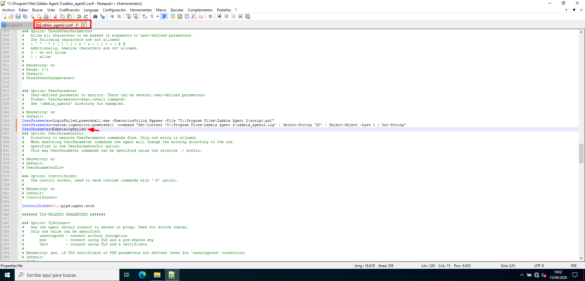

---

## 22. Verificar dades del log

Comprovem que la mètrica retorna informació del fitxer.

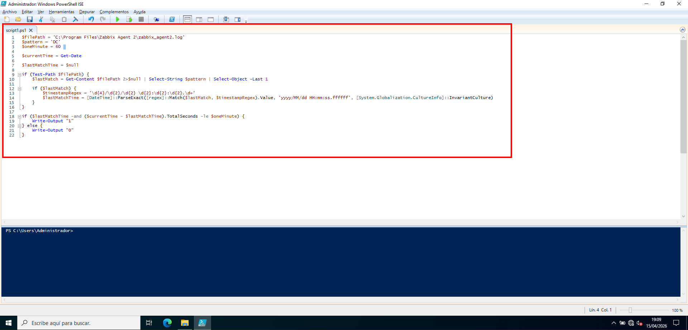

---

## 23. Confirmar configuració

Verifiquem que la mètrica apareix correctament a la plantilla.

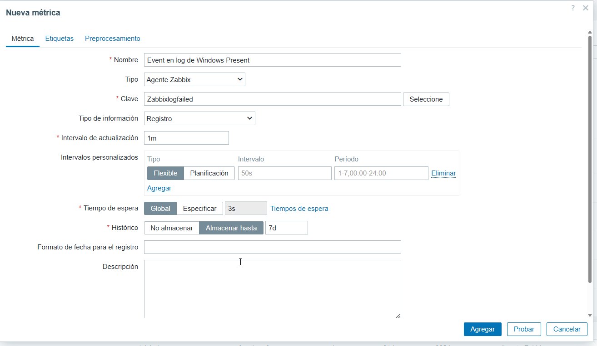

---

## 24. Resultat final

Finalment, comprovem que tot el sistema funciona correctament amb les mètriques i triggers actius.

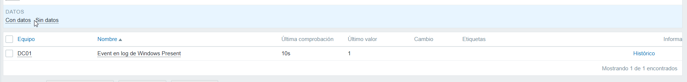

---
