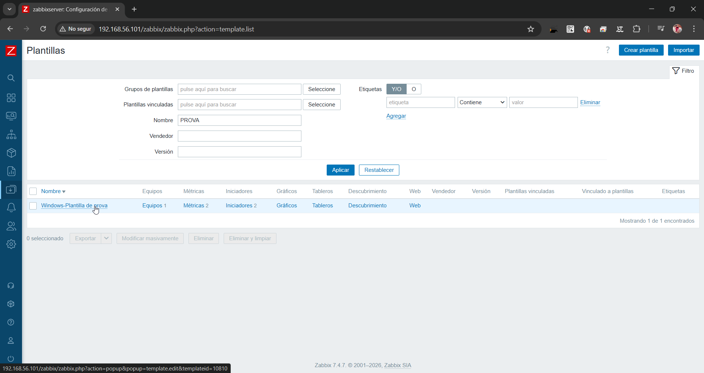
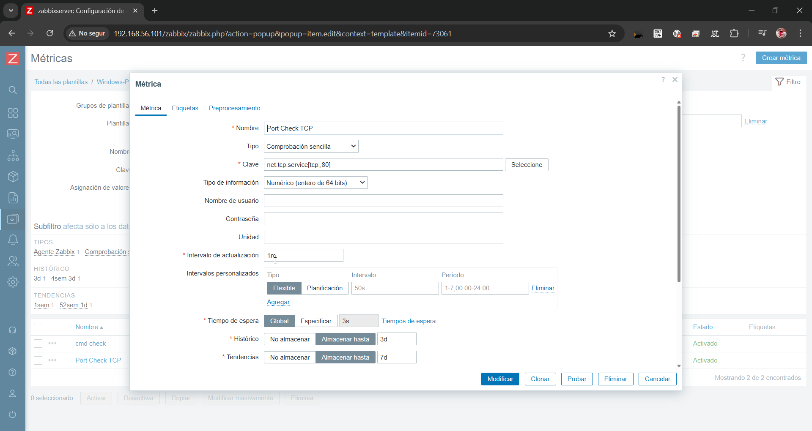
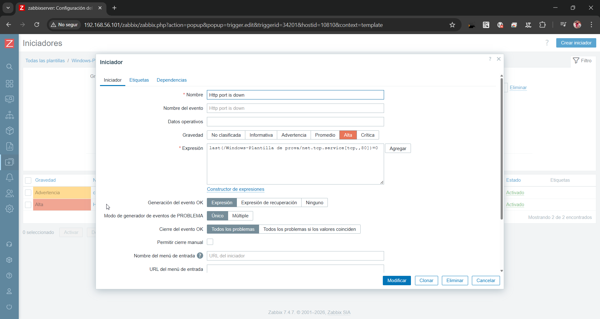
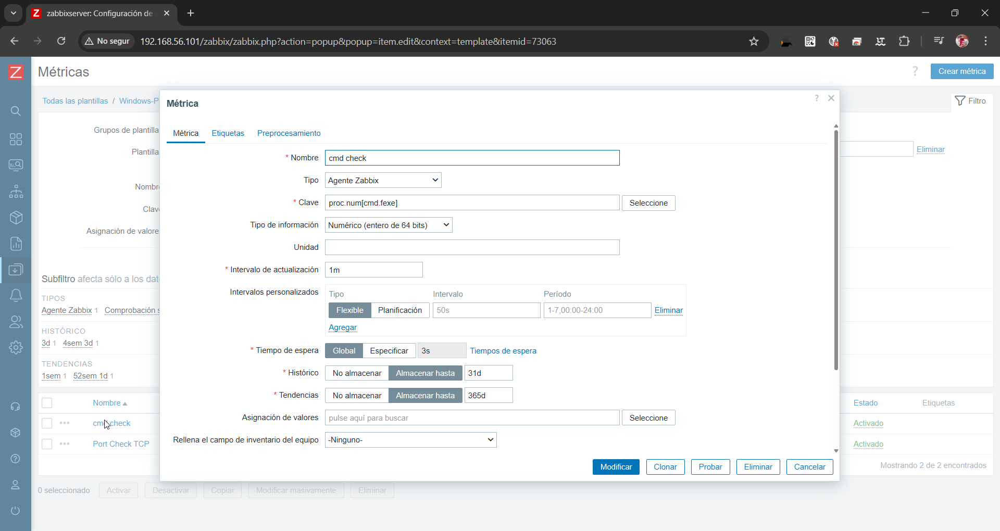
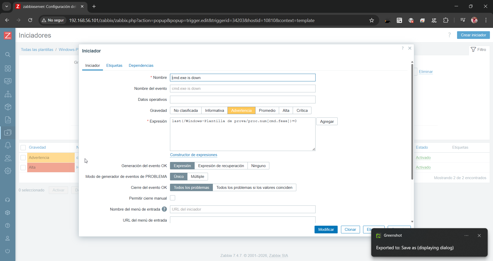

# Creació de plantilles personalitzades

### 1. Llistat de Plantilles
Es mostra la creació de la nova plantilla personalitzada per a les proves de monitoratge.

### 2. Monitoratge del Port HTTP (Port 80)
Configuració de l'item per verificar si el port 80 (TCP) està actiu mitjançant una comprovació senzilla.

### 3. Alerta de Port Caigut
Definició de l'iniciador (trigger) que s'activa quan el servei HTTP no respon. Gravetat: **Alta**.

### 4. Monitoratge del Procés CMD
Configuració per comptar el nombre d'instàncies de l'executable `cmd.exe` que s'estan executant al sistema Windows.

### 5. Alerta de Procés no detectat
Trigger configurat per saltar si el procés `cmd.exe` no s'està executant (valor igual a 0). Gravetat: **Advertència**.

