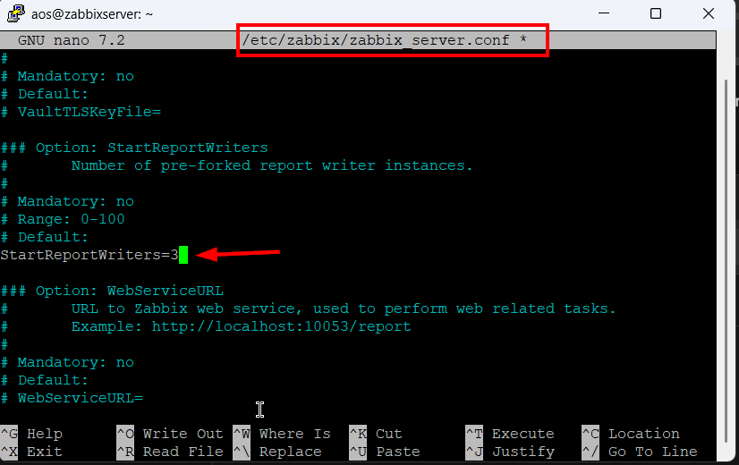
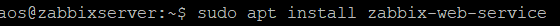
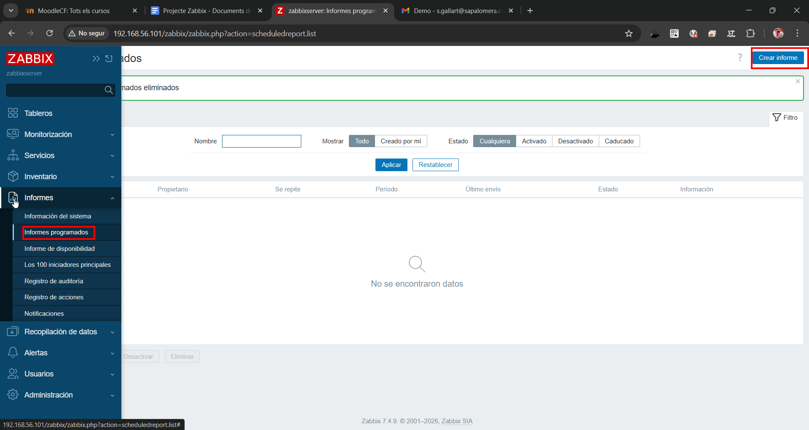
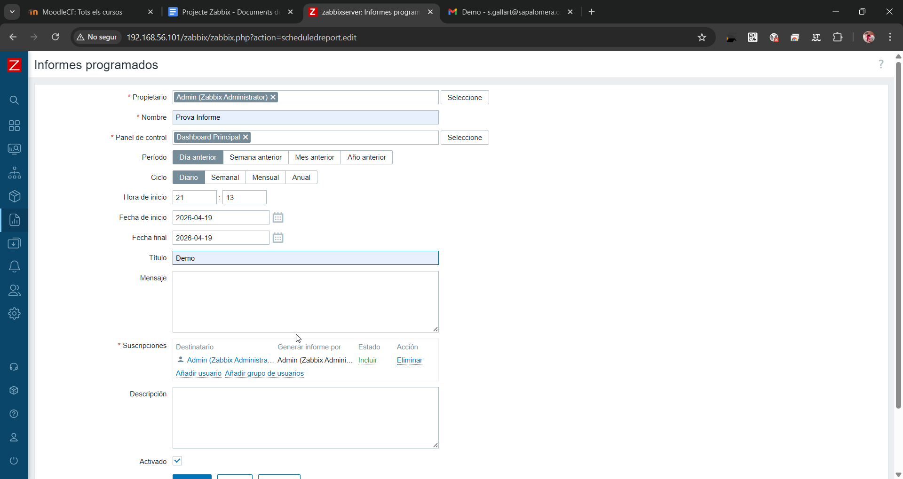
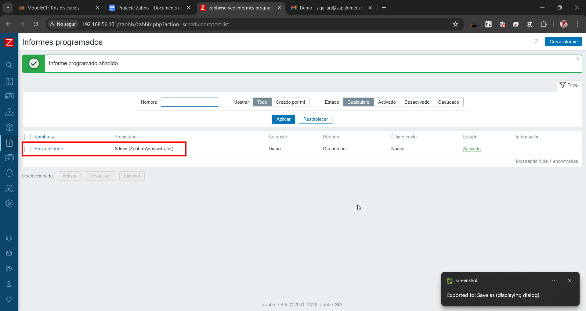
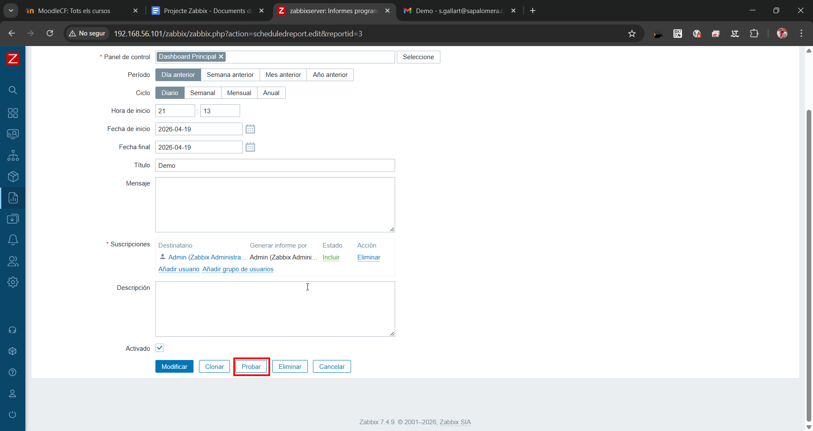
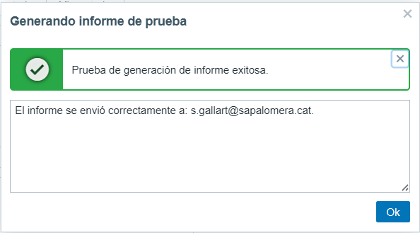
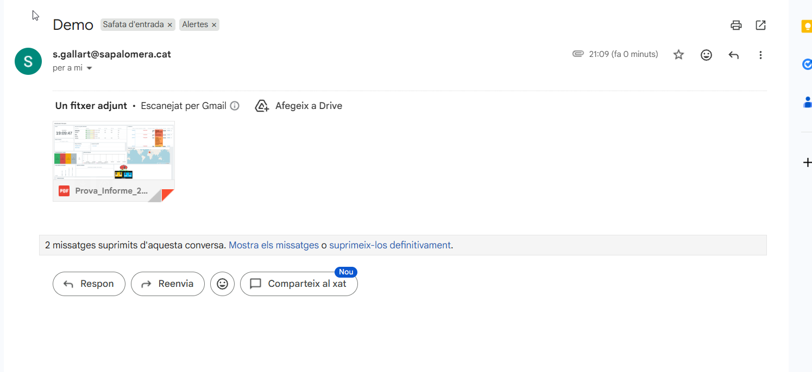
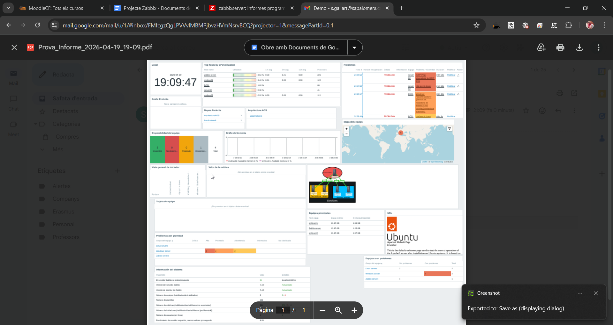

# Configuració d’Informes a Zabbix

## Fase 1: Instal·lació dels components

### Pas 1: Instal·lar el servei web de Zabbix



```bash
sudo apt update
sudo apt install zabbix-web-service
```

Aquest servei gestiona la generació d’informes.

---

### Pas 2: Instal·lar Google Chrome



```bash
wget https://dl.google.com/linux/direct/google-chrome-stable_current_amd64.deb
sudo apt install ./google-chrome-stable_current_amd64.deb
```

Chrome és el motor que genera els PDFs.

---

## Fase 2: Configuració del servidor Zabbix

### Pas 1: Editar el fitxer de configuració



```bash
nano /etc/zabbix/zabbix_server.conf
```

---

### Pas 2: Configurar paràmetres d’informes


```ini
StartReportWriters=3
WebServiceURL=http://localhost:10053/report
```

* **StartReportWriters**: processos per generar informes
* **WebServiceURL**: URL del servei web

---

### Pas 3: Reiniciar el servidor



```bash
systemctl restart zabbix-server
```

---

## Fase 3: Solució de permisos

### Pas 1: Crear directori de treball



```bash
sudo mkdir -p /var/lib/zabbix
```

---

### Pas 2: Assignar permisos



```bash
sudo chown -R zabbix:zabbix /var/lib/zabbix
sudo chmod -R 775 /var/lib/zabbix
```

---

### Pas 3: Activar servei web



```bash
sudo systemctl enable zabbix-web-service
sudo systemctl restart zabbix-web-service
```

---

## Fase 4: Configuració al Frontend

### Pas 1: Accedir a configuració general


Ruta:

* **Administration → General → Other**

---

### Pas 2: Configurar Frontend URL


```
http://192.168.56.101/zabbix/
```

Aquest valor indica quina interfície es capturarà per generar els informes.

---

## Fase 5: Creació i prova d’informes

### Pas 1: Crear informe programat



Ruta:

* **Informes → Informes programados**
* **Crear informe**

Configurem:

* Nom
* Dashboard
* Període
* Destinatari

---

### Pas 2: Generar informe de prova



Cliquem **Probar** per generar un informe manual.

---

### Pas 3: Verificació


Comprovem:

* Missatge d’èxit
* Recepció del correu amb el PDF
