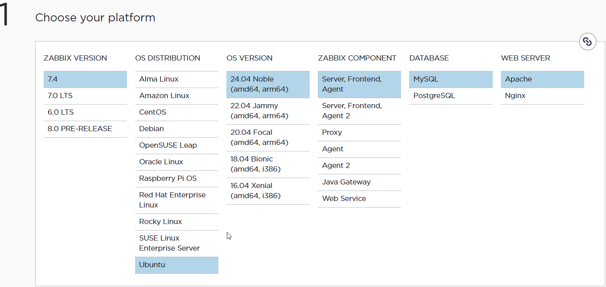

# Instal·lació de les dependències de Zabbix

Per al correcte funcionament s’instal·len els següents components:

- Apache2 (Servidor web)
- MariaDB (Base de dades)
- PHP (Llenguatge necessari per al frontend de Zabbix)

---

## Pas 1 Instal·lació d'Apache i MariaDB
Instal·lem el servidor web Apache i el gestor de base de dades MariaDB.

```bash
sudo apt install apache2 mariadb-server -y
````

## Pas 2 Afegir repositori PHP
Primer instal·lem paquets necessaris per afegir repositoris externs.
```bash
sudo apt install ca-certificates apt-transport-https software-properties-common
```


Seguidament afegim el repositori de PHP.

```bash
add-apt-repository ppa:ondrej/php
```

Aquest repositori permet instal·lar **diferents versions de PHP actualitzades**.

---
## Pas 3 Actualització del sistema
Actualitzem la llista de paquets i instal·lem les últimes versions disponibles.

```bash
sudo apt update -y && sudo apt upgrade -y
```

---

## Pas 4 Instal·lació de PHP8 o 8.1 i extensions
Instal·lem PHP 8 o 8.1 i extensions
#### PHP 8.0
```bash
apt install php8.0 libapache2-mod-php8.0 php8.0-common php8.0-fpm php8.0-cgi php8.0-bcmath php8.0-gd php8.0-imap php8.0-intl php8.0-apcu php8.0-cli php8.0-mbstring php8.0-curl php8.0-mysql php8.0-xml unzip -y
```
#### PHP 8.1
```bash
apt install php8.1 libapache2-mod-php8.1 php8.1-common php8.1-fpm php8.1-cgi php8.1-bcmath php8.1-gd php8.1-imap php8.1-intl php8.1-apcu php8.1-cli php8.1-mbstring php8.1-curl php8.1-mysql php8.1-xml unzip -y
```
#### PHP 8.3 (Que és la que utilitzarem)
```bash
apt install php8.3 libapache2-mod-php8.3 php8.3-common php8.3-fpm php8.3-cgi php8.3-bcmath php8.3-gd php8.3-imap php8.3-intl php8.3-apcu php8.3-cli php8.3-mbstring php8.3-curl php8.3-mysql php8.3-xml unzip -y
```

---
## Pas 5 Comprovació de la versió de PHP

Comprovem que php s'ha instal·lat correctament i la versió que s'ha instal·lat

```bash
php -v
```


En aquest cas el sistema utilitza **PHP 8.3**.

---

## Pas 6 Reinici i comprovació d'Apache

Reiniciem el servidor web i comprovem que està funcionant correctament.

```bash
sudo service apache2 restart
sudo service apache2 status
```
Si apareix:

```
active (running)
```

significa que **Apache està funcionant correctament**.


---

# Instal·lació de Zabbix
Primer accedim a la pàgina web oficial de zabbix en el seguent [enllaç](https://www.zabbix.com/download?zabbix=7.4&os_distribution=ubuntu&os_version=24.04&components=server_frontend_agent&db=mysql&ws=apache "enllaç")
I seleccionar el que volem, en el nostre cas seleccionarem: 
- La última versió(7.4) 
- Sistema Operatiu: Ubuntu
- Versió del SO: 24.04 Noble
- Components de Zabbix: Server, Frontend, Agent
- Base de dades: MySQL
- Servidor Web: Apache
  
Un cop a dins de la pàgina web i havent seleccionat els components, la propia pàgina ens donarà totes les comandes per a realitzar la instal·laciò
## Pas 1 Convertir-se en usuari root
El primer pas és obtenir privilegis de administrador per poder instal·lar paquets i modificar configuracions del sistema.
```bash
sudo -s
```
## Pas 2 Instal·lació del repositori Zabbix
Per poder instal·lar els paquets oficials de Zabbix és necessari afegir el seu repositori al sistema.

Primer es descarrega el paquet del repositori:
```bash
wget https://repo.zabbix.com/zabbix/7.4/release/ubuntu/pool/main/z/zabbix-release/zabbix-release_latest_7.4+ubuntu24.04_all.deb
```
Després s’instal·la el paquet descarregat:
```bash
dpkg -i zabbix-release_latest_7.4+ubuntu24.04_all.deb
```
Finalment s’actualitza la llista de paquets del sistema:
```bash
apt update
```
## Pas 3 Instal·lació del servidor, frontend i agent
Un cop configurat el repositori, s’instal·len els components principals de Zabbix:
```bash
apt install zabbix-server-mysql zabbix-frontend-php zabbix-apache-conf zabbix-sql-scripts zabbix-agent
```
## Pas 4 Creació de la base de dades
Zabbix necessita una base de dades per guardar la informació de monitorització.

Primer accedim al servidor MySQL:
```bash
mysql -uroot -p
```
Després es crea la base de dades:
```sql
create database zabbix character set utf8mb4 collate utf8mb4_bin;
```
Es crea l’usuari que utilitzarà Zabbix:
```sql
create user zabbix@localhost identified by 'P@ssw0rd';
```
Es donen permisos a l’usuari:
```sql
grant all privileges on zabbix.* to zabbix@localhost;
```
S’habilita temporalment una configuració necessària per importar l’esquema:
```sql
set global log_bin_trust_function_creators = 1;
```
## Pas 5 Importació de l’estructura de la base de dades
Ara s’importa l’esquema inicial de Zabbix a la base de dades creada.
```sql
zcat /usr/share/zabbix/sql-scripts/mysql/server.sql.gz | mysql --default-character-set=utf8mb4 -uzabbix -p zabbix
```
Aquest procés crea totes les taules, índexos i dades inicials necessàries per al funcionament del sistema.
Després es torna a desactivar la configuració temporal:
```bash
mysql -uroot -p
```
```sql
set global log_bin_trust_function_creators = 0;
quit;
```
## Pas 6 Configuració de la base de dades al servidor Zabbix
El servidor Zabbix necessita conèixer la contrasenya de la base de dades.

S’edita el fitxer de configuració:    ```/etc/zabbix/zabbix_server.conf```
I es modifica la línia següent:
``DBPassword=password``
On password és la contrasenya configurada per l'usuari de la base de dades.
## Pas 7 Inici dels serveis de Zabbix
Un cop configurat tot el sistema, s’inicien els serveis principals:
```bash
systemctl restart zabbix-server zabbix-agent apache2
```
També es configura el sistema perquè els serveis s’iniciïn automàticament amb el sistema:
```bash
systemctl enable zabbix-server zabbix-agent apache2
```
## Pas 8 Accés a la interfície web
Finalment es pot accedir a la interfície web de Zabbix des d’un navegador utilitzant l’URL: http://host/zabbix

On host correspon a la direcció IP o nom del servidor on hem instal·lat Zabbix.

A través d’aquesta interfície es podrà completar la configuració inicial i començar a monitoritzar dispositius i serveis.
