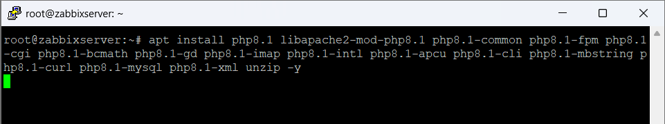
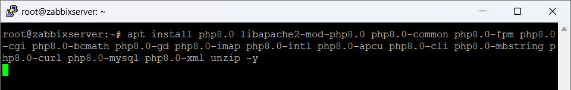

# Instal·lació de l'entorn per Zabbix

En aquesta documentació es mostra el procés de preparació d’un servidor Linux per instal·lar **Zabbix**.  
Per al correcte funcionament s’instal·len els següents components:

- Apache2 (Servidor web)
- MariaDB (Base de dades)
- PHP (Llenguatge necessari per al frontend de Zabbix)

---

# 1. Instal·lació d'Apache i MariaDB


## Pas 1
Instal·lem el servidor web Apache i el gestor de base de dades MariaDB.

```bash
sudo apt install apache2 mariadb-server -y
````

### Explicació

* **sudo** → executa la comanda amb permisos d'administrador
* **apt install** → instal·la paquets des del repositori
* **apache2** → servidor web que utilitzarà Zabbix
* **mariadb-server** → base de dades on Zabbix guardarà la informació
* **-y** → accepta automàticament la instal·lació

---

# 2. Actualització del sistema


## Pas 2

Actualitzem la llista de paquets i instal·lem les últimes versions disponibles.

```bash
sudo apt update -y && sudo apt upgrade -y
```

### Explicació

* **apt update** → actualitza la llista de paquets disponibles
* **apt upgrade** → instal·la les actualitzacions disponibles
* **&&** → executa la segona comanda si la primera ha funcionat

Això garanteix que el sistema estigui **actualitzat i estable**.

---

# 3. Comprovació de la versió de PHP


## Pas 3

Comprovem la versió de PHP instal·lada al sistema.

```bash
php -v
```

### Explicació

Aquesta comanda mostra:

* la versió de PHP
* el motor Zend
* informació de compilació

En aquest cas el sistema utilitza **PHP 8.3**.

---

# 4. Instal·lació de mòduls PHP






## Pas 4

Instal·lem els mòduls PHP necessaris perquè Zabbix funcioni correctament.

Exemple de comanda:

```bash
apt install php8.3 libapache2-mod-php8.3 php8.3-common php8.3-fpm php8.3-cgi php8.3-bcmath php8.3-gd php8.3-imap php8.3-intl php8.3-apcu php8.3-cli php8.3-mbstring php8.3-curl php8.3-mysql php8.3-xml unzip -y
```

### Explicació dels principals mòduls

* **php-mysql** → connexió amb MariaDB
* **php-gd** → processament d’imatges
* **php-mbstring** → suport per caràcters multibyte
* **php-curl** → connexions HTTP
* **php-xml** → processament de dades XML

---

# 5. Reinici i comprovació d'Apache


## Pas 5

Reiniciem el servidor web i comprovem que està funcionant correctament.

```bash
sudo service apache2 restart
sudo service apache2 status
```

### Explicació

* **restart** → reinicia el servei
* **status** → mostra l’estat actual

Si apareix:

```
active (running)
```

significa que **Apache està funcionant correctament**.

---

# 6. Instal·lació de paquets per repositoris


## Pas 6

Instal·lem paquets necessaris per afegir repositoris externs.

```bash
sudo apt install ca-certificates apt-transport-https software-properties-common
```

### Explicació

Aquests paquets permeten:

* afegir repositoris externs
* gestionar certificats de seguretat
* instal·lar programari des de fonts HTTPS

---

# 7. Afegir repositori PHP


## Pas 7

Afegim el repositori de PHP mantingut per **Ondřej Surý**.

```bash
add-apt-repository ppa:ondrej/php
```

Aquest repositori permet instal·lar **diferents versions de PHP actualitzades**.

---

