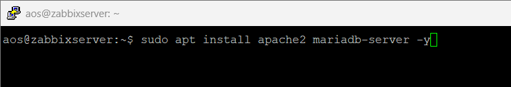
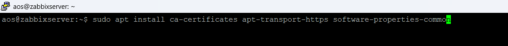
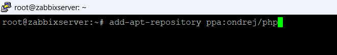
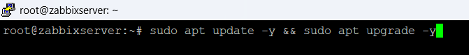
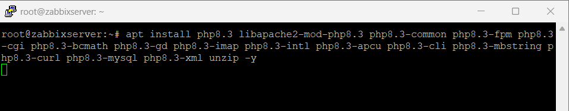
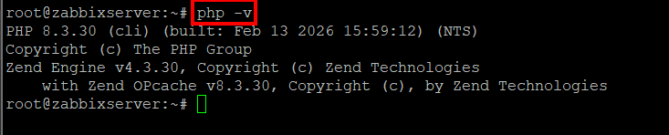
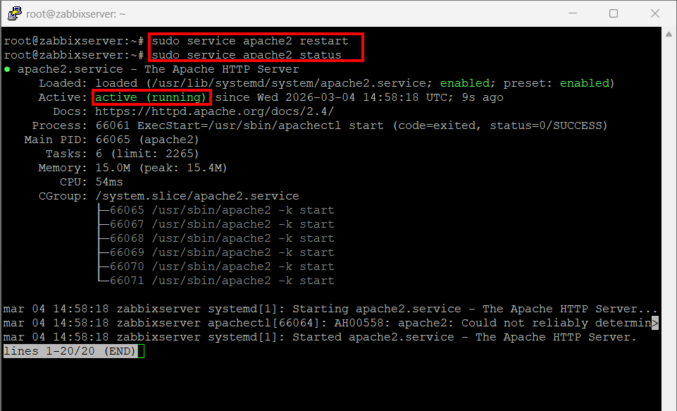

# Instal·lació de l'entorn per Zabbix

Per al correcte funcionament s’instal·len els següents components:

- Apache2 (Servidor web)
- MariaDB (Base de dades)
- PHP (Llenguatge necessari per al frontend de Zabbix)

---

## Pas 1 Instal·lació d'Apache i MariaDB
Instal·lem el servidor web Apache i el gestor de base de dades MariaDB.

```bash
sudo apt install apache2 mariadb-server -y
````

## Pas 2 Afegir repositori PHP
Primer instal·lem paquets necessaris per afegir repositoris externs.
```bash
sudo apt install ca-certificates apt-transport-https software-properties-common
```


Seguidament afegim el repositori de PHP.

```bash
add-apt-repository ppa:ondrej/php
```

Aquest repositori permet instal·lar **diferents versions de PHP actualitzades**.
---
## Pas 3 Actualització del sistema
Actualitzem la llista de paquets i instal·lem les últimes versions disponibles.

```bash
sudo apt update -y && sudo apt upgrade -y
```

---

## Pas 4 Instal·lació de PHP8 o 8.1 i extensions
Instal·lem PHP 8 o 8.1 i extensions
PHP8
```bash
apt install php8.0 libapache2-mod-php8.0 php8.0-common php8.0-fpm php8.0-cgi php8.0-bcmath php8.0-gd php8.0-imap php8.0-intl php8.0-apcu php8.0-cli php8.0-mbstring php8.0-curl php8.0-mysql php8.0-xml unzip -y
```
PHP8.1
```bash
apt install php8.1 libapache2-mod-php8.1 php8.1-common php8.1-fpm php8.1-cgi php8.1-bcmath php8.1-gd php8.1-imap php8.1-intl php8.1-apcu php8.1-cli php8.1-mbstring php8.1-curl php8.1-mysql php8.1-xml unzip -y
```
PHP8.3 (Que és la que utilitzarem)
```bash
apt install php8.3 libapache2-mod-php8.3 php8.3-common php8.3-fpm php8.3-cgi php8.3-bcmath php8.3-gd php8.3-imap php8.3-intl php8.3-apcu php8.3-cli php8.3-mbstring php8.3-curl php8.3-mysql php8.3-xml unzip -y
```

---
## Pas 5 Comprovació de la versió de PHP

Comprovem la versió de PHP instal·lada al sistema.

```bash
php -v
```


En aquest cas el sistema utilitza **PHP 8.3**.

---

## Pas 6 Reinici i comprovació d'Apache

Reiniciem el servidor web i comprovem que està funcionant correctament.

```bash
sudo service apache2 restart
sudo service apache2 status
```
Si apareix:

```
active (running)
```

significa que **Apache està funcionant correctament**.


---
