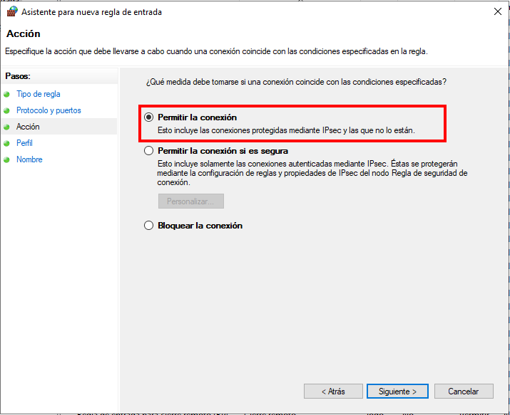
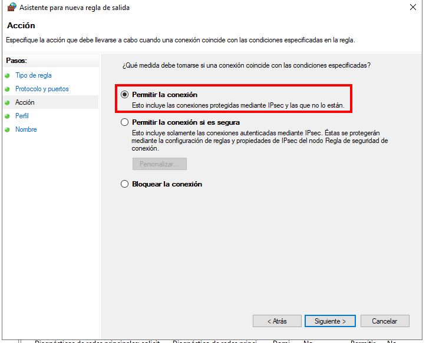

# Instal·lació i configuració de l'agent de Zabbix en Windows
---

## 1. Instal·lació de l'agent a la màquina client

### Pas 1: Benvinguda i llicència
Iniciem l'execució de l'instal·lador oficial de Zabbix i acceptem els termes de la llicència.

### Pas 2: Configuració del servidor (Zabbix Server)
Configurem la IP del servidor Zabbix i el nom d'equip (Hostname) que s'utilitzarà per identificar el client.

### Pas 3: Selecció de ruta i components
Triem el directori d'instal·lació i els components de l'agent que volem habilitar.

### Pas 4: Finalitzar la instal·lació
Procedim a la instal·lació dels fitxers i finalitzem l'assistent.

---

## 2. Configuració del Firewall de Windows

Cal obrir el port **10050/TCP** per permetre que el servidor es pugui comunicar amb l'agent.

### Pas 1: Accés al Firewall i Nova Regla
Accedim al Firewall i creem una nova regla d'entrada.

### Pas 2: Configuració del Wizard de la Regla
Seguim els passos de l'assistent del Firewall en l'ordre correcte:
1. **Ports**: Seleccionem el tipus "Port" i especifiquem el port **10050**.
2. **Acció**: Seleccionem "Allow the connection".
3. **Perfils**: Configurem on s'aplica la regla (Domini, Privat, Públic).
4. **Nom**: Posem un nom descriptiu a la regla (ex: "Zabbix Agent").

---

## 3. Verificació de l'estat del servei

Comprovem que el servei de Zabbix Agent s'ha creat i s'està executant correctament a la màquina client.

---

## 4. Configuració del Host al Servidor Zabbix

Ara registrem el client a la interfície web del servidor per començar el monitoratge.

### Pas 1: Accés i creació de Host
Accedim a la web i anem a la secció de configuració d'equips.

### Pas 2: Detalls del Host i Plantilla
Configurem el nom, la IP del client i assignem la plantilla (Template) de Windows.

---

## 5. Monitoratge i Resultats (Sortida)

Un cop configurat, verifiquem que la disponibilitat sigui correcta i que s'estiguin rebent dades.

### Pas 1: Estat i Disponibilitat
Comprovem que la icona ZBX estigui en verd i l'equip estigui actiu.

### Pas 2: Visualització de dades (Latest Data)
Revisem les gràfiques i les dades recollides pel servidor.

### Pas 3: Comprovació final
Realitzem les últimes comprovacions de funcionament del sistema.

---

## 6. Manteniment i Gestió de Logs

Gestió dels registres d'activitat de l'agent i opcions de desvinculació.

