# Instal·lació de l'Agent de Zabbix a Linux

## Pas 1: Selecció de la Plataforma
Abans de començar, hem d'anar al lloc web oficial de Zabbix per obtenir les instruccions específiques per a la nostra plataforma.

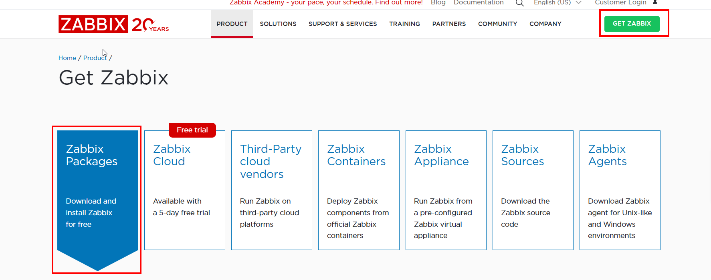
*Accés a la secció de descàrregues de Zabbix.*

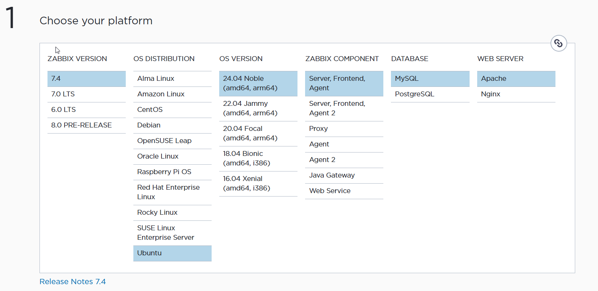
*Selecció de la versió de Zabbix (7.4), el sistema operatiu (Ubuntu), la versió (24.04) i el component (Agent).*

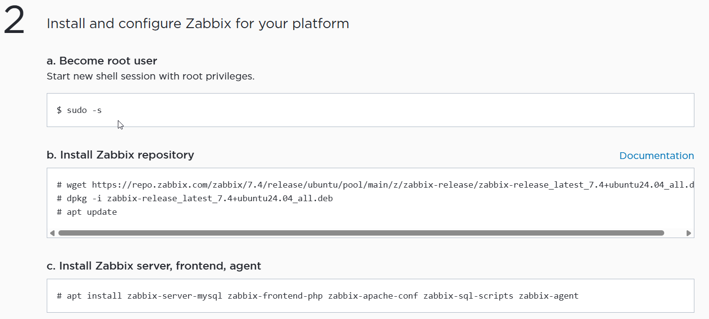

*Resum dels passos que haurem d'executar a la terminal.*

## Pas 2: Instal·lació de l'Agent
Executem les comandes necessàries per descarregar el repositori i instal·lar l'agent.

```bash
# Esdevenir usuari root
sudo -s

# Descarregar el repositori de Zabbix
wget https://repo.zabbix.com/zabbix/7.4/release/ubuntu/pool/main/z/zabbix-release/zabbix-release_latest_7.4+ubuntu24.04_all.deb

# Instal·lar el repositori
dpkg -i zabbix-release_latest_7.4+ubuntu24.04_all.deb

# Actualitzar els repositoris
apt update

# Instal·lar l'agent de Zabbix
apt install zabbix-agent
```

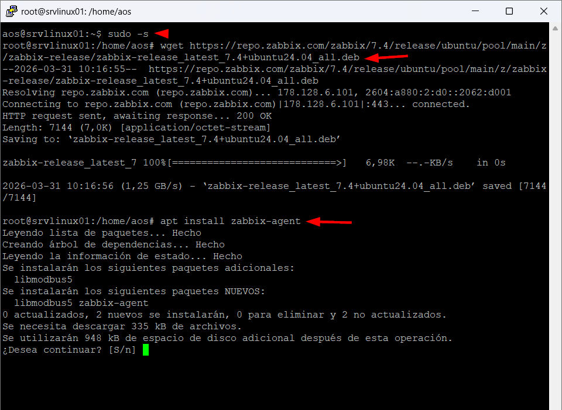
*Execució de les comandes d'instal·lació a la terminal.*

## Pas 3: Configuració del fitxer de l'Agent
Hem de configurar l'agent perquè es comuniqui amb el nostre servidor Zabbix.

```bash
# Editar el fitxer de configuració
nano /etc/zabbix/zabbix_agentd.conf
```


*Obertura del fitxer de configuració amb nano.*

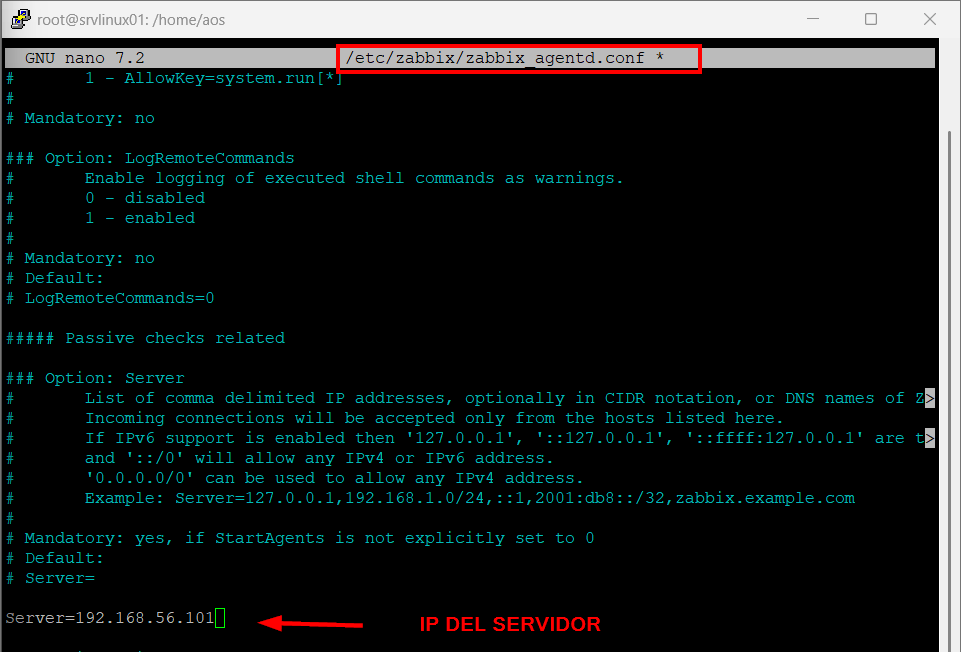

*Edició del paràmetre `Server` amb la IP del servidor Zabbix (`192.168.56.101`).*

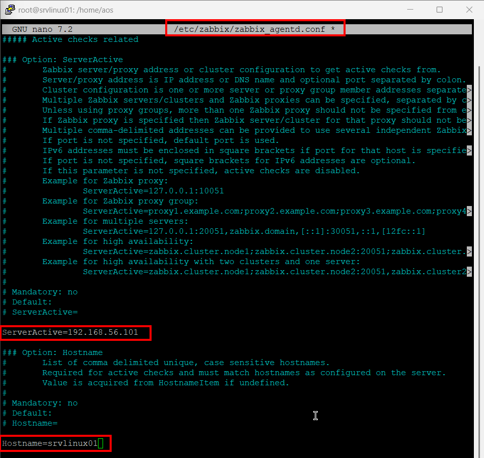

*Configuració de `ServerActive` (IP del servidor) i el `Hostname` de la màquina local (`srvlinux01`).*

## Pas 4: Seguretat i Gestió del Servei
Configuració del tallafocs i activació del servei.

```bash
# Obrir els ports al tallafocs
ufw allow 10050
ufw allow 10051
```

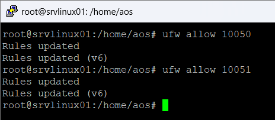

*Obertura dels ports 10050 i 10051.*

```bash
# Reiniciar el servei de l'agent
systemctl restart zabbix-agent.service

# Habilitar el servei perquè s'iniciï amb el sistema
systemctl enable zabbix-agent.service

# Comprovar l'estat del servei
systemctl status zabbix-agent.service
```

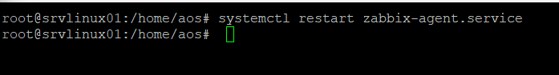

*Reinici del servei.*

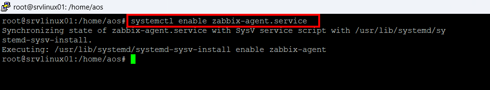

*Activació del servei.*

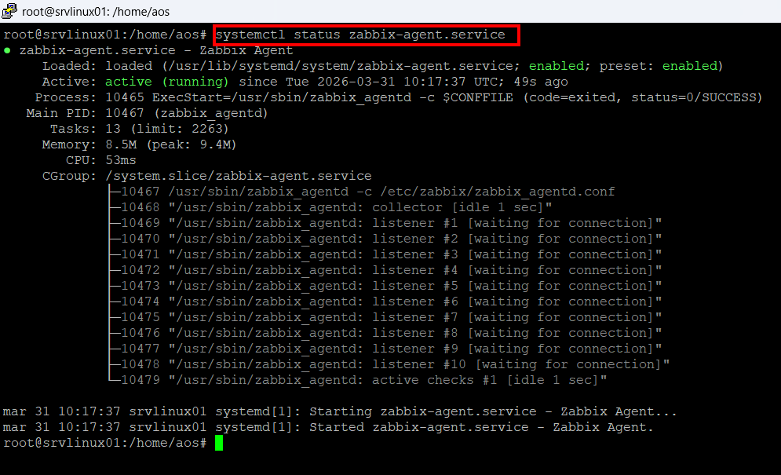

*Estat del servei (active/running).*

## Pas 5: Configuració a la Interfície Web
Un cop l'agent està funcionant, l'hem de donar d'alta al servidor Zabbix.

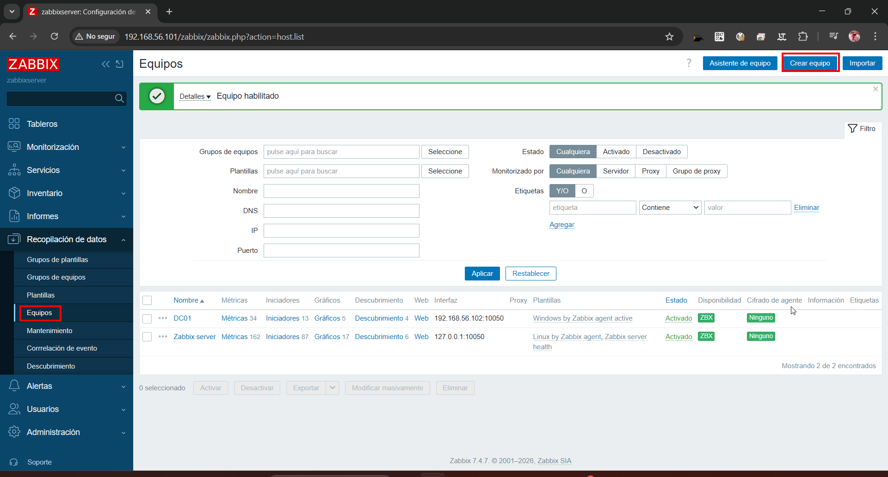

*Dins del panell de Zabbix, anem a "Recopilación de datos" -> "Equipos" i cliquem a "Crear equipo".*

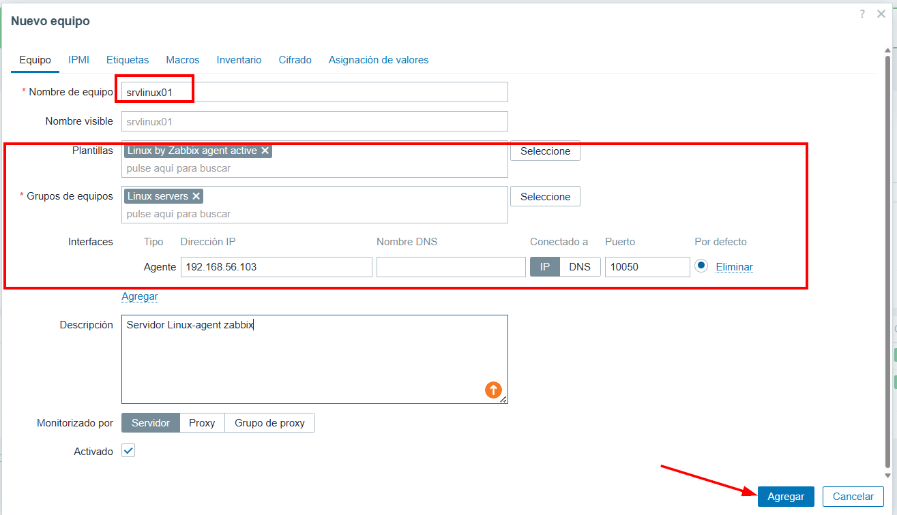

*Introduïm el nom de l'equip (`srvlinux01`), seleccionem la plantilla "Linux by Zabbix agent active" i el grup "Linux servers". També configurem la interfície de l'agent amb la seva IP.*

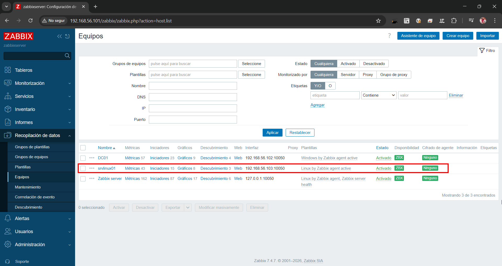

*Confirmació que l'equip apareix a la llista com a actiu i amb disponibilitat (ZBX en verd).*

## Pas 6: Verificació de les Dades
Finalment, comprovem que el servidor està rebent informació de la màquina.

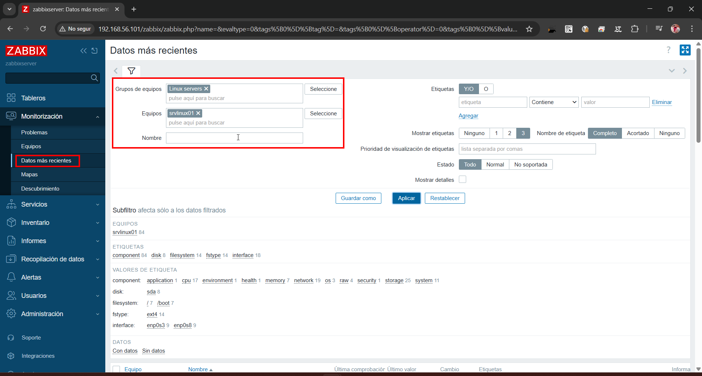

*Naveguem a "Monitorización" -> "Datos más recientes" i filtrem per l'equip.*

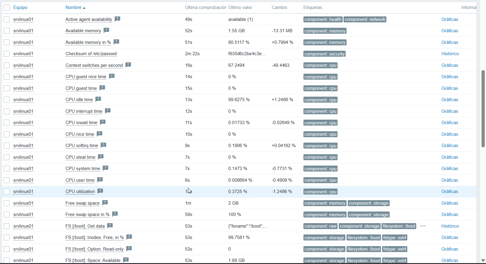

*Llistat detallat de les mètriques rebudes (memòria, CPU, etc.), confirmant que la instal·lació ha estat un èxit.*
