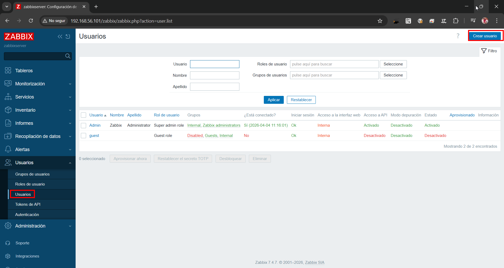
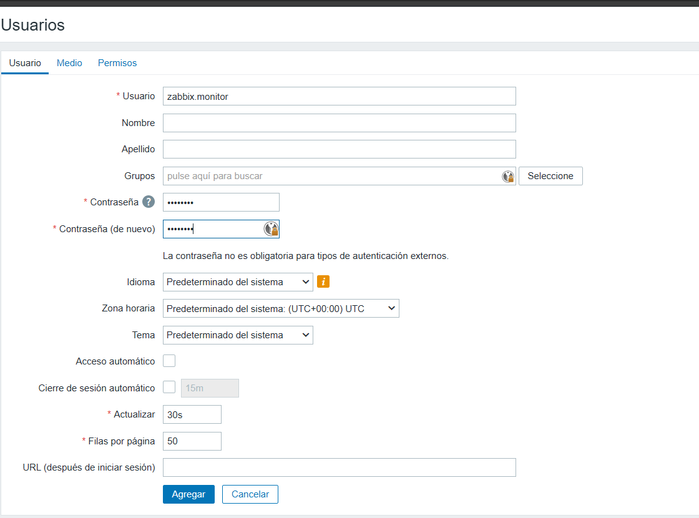

# Integració d'Active Directory amb Zabbix

Aquest document presenta el pas a pas complet del procés d'instal·lació, configuració i integració realitzat, amb una explicació individual per a cada captura de pantalla.

---

## 1. Instal·lació del Rol de Servidor
El primer pas és preparar el servidor Windows Server per actuar com a controlador de domini.

### Instal·lació del Rol AD DS


En aquesta pantalla del gestor del servidor, seleccionem el rol **"Servicios de dominio de Active Directory"**. Aquest component és el que permetrà gestionar usuaris, equips i polítiques de seguretat de manera centralitzada.

---

## 2. Configuració del Controlador de Domini (Pas a Pas)
Un cop instal·lat el rol, procedim a promocionar el servidor a controlador de domini.

### Pas 1: Selecció de l'operació


Triem l'opció **"Agregar un nuevo bosque"** i definim el nom del domini arrel com a `aos.cat`. Aquesta és la base de la nostra estructura de directori.

### Pas 2: Opcions del controlador


Establim els nivells funcionals del bosc i del domini (Windows Server 2016). També definim la **contrasenya de DSRM** (Modo de restauración de servicios de directorio), vital per a la recuperació del sistema en cas de fallada.

### Pas 3: Opcions addicionals (NetBIOS)


El sistema assigna automàticament el nom NetBIOS **AOS**. Aquest nom s'utilitza per a la compatibilitat amb versions anteriors de Windows i per a la identificació a la xarxa local.

### Pas 4: Rutes d'accés


Definim on s'emmagatzemaran la base de dades (NTDS), els fitxers de registre i la carpeta **SYSVOL**. S'han deixat les rutes per defecte de Windows per a una configuració estàndard.

### Pas 5: Revisió d'opcions


Resum de totes les configuracions seleccionades. És el moment de verificar que el domini, el NetBIOS i els nivells funcionals són els que hem definit abans de començar la instal·lació real.

### Pas 6: Comprovació de requisits


L'assistent verifica que el servidor compleix tots els requisits previs. Un cop apareix el missatge verd de **"Todas las comprobaciones se realizaron correctamente"**, podem procedir amb la instal·lació.

### Pas 7: Inici de sessió al domini


Primer inici de sessió un cop el domini està actiu i el servidor s'ha reiniciat. Observem que ara ens identifiquem com a **AOS\Administrador**, confirmant que el servidor ja és el controlador del nou domini.

### Pas 8: Administració d'Usuaris i Equips


Obrim la consola **Usuarios y equipos de Active Directory** per gestionar el nostre nou domini `aos.cat`.

### Pas 9: Creació de la Unitat Organitzativa


Creem una nova **Unitat Organitzativa (UO)** anomenada **Zabbix** per tenir localitzats tots els usuaris que utilitzarem per a la monitorització.

### Pas 10: Creació de l'usuari zabbix.monitor


Dins de l'UO Zabbix, creem l'usuari **zabbix monitor**. Aquest usuari serà l'encarregat de fer les consultes LDAP des de la plataforma Zabbix.

### Pas 11: Configuració de la contrasenya


Assignem la contrasenya i marquem l'opció **"La contraseña nunca expira"** per evitar talls de servei en el futur.

---

## 3. Integració amb Zabbix i Resolució d'Errors

### Pas 12: Menú d'Autenticació a Zabbix


Anem a Zabbix i entrem al menú d'Autenticació, concretament a la pestanya de **Configuració LDAP**.

### L'Error de PHP LDAP


En intentar configurar LDAP, apareix l'error **"Extensión PHP LDAP faltante"**, ja que el servidor web no té el mòdul necessari instal·lat.

### Solució - Part 1: Instal·lació del mòdul


Executem la comanda d'instal·lació del paquet `php-ldap` al servidor Linux de Zabbix per resoldre la falta de la dependència:
```bash
sudo apt install php8.3-ldap
```

### Solució - Part 2: Reinici de serveis


Activem el mòdul i reiniciem el servidor web perquè els canvis tinguin efecte:
```bash
sudo phpenmod ldap
sudo systemctl restart apache2
```

### Pas 13: Configuració del Servidor LDAP


Introduïm la IP del DC (192.168.56.102), el DN base (`DC=aos,DC=cat`) i l'usuari d'enllaç (`zabbix@aos.cat`).

### Pas 14: Prova de connexió


Realitzem una prova d'inici de sessió (Autenticación de prueba) per verificar que Zabbix pot parlar amb l'Active Directory.

### Pas 15: Connexió correcta


Zabbix ens confirma que l'inici de sessió ha estat correcte amb el missatge verd de **"Inicio de sesión correcto"**.

### Pas 16: Guardar el servidor LDAP


Fem clic a **"Agregar"** per finalitzar el registre del servidor LDAP a la plataforma.

### Pas 17: Alta de l'usuari zabbix.monitor a Zabbix


Creem el compte d'usuari dins de Zabbix i el vinculem a l'autenticació LDAP que acabem de configurar.

### Pas 18: Llista d'usuaris a Zabbix


Podem veure la llista global d'usuaris de Zabbix, on ja apareix l'usuari admin i el nou usuari monitor.

### Pas 19: Login amb zabbix.monitor


Provem d'entrar a la plataforma utilitzant les credencials del domini per a l'usuari `zabbix.monitor`.

### Pas 20: Dashboard de zabbix.monitor


Accés concedit. Es mostra el Dashboard (Global view) amb les dades de monitorització dels hosts.

---

## 4. Configuració de l'usuari zabbix.suport
Creem un segon usuari amb un rol restringit per verificar la gestió de permisos.

### Pas 21: Creació de zabbix.suport a l'AD


Tornem a l'Active Directory i creem un nou usuari anomenat **zabbix suport** dins de l'UO Zabbix.

### Pas 22: Contrasenya de zabbix.suport


Definim la contrasenya per a l'usuari de suport i marquem que no expiri mai.

### Pas 23: Alta de zabbix.suport a Zabbix


Donem d'alta el compte a Zabbix especificant el mètode d'autenticació LDAP.

### Pas 24: Assignació del Rol User (Restringit)


A la pestanya de permisos, li assignem el **User role** per limitar les seves capacitats dins de la plataforma.

### Pas 25: Guardar usuari de suport


Finalitzem la creació de l'usuari fent clic a "Agregar".

### Pas 26: Login amb zabbix.suport


Iniciem sessió a Zabbix amb el nou compte de suport del domini.

### Pas 27: Dashboard restringit de zabbix.suport


Observem que l'usuari de suport té un Dashboard més buit i limitat, confirmant que el rol restringit s'aplica correctament.

---

## 5. Monitorització i Estat Final

### Pas 28: Llista de Hosts monitoritzats


Vista de la secció de monitorització on apareixen el controlador de domini (DC01) i el servidor de Zabbix.

### Pas 29: Gràfics de rendiment


Visualització dels gràfics de càrrega de CPU i ús de memòria en temps real del controlador de domini.

### Pas 30: Estat Global del Sistema


Resum final de l'estat de tots els serveis i equips monitoritzats.

### VM en funcionament
 [Corriendo] - Oracle VirtualBox.png)

Captura final de la màquina virtual Windows Server on s'està executant l'agent de Zabbix de manera estable.
