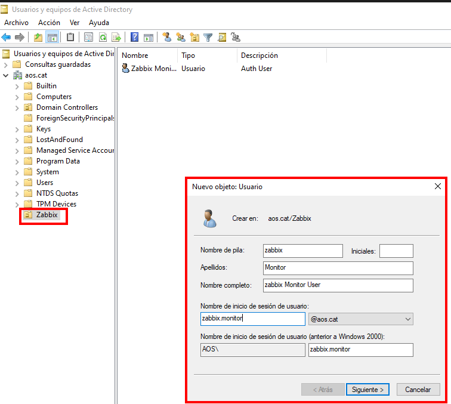
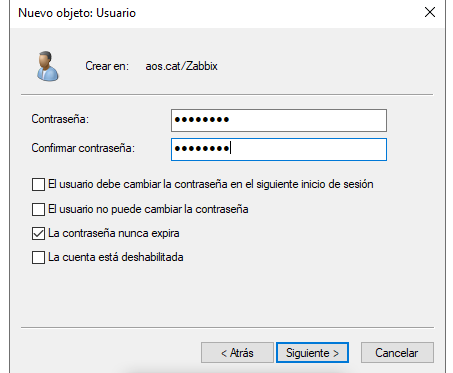

# Guia Detallada de Configuració d'Active Directory i Integració amb Zabbix

Aquest document presenta el pas a pas complet del procés d'instal·lació, configuració i integració realitzat, amb una explicació individual per a cada captura de pantalla.

---

## 1. Instal·lació del Rol de Servidor
El primer pas és preparar el servidor Windows Server per actuar com a controlador de domini.

### Instal·lació del Rol AD DS

En aquesta pantalla del gestor del servidor, seleccionem el rol **"Servicios de dominio de Active Directory"**. Aquest component és el que permetrà gestionar usuaris, equips i polítiques de seguretat de manera centralitzada.

---

## 2. Configuració del Controlador de Domini (Pas a Pas)
Un cop instal·lat el rol, procedim a promocionar el servidor a controlador de domini.

### Pas 1: Selecció de l'operació

Triem l'opció **"Agregar un nuevo bosque"** i definim el nom del domini arrel com a `aos.cat`. Aquesta és la base de la nostra estructura de directori.

### Pas 2: Opcions del controlador

Establim els nivells funcionals del bosc i del domini (Windows Server 2016). També definim la **contrasenya de DSRM** (Modo de restauración de servicios de directorio), vital per a la recuperació del sistema.

### Pas 3: Opcions de DNS

Configuració de les opcions de DNS. Apareix un avís sobre la delegació, que és normal en aquest punt de la instal·lació inicial.

### Pas 4: Nom NetBIOS

El sistema assigna automàticament el nom NetBIOS **AOS**. Aquest nom s'utilitza per a la compatibilitat amb versions anteriors de Windows.

### Pas 5: Rutes d'accés

Definim on s'emmagatzemaran la base de dades (NTDS), els fitxers de registre i la carpeta **SYSVOL**. S'han deixat les rutes per defecte de Windows.

### Pas 6: Revisió d'opcions

Resum de totes les configuracions seleccionades. És el moment de verificar que el domini, el NetBIOS i els nivells funcionals són corrects.

### Pas 7: Comprovació de requisits

L'assistent verifica que el servidor compleix tots els requisits. Un cop apareix el missatge verd de **"Todas las comprobaciones se realizaron correctamente"**, podem procedir.

### Pas 8: Inici de sessió al domini

Primer inici de sessió un cop el domini està actiu i el servidor s'ha reiniciat. Observem que ara ens identifiquem com a **AOS\Administrador**.

### Pas 9: Usuaris i equips d'AD

Obertura de la consola principal de gestió: **Usuarios y equipos de Active Directory** per començar a gestionar el nou domini.

### Pas 10: Estructura del domini

Vista inicial de l'arbre del domini `aos.cat` amb les seves carpetes per defecte (Builtin, Computers, Users, etc.).

### Pas 11: Nova Unitat Organitzativa

Creació d'una **Unitat Organitzativa (UO)** anomenada **Zabbix** per mantenir els objectes relacionats amb la monitorització ben organitzats.

### Pas 12: Creació d'usuari de monitorització

Dins de l'UO Zabbix, creem un nou usuari anomenat **zabbix.monitor**. Aquest usuari serà l'encarregat de fer les consultes LDAP des de Zabbix.

### Pas 13: Contrasenya de l'usuari

Assignem una contrasenya segura i marquem l'opció **"La contraseña nunca expira"** per evitar talls en el servei de monitorització.

### Pas 14: Resum de l'usuari

Confirmació final de les dades de l'usuari `zabbix.monitor@aos.cat` abans de finalitzar la creació.

### Pas 15: Usuari llistat

L'usuari apareix correctament creat dins de l'UO Zabbix a la consola de gestió de l'Active Directory.

---

## 3. Integració amb Zabbix i Resolució d'Errors

### Pas 16: Configuració LDAP a Zabbix

Anem a l'apartat d'autenticació de Zabbix i intentem activar la **Configuració LDAP** per vincular-lo amb el nostre AD.

### L'Error de PHP LDAP

En intentar activar-lo, ens trobem amb un error: **"Extensión PHP LDAP faltante"**. El servidor web on corre Zabbix no té el mòdul necessari per parlar amb l'Active Directory.

### Solució - Part 1

Executem la comanda d'instal·lació del paquet `php-ldap` al servidor Linux de Zabbix per resoldre la falta de dependències.

### Solució - Part 2

Reiniciem els serveis (Apache o PHP-FPM) perquè els canvis tinguin efecte i el mòdul es carregui correctament.

### Pas 17: Activació LDAP

Un cop instal·lada l'extensió i reiniciat el servei, ja podem marcar la casella **"Activar autenticación LDAP"**.

### Pas 18: Configuració del servidor LDAP

Introduïm les dades del nostre controlador de domini:
- **IP**: 192.168.56.102
- **DN Base**: `DC=aos,DC=cat`
- **DN del enlace**: `zabbix@aos.cat` (l'usuari que hem creat abans).

### Pas 19: Prova d'autenticació

Abans de guardar, fem una prova d'inici de sessió amb l'usuari `zabbix` per verificar que la comunicació amb l'Active Directory és correcta.

### Pas 20: Selecció de permisos

Configuració dels permisos i rols que s'assignaran als usuaris que s'autentiquin via LDAP a Zabbix.

### Pas 21: Èxit en la prova

Zabbix ens confirma: **"Inicio de sesión correcto"**. La integració LDAP funciona sense cap error.

### Pas 22: Servidor guardat

El servidor LDAP queda registrat i actiu a la llista de servidors d'autenticació de la plataforma Zabbix.

### Pas 23: Alta d'usuari a Zabbix

Creem l'usuari `zabbix.monitor` dins de la base de dades de Zabbix, vinculant-lo a l'autenticació externa per LDAP.

### Pas 24: Assignació de permisos

Li assignem el **"Super admin role"** perquè l'usuari tingui permisos totals sobre el panell de monitorització.

### Pas 25: Llista d'usuaris final

L'usuari ja apareix a la llista d'usuaris de Zabbix amb el mètode d'autenticació configurat correctament.

### Pas 26: Login amb usuari LDAP

Fem la prova real de login a la pantalla d'entrada de Zabbix utilitzant les credencials del domini de l'Active Directory.

### Pas 27: Panell de control

Accés concedit correctament. Ja estem dins de Zabbix autenticats amb un usuari gestionat pel controlador de domini.

### Pas 28: Monitorització activa

El sistema ja mostra la llista d'equips monitoritzats, incloent el servidor controlador de domini **DC01**.

### Pas 29: Detalls de rendiment

Vista dels gràfics en temps real de la càrrega de CPU i l'ús de memòria del servidor de domini.

### Pas 30: Estat Global

Pantalla final amb el resum de l'estat del sistema, confirmant que tota la infraestructura està operativa i monitoritzada.

---

## 4. Estat Final del Sistema

### VM en funcionament
 [Corriendo] - Oracle VirtualBox.png)

Captura de la màquina virtual d'Oracle VirtualBox on es veu el servidor Windows amb l'Agent de Zabbix corrent i el sistema estable.
