# Integració d'Active Directory amb Zabbix

Aquest document presenta el pas a pas complet del procés d'instal·lació, configuració i integració realitzat, amb una explicació individual per a cada captura de pantalla.

---

## 1. Instal·lació del Rol de Servidor
El primer pas és preparar el servidor Windows Server per actuar com a controlador de domini.

### Instal·lació del Rol AD DS
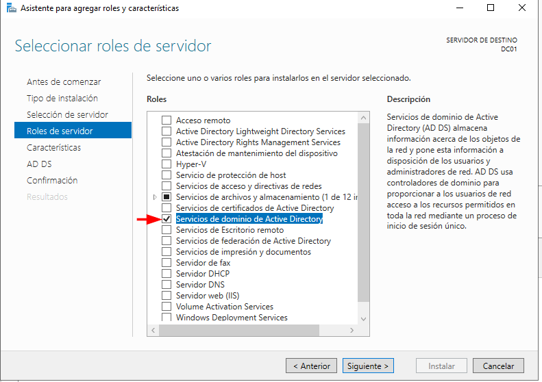

En aquesta pantalla del gestor del servidor, seleccionem el rol **"Servicios de dominio de Active Directory"**. Aquest component és el que permetrà gestionar usuaris, equips i polítiques de seguretat de manera centralitzada.

---

## 2. Configuració del Controlador de Domini (Pas a Pas)
Un cop instal·lat el rol, procedim a promocionar el servidor a controlador de domini.

### Pas 1: Selecció de l'operació
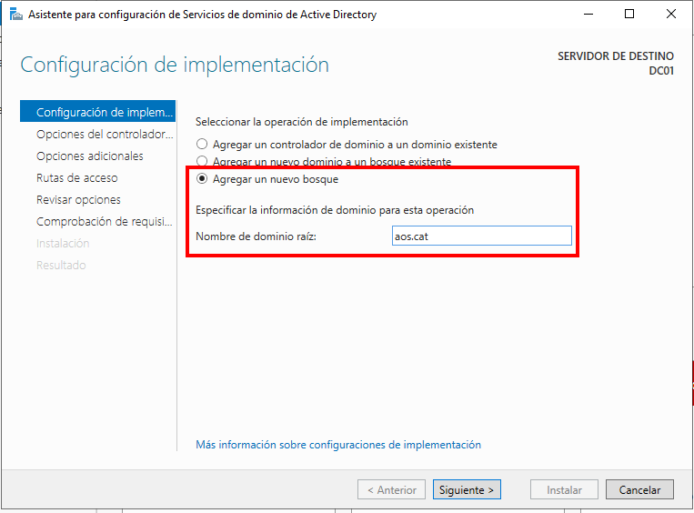

Triem l'opció **"Agregar un nuevo bosque"** i definim el nom del domini arrel com a `aos.cat`. Aquesta és la base de la nostra estructura de directori.

### Pas 2: Opcions del controlador
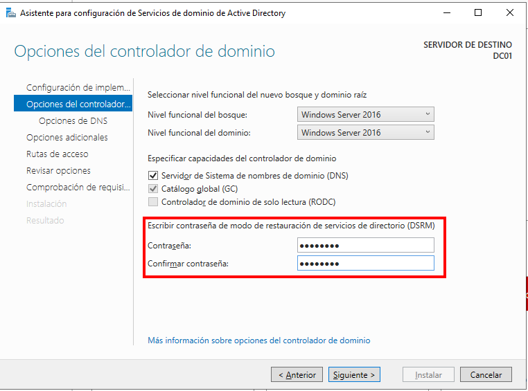

Establim els nivells funcionals del bosc i del domini (Windows Server 2016). També definim la **contrasenya de DSRM** (Modo de restauración de servicios de directorio), vital per a la recuperació del sistema en cas de fallada.

### Pas 3: Opcions addicionals (NetBIOS)
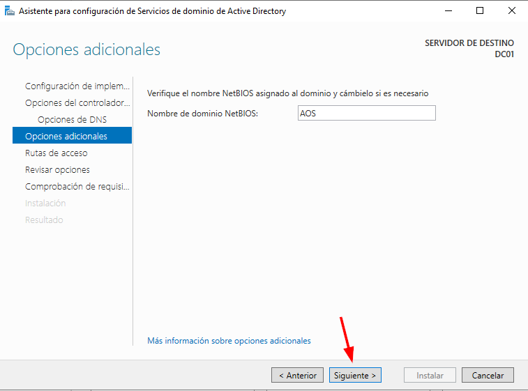

El sistema assigna automàticament el nom NetBIOS **AOS**. Aquest nom s'utilitza per a la compatibilitat amb versions anteriors de Windows i per a la identificació a la xarxa local.

### Pas 4: Rutes d'accés
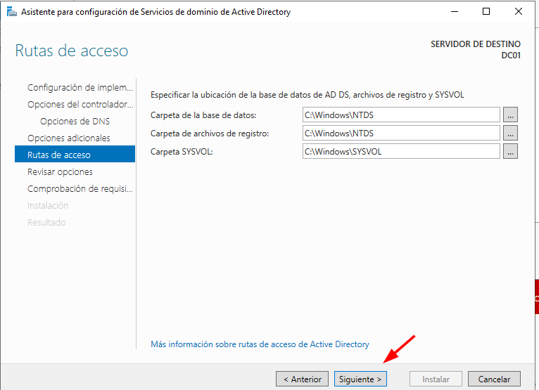

Definim on s'emmagatzemaran la base de dades (NTDS), els fitxers de registre i la carpeta **SYSVOL**. S'han deixat les rutes per defecte de Windows per a una configuració estàndard.

### Pas 5: Revisió d'opcions
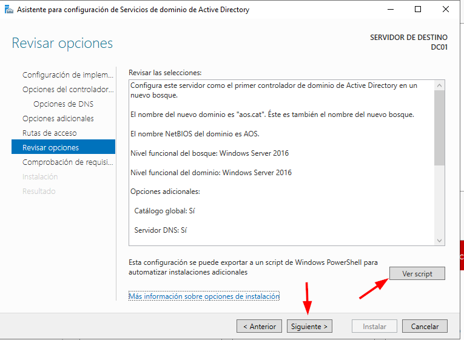

Resum de totes les configuracions seleccionades. És el moment de verificar que el domini, el NetBIOS i els nivells funcionals són els que hem definit abans de començar la instal·lació real.

### Pas 6: Comprovació de requisits
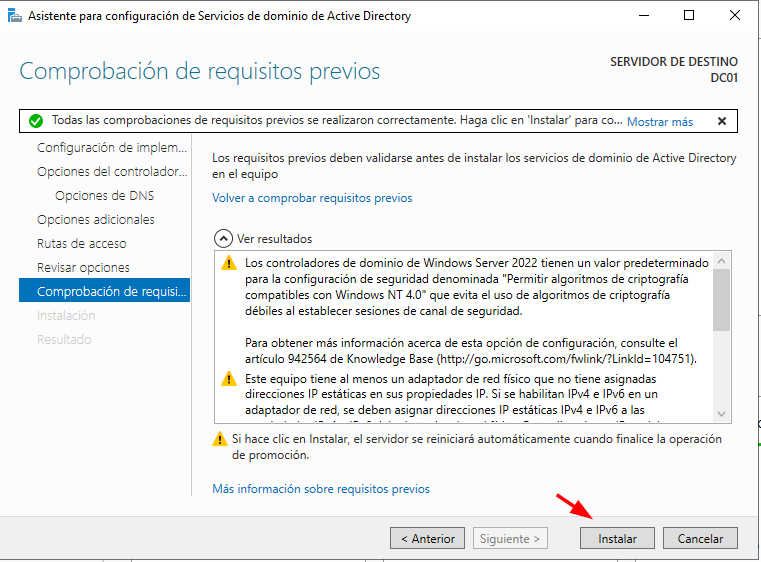

L'assistent verifica que el servidor compleix tots els requisits previs. Un cop apareix el missatge verd de **"Todas las comprobaciones se realizaron correctamente"**, podem procedir amb la instal·lació.

### Pas 7: Inici de sessió al domini
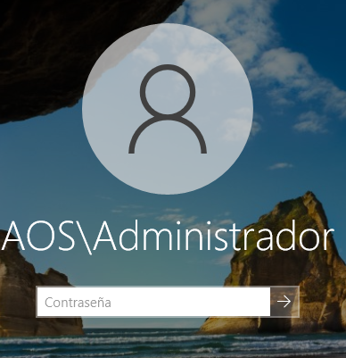

Primer inici de sessió un cop el domini està actiu i el servidor s'ha reiniciat. Observem que ara ens identifiquem com a **AOS\Administrador**, confirmant que el servidor ja és el controlador del nou domini.

### Pas 8: Administració d'Usuaris i Equips
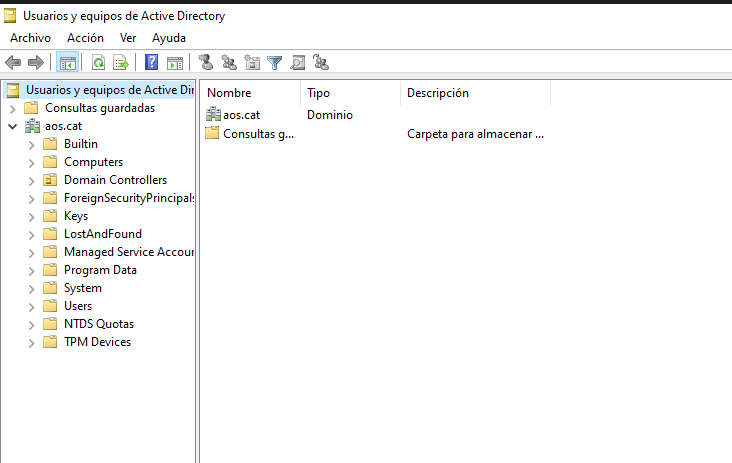

Obrim la consola **Usuarios y equipos de Active Directory** per gestionar el nostre nou domini `aos.cat`.

### Pas 9: Creació de la Unitat Organitzativa
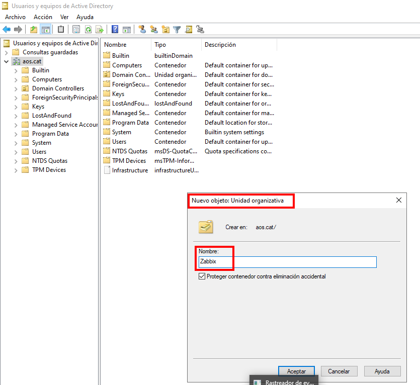

Creem una nova **Unitat Organitzativa (UO)** anomenada **Zabbix** per tenir localitzats tots els usuaris que utilitzarem per a la monitorització.

### Pas 10: Creació de l'usuari zabbix.monitor a l'AD
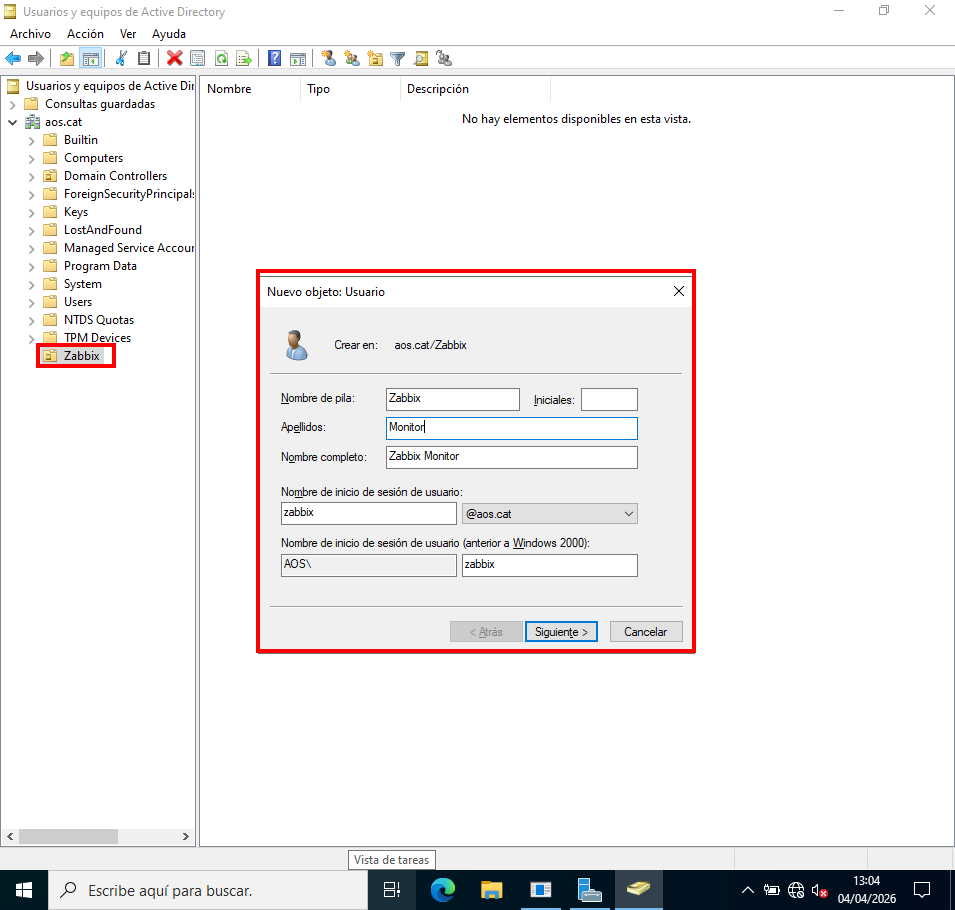

Dins de l'UO Zabbix, creem l'usuari **zabbix.monitor**. Aquest usuari serà l'encarregat de fer les consultes LDAP des de la plataforma Zabbix.

### Pas 11: Configuració de la contrasenya
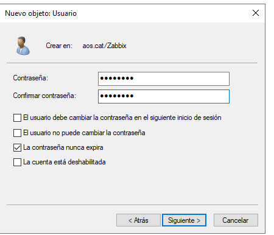

Assignem la contrasenya i marquem l'opció **"La contraseña nunca expira"** per evitar talls de servei en el futur.

---

## 3. Integració amb Zabbix i Resolució d'Errors

### Pas 12: Menú d'Autenticació a Zabbix
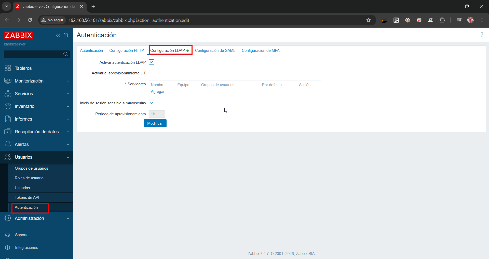

Anem a Zabbix i entrem al menú d'usuaris per verificar els comptes actuals abans d'activar l'autenticació externa.

### Pas 13: Configuració LDAP
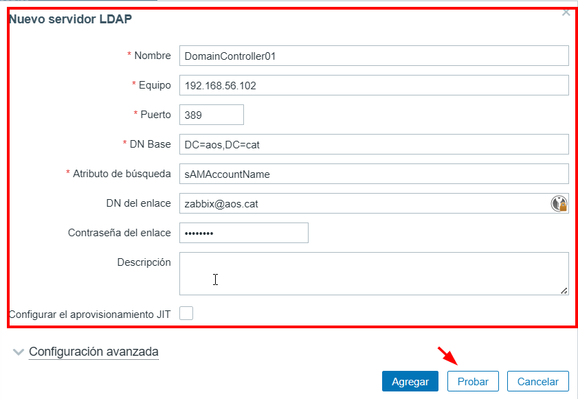

Seleccionem la pestanya de **Configuració LDAP** per iniciar la vinculació amb el nostre controlador de domini.

### L'Error de PHP LDAP
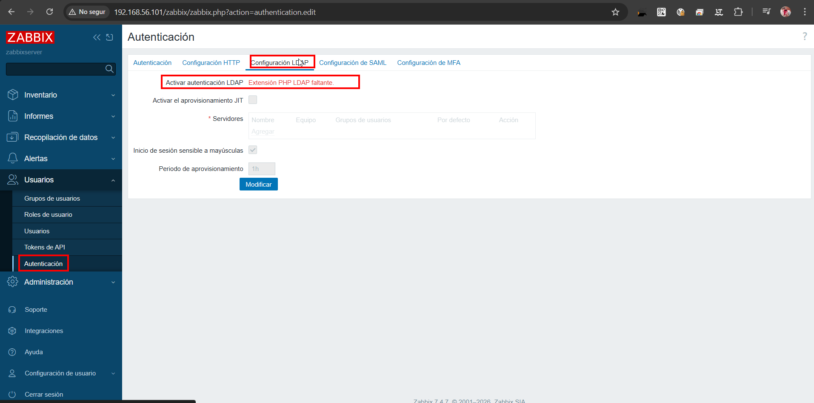

En intentar configurar LDAP, apareix l'error **"Extensión PHP LDAP faltante"**, ja que el servidor web no té el mòdul necessari instal·lat.

### Solució - Part 1: Instal·lació del mòdul
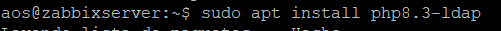

Executem la comanda d'instal·lació del paquet `php-ldap` al servidor Linux de Zabbix per resoldre la falta de la dependència:
```bash
sudo apt install php8.3-ldap
```

### Solució - Part 2: Reinici de serveis
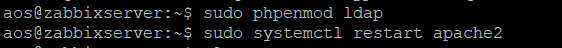

Activem el mòdul i reiniciem el servidor web perquè els canvis tinguin efecte:
```bash
sudo phpenmod ldap
sudo systemctl restart apache2
```

### Pas 14: Formulari del Servidor LDAP
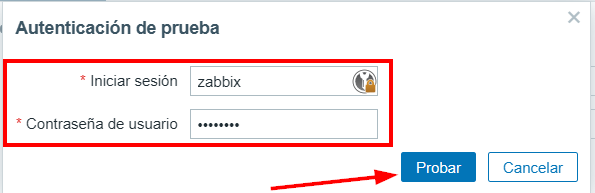

Introduïm les dades del nostre controlador de domini: IP (192.168.56.102), DN Base (`DC=aos,DC=cat`) i l'usuari d'enllaç (`zabbix@aos.cat`).

### Pas 15: Prova de connexió LDAP
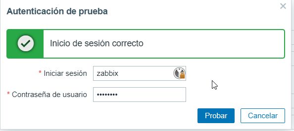

Realitzem una prova d'inici de sessió (Autenticación de prueba) per verificar que Zabbix pot parlar amb l'Active Directory.

### Pas 16: Connexió correcta
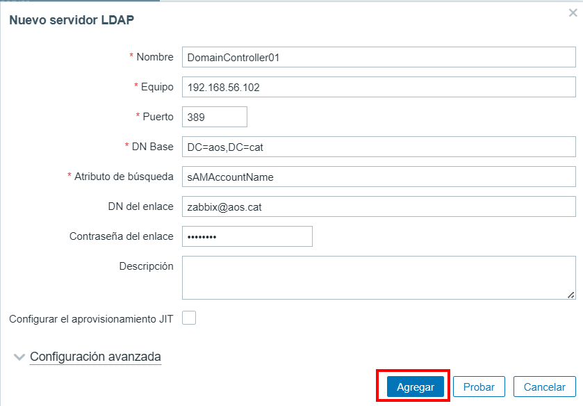

Zabbix ens confirma que l'inici de sessió ha estat correcte amb el missatge verd de **"Inicio de sesión correcto"**.

### Pas 17: Assignació del Rol Super Admin
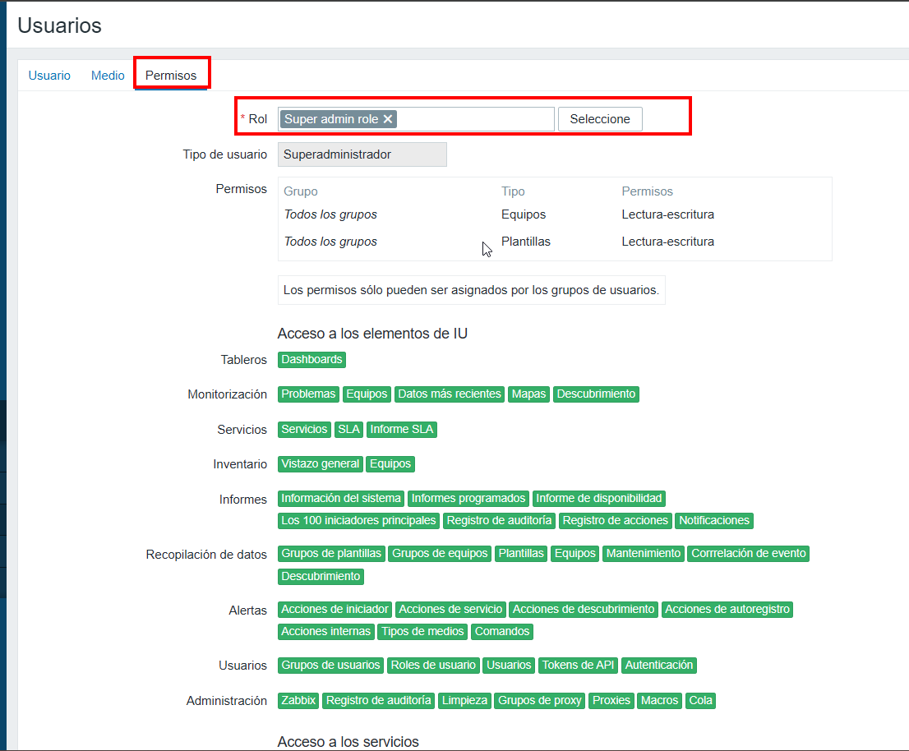

Creem l'usuari monitor a Zabbix i li assignem el rol de **Super administrador** per tenir control total sobre la plataforma.

### Pas 18: Confirmació de l'alta a Zabbix
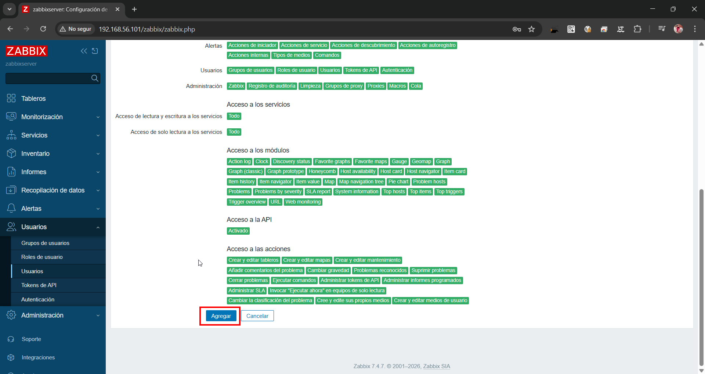

Finalitzem la creació de l'usuari monitor fent clic al botó "Agregar".

### Pas 19: Llista d'usuaris amb zabbix.monitor
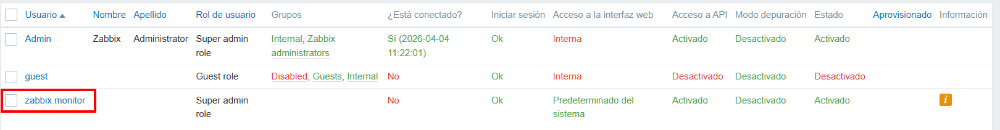

L'usuari `zabbix.monitor` ja apareix actiu a la llista d'usuaris de Zabbix amb el mètode d'autenticació LDAP.

### Pas 20: Login amb zabbix.monitor
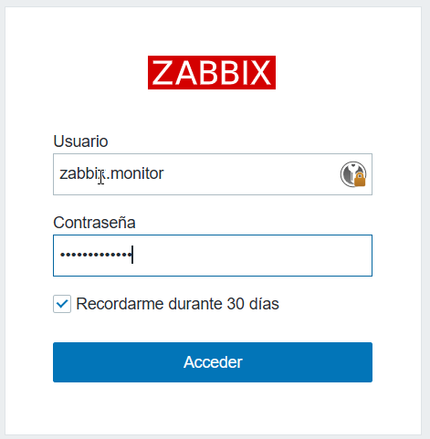

Fem la prova real d'accés a Zabbix utilitzant les credencials del domini AOS.

### Pas 21: Dashboard de zabbix.monitor
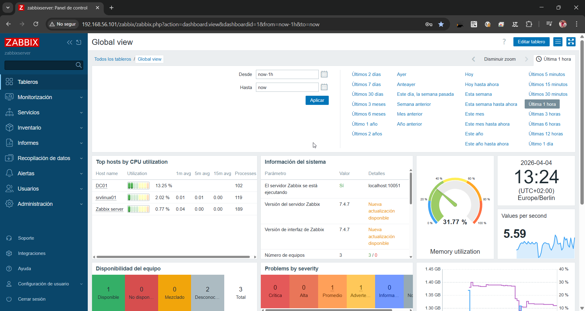

Dashboard completament funcional un cop hem entrat amb l'usuari monitor de l'AD.

---

## 4. Configuració de l'usuari zabbix.suport
Creem un segon usuari amb un rol restringit per verificar la gestió de permisos.

### Pas 22: Creació de zabbix.suport a l'AD
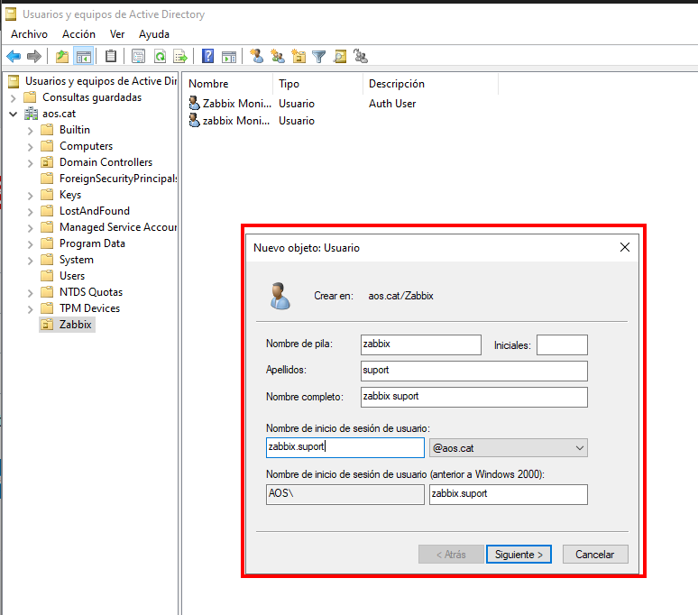

Tornem a l'Active Directory i creem un nou usuari anomenat **zabbix suport** dins de la mateixa UO.

### Pas 23: Contrasenya de zabbix.suport
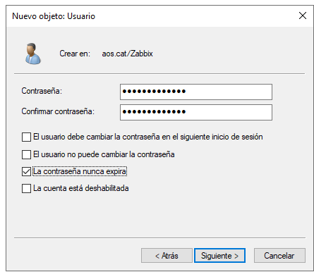

Definim la contrasenya per a l'usuari de suport i marquem que no expiri mai.

### Pas 24: Alta de zabbix.suport a Zabbix
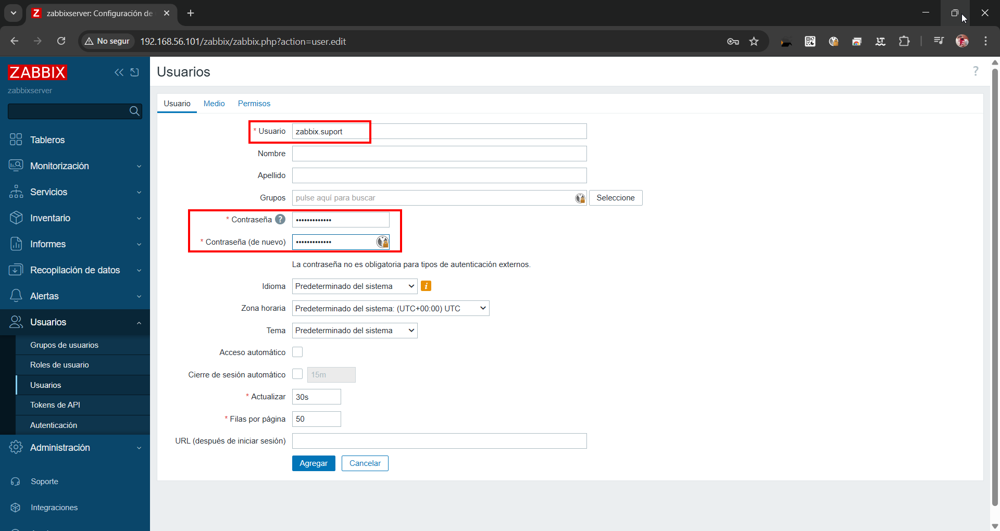

Iniciem el procés d'alta de l'usuari de suport a la plataforma Zabbix.

### Pas 25: Assignació del Rol User (Restringit)
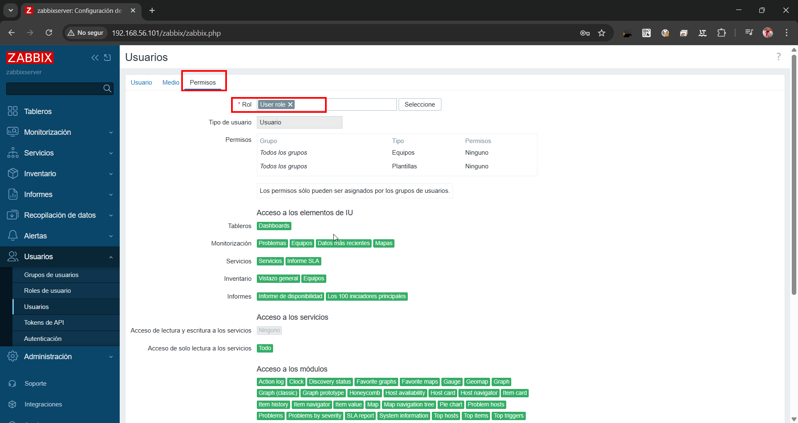

A la pestanya de permisos, li assignem el **User role** per limitar les seves capacitats de gestió.

### Pas 26: Guardar usuari de suport
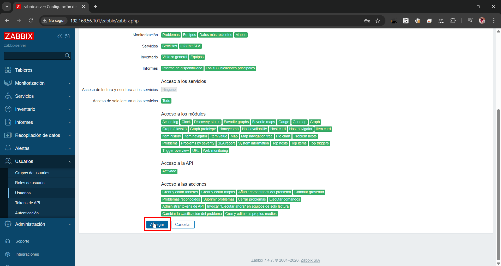

Fem clic a "Agregar" per confirmar la creació del compte de suport.

### Pas 27: Login amb zabbix.suport
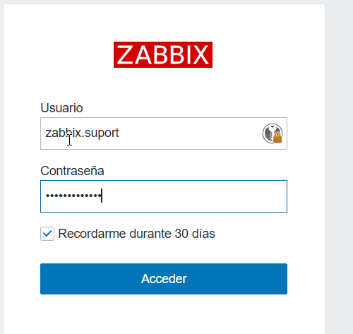

Iniciem sessió amb el compte de suport per verificar que l'autenticació i el rol funcionen.

### Pas 28: Dashboard restringit de zabbix.suport
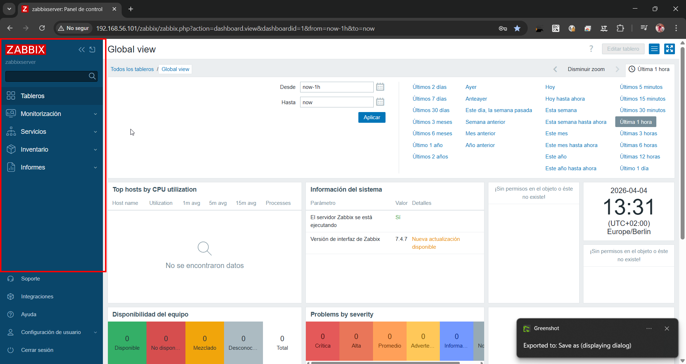

Observem que l'usuari de suport té un Dashboard més limitat, confirmant que les polítiques de rols s'apliquen correctament.

---
