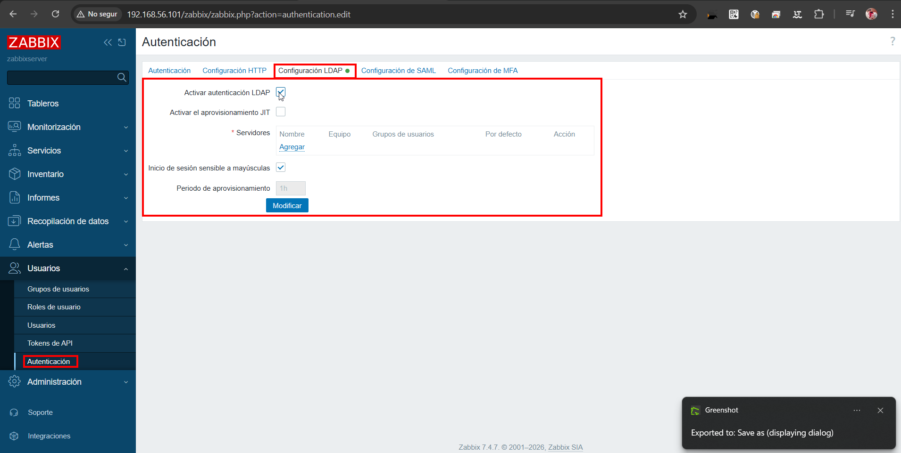

# README – Integració de Zabbix amb LDAP (Active Directory)

## 1. Instal·lació del rol Active Directory


Abans de configurar el domini, cal instal·lar el rol:

* **Servicios de dominio de Active Directory (AD DS)**

Aquest rol permet gestionar usuaris, equips i recursos dins d’un domini.

---

## 2. Promoció a controlador de domini

### Iniciar configuració


Un cop instal·lat el rol, cal promocionar el servidor:

* **Promover este servidor a controlador de dominio**

---

### Crear nou bosc


* Opció: **Agregar un nuevo bosque**
* Nom del domini: `aos.cat`

Aquest domini serà el nucli de l’autenticació.

---

### Opcions del controlador


* Nivell funcional: Windows Server 2016
* Definir contrasenya DSRM (recuperació del sistema)

---

### Nom NetBIOS


* Nom curt del domini: `AOS`

---

### Rutes del sistema


Es poden deixar per defecte, ja que són adequades per entorns de prova.

---

### Revisió i instal·lació


* Verificar configuració
* Instal·lar i reiniciar

---

## 3. Verificació del domini


Després del reinici:

* Obrir **Usuarios y equipos de Active Directory**
* Confirmar que el domini `aos.cat` està operatiu

Això garanteix que el servei LDAP ja està disponible.

---

## 4. Organització del domini (OU)


Per mantenir una estructura ordenada:

* Crear una OU anomenada `Zabbix`

Això facilita la gestió i aplicació de polítiques en entorns reals.

---

## 5. Creació d’usuaris LDAP

### Usuari monitor


* Usuari: `zabbix.monitor`

---

### Configuració de contrasenya


Configuració recomanada:

* Desactivar canvi obligatori
* Activar **La contraseña nunca expira**

Això evita problemes d’autenticació en serveis.

---

## 6. Instal·lació del suport LDAP a Zabbix

### Error inicial


Zabbix pot mostrar:

* **Extensión PHP LDAP faltante**

---

### Solució

```bash
sudo apt install php8.3-ldap
sudo phpenmod ldap
sudo systemctl restart apache2
```

Aquest pas és imprescindible perquè Zabbix pugui comunicar-se amb LDAP.

---

## 7. Configuració LDAP a Zabbix



Ruta:

```
Usuarios → Autenticación → Configuración LDAP
```

Accions:

* Activar autenticació LDAP
* Configurar servidor LDAP

---

### Paràmetres LDAP


* **Servidor:** 192.168.56.102
* **Puerto:** 389
* **DN Base:** DC=aos,DC=cat
* **Atributo:** sAMAccountName
* **Usuario enlace:** [zabbix@aos.cat](mailto:zabbix@aos.cat)

Aquest usuari permet fer consultes al directori.

---

## 8. Prova d’autenticació


* Usuari: `zabbix`
* Resultat: correcte

Aquest test valida la connexió amb el controlador de domini.

---

## 9. Creació d’un usuari LDAP addicional

### Usuari suport


* Usuari: `zabbix.support`

---

### Password


Mateixa configuració que abans.

---

## 10. Creació d’usuaris a Zabbix

Tot i utilitzar LDAP, Zabbix necessita una entrada interna (si no s’utilitza JIT).

---

### Accedir a usuaris


---

### Crear usuari


* Usuari: `zabbix.support`

---

### Assignar permisos


* Rol: **User role**

Aquest rol limita l’accés a funcionalitats bàsiques.

---

### Guardar


---

## 11. Prova d’inici de sessió


* Login amb usuari LDAP

---

### Resultat


Es pot observar:

* Accés restringit
* Menys opcions visibles

Això confirma que el sistema de rols funciona correctament.

---

## 12. Usuari administrador

### Crear usuari


---

### Password


---

### Crear a Zabbix


---

### Assignar rol administrador


* Rol: **Super admin role**

---

### Guardar


---

## 13. Validació final

### Llista d’usuaris


---

### Login administrador


---

### Dashboard complet


Ara es disposa de:

* Accés complet
* Tots els menús habilitats
* Control total sobre Zabbix

---

## Resultat final

La integració s’ha realitzat correctament:

* Autenticació amb Active Directory funcional
* Usuaris diferenciats per rols
* Accés controlat segons permisos
