# Guia de configuracio de Zabbix Agent 2 amb PSK a Windows

En aquest document veurem, pas a pas, com donar d'alta un host Windows a Zabbix utilitzant xifrat PSK (Pre-Shared Key).

## Objectiu

Configurarem un equip Windows anomenat `server02` perque es connecti al servidor Zabbix `192.168.56.101` mitjancant `Zabbix Agent 2` amb autenticacio PSK.

## Dades utilitzades a l'exemple

- Hostname: `server02`
- Servidor Zabbix: `192.168.56.101`
- Port de l'agent: `10050`
- Grup d'equips: `Windows Server`
- Plantilla: `Windows by Zabbix agent active`

## Pas 1. Generar la clau PSK al servidor Zabbix

Generem una clau PSK de 32 bytes en format hexadecimal des del servidor Zabbix:

```bash
openssl rand -hex 32
```

Aquesta clau la farem servir tant a la instal.lacio de l'agent com a la configuracio del host dins de Zabbix.

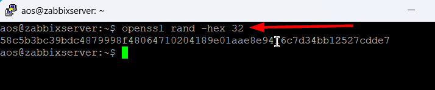

## Pas 2. Configurar l'agent Windows durant la instal.lacio

Durant la instal.lacio de `Zabbix Agent 2`, omplim les dades basiques del host:

- Introduim el nom de l'equip a `Host name`
- Indiquem la IP o DNS del servidor Zabbix
- Deixem el port de l'agent a `10050`
- Introduim el servidor o proxy per a `active checks`
- Marquem l'opcio `Enable PSK`

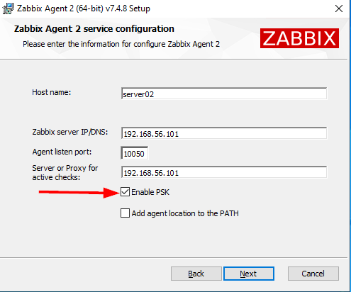

## Pas 3. Introduir la identitat i la clau PSK

Quan l'instal.lador ens demani la configuracio PSK:

- A `Pre-shared key identity`, escrivim una identitat descriptiva, en aquest exemple `server02`
- A `Pre-shared key value`, enganxem la clau generada amb `openssl`

Despres continuem amb `Next`.

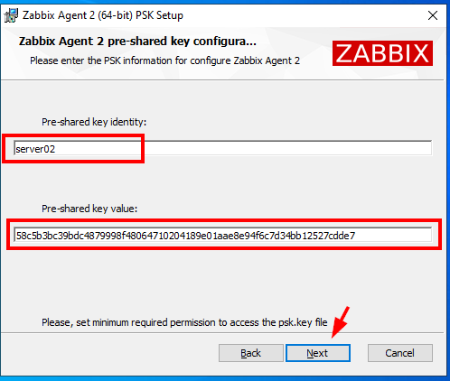

## Pas 4. Crear un grup d'equips a Zabbix

Des de la interfície web de Zabbix, anem a:

`Recopilacion de datos` -> `Grupos de equipos`

A continuacio, premem `Crear grupo de equipos`.

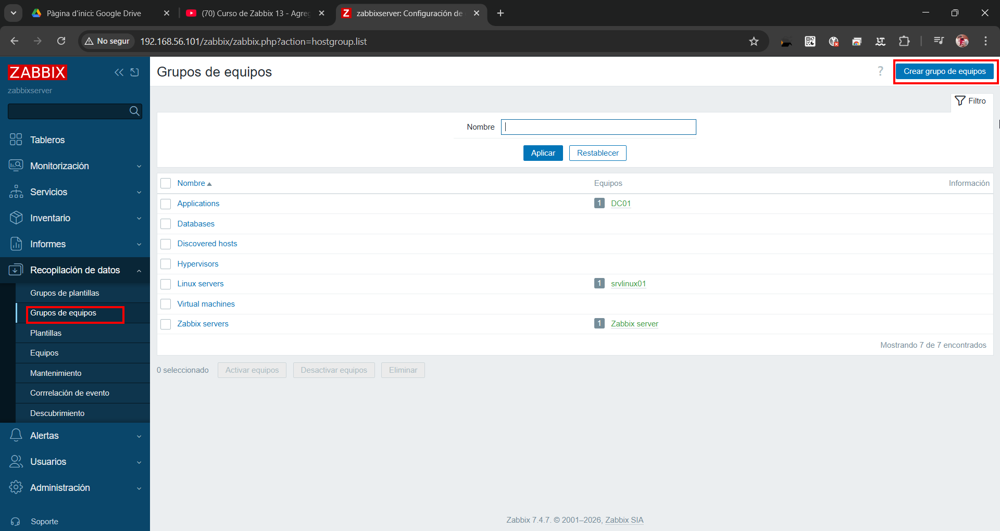

## Pas 5. Afegir el grup per als hosts Windows

Creem un grup nou amb el nom `Windows Server`.

Aquest grup ens servira per classificar els equips Windows que monitoritzarem.

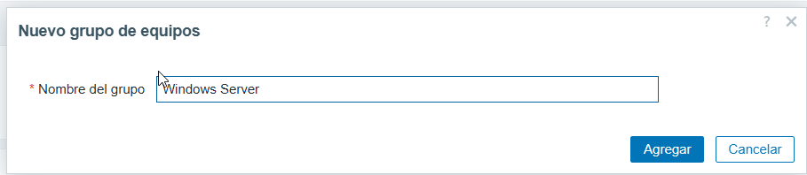

## Pas 6. Verificar que el grup s'ha creat

Comprovem que el grup `Windows Server` apareix dins del llistat de grups disponibles.

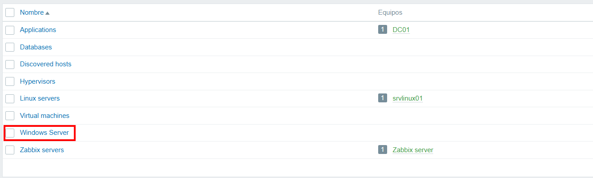

## Pas 7. Crear el nou host

Ara anem a:

`Recopilacion de datos` -> `Equipos`

I premem `Crear equipo`.

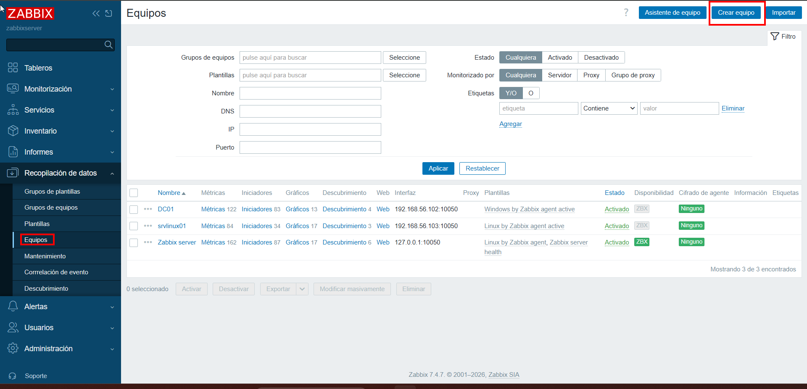

## Pas 8. Omplir la configuracio basica del host

A la pestanya `Equipo`, configurem:

- `Nombre de equipo`: `server02`
- Plantilla: `Windows by Zabbix agent active`
- Grup d'equips: `Windows Server`
- Interficie de l'agent amb la IP del host, en l'exemple `192.168.56.104`
- Port: `10050`

Quan ho tinguem tot omplert, encara no ho guardem: primer cal revisar la pestanya de xifrat.

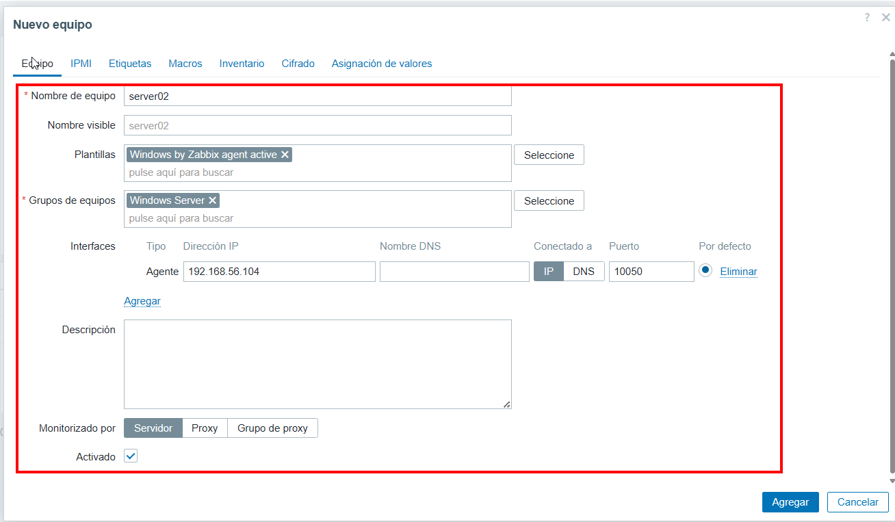

## Pas 9. Obrir la pestanya de xifrat

Dins del formulari del host, entrem a la pestanya `Cifrado`.


## Pas 10. Configurar el xifrat PSK al host de Zabbix

A la pestanya `Cifrado`:

- A `Conexiones al host`, seleccionem `PSK`
- A `Conexiones desde el host`, marquem tambe `PSK`
- A `Identidad PSK`, introduim `server02`
- A `PSK`, enganxem exactament la mateixa clau generada al pas 1

Despres premem `Agregar`.

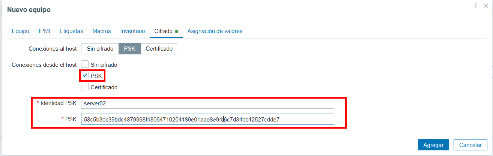

## Pas 11. Filtrar i comprovar el nou host

Un cop creat el host, el podem buscar a `Datos mas recientes` filtrant per `server02` i aplicant el filtre.

Aquest pas ens permet validar rapidament que el host ja existeix i esta enviant dades o intentant enviar-ne.

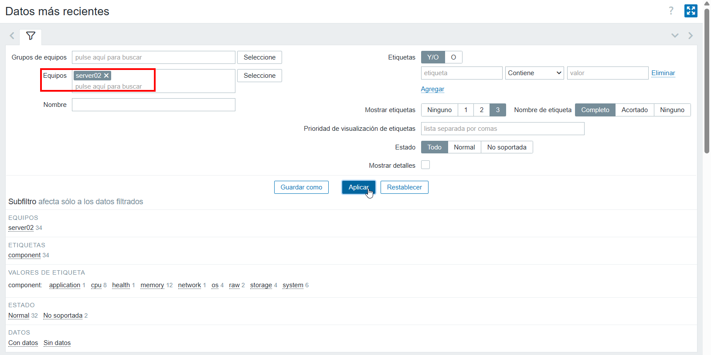

## Pas 12. Validar que arriben les metriques

Si la configuracio es correcta, veurem els items del host `server02` dins de `Datos mas recientes`, com per exemple:

- CPU
- memoria
- processos
- sistema
- filesystem

Aixo confirma que el `Zabbix Agent 2` esta registrat i reportant informacio al servidor.

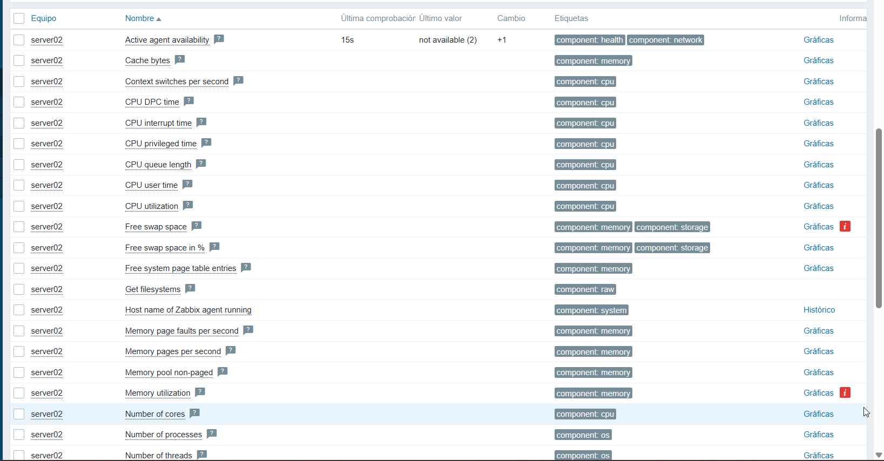

## Resum rapid

1. Generem la clau PSK al servidor Zabbix.
2. Instal.lem `Zabbix Agent 2` a Windows i activem `Enable PSK`.
3. Introduim la identitat i la clau PSK a l'instal.lador.
4. Creem el grup `Windows Server`.
5. Donem d'alta el host `server02`.
6. Assignem la plantilla `Windows by Zabbix agent active`.
7. Configurem el xifrat PSK amb la mateixa identitat i clau.
8. Verifiquem a `Datos mas recientes` que entren les metriques.
