# Configuracio de Zabbix Agent amb PSK a Linux

En aquest document expliquem, pas a pas, com instal.lar i configurar `Zabbix Agent` en un equip Linux i com donar-lo d'alta al servidor Zabbix utilitzant xifrat `PSK` (Pre-Shared Key).

Ens basem en les captures incloses en aquesta carpeta i les fem servir com a referencia rapida per repetir el proces en altres hosts.

## Objectiu

- Instal.lar el paquet oficial de `zabbix-agent`.
- Configurar la connexio passiva i activa contra el servidor Zabbix.
- Activar el xifrat `PSK` a l'agent.
- Registrar l'equip al frontal web de Zabbix.

## Dades que cal adaptar

Abans de seguir la guia, adaptem aquests valors al nostre entorn:

- IP del servidor Zabbix: `192.168.56.101`
- Nom del host Linux: `srvlinux02`
- IP del host Linux: `192.168.56.105`
- Ruta del fitxer de clau PSK: `/opt/encrypted.key`

## Procediment

### 1. Descarregar el repositori i instal.lar l'agent

Descarreguem el paquet de repositori de Zabbix per Ubuntu 24.04, l'instal.lem amb `dpkg` i despres instal.lem `zabbix-agent` amb `apt`.

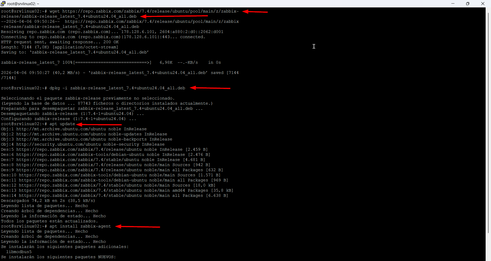

### 2. Configurar el servidor per a comprovacions passives

Al fitxer `/etc/zabbix/zabbix_agentd.conf`, definim el parametre `Server` amb la IP del servidor Zabbix que es podra connectar a l'agent.

```ini
Server=192.168.56.101
```

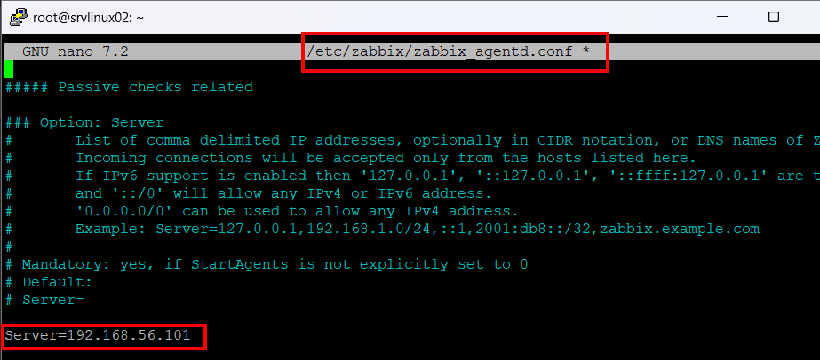

### 3. Configurar comprovacions actives i el nom del host

Al mateix fitxer, indiquem:

- `ServerActive` amb la IP del servidor Zabbix
- `Hostname` amb el nom exacte que tindra el host a Zabbix

```ini
ServerActive=192.168.56.101
Hostname=srvlinux02
```

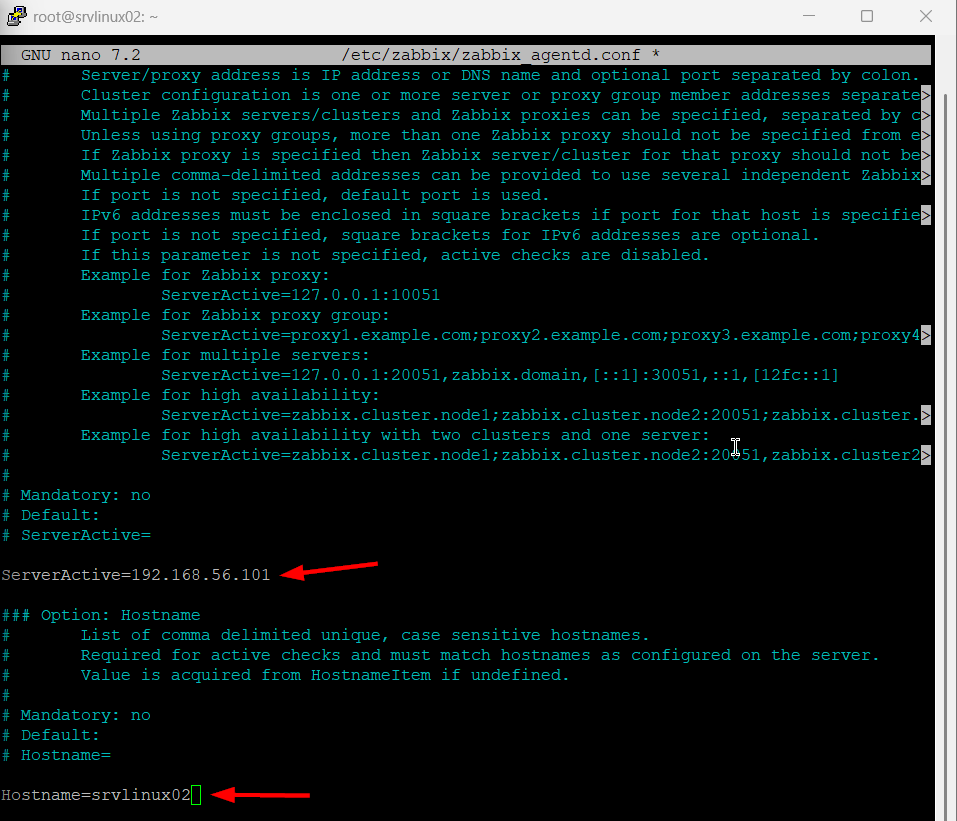

### 4. Activar xifrat PSK a l'agent

Configurem l'agent per usar `PSK` tant en la connexio sortint com en les connexions entrants.

```ini
TLSConnect=psk
TLSAccept=psk
```

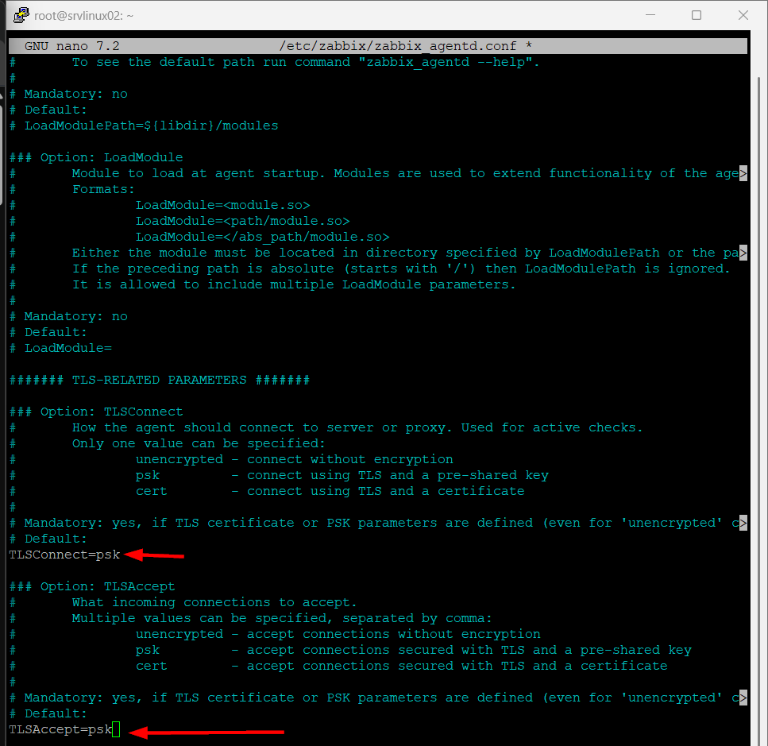

### 5. Definir la identitat PSK i el fitxer de clau

Assignem un identificador PSK i indiquem la ruta del fitxer on es guardara la clau compartida.

```ini
TLSPSKIdentity=srvlinux02
TLSPSKFile=/opt/encrypted.key
```

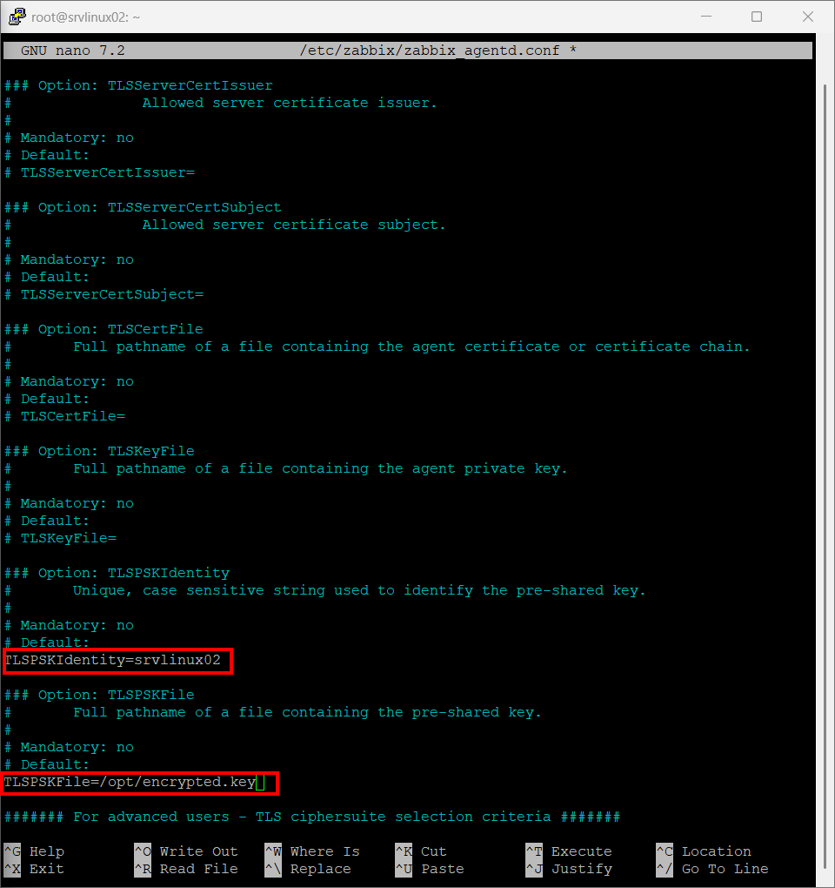

### 6. Generar la clau PSK

Generem una clau hexadecimal aleatoria de 32 bytes amb `openssl`.

```bash
openssl rand -hex 32
```

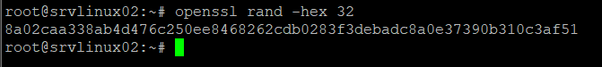

### 7. Guardar la clau en un fitxer

Desem la clau generada al fitxer definit a `TLSPSKFile`, per exemple:

```bash
nano /opt/encrypted.key
```

Despres de desar-la, ajustem els permisos per protegir-la:

```bash
chmod 600 /opt/encrypted.key
chown zabbix:zabbix /opt/encrypted.key
```

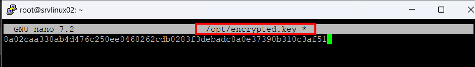

### 8. Habilitar i reiniciar el servei

Un cop aplicada la configuracio, habilitem el servei a l'arrencada i el reiniciem.

```bash
systemctl enable zabbix-agent.service
systemctl restart zabbix-agent.service
```

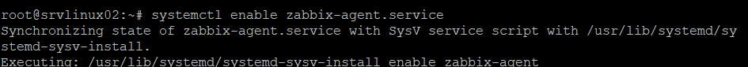

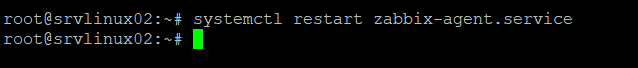

### 9. Verificar l'estat de l'agent

Comprovem que el servei esta actiu i en execucio:

```bash
systemctl status zabbix-agent.service
```

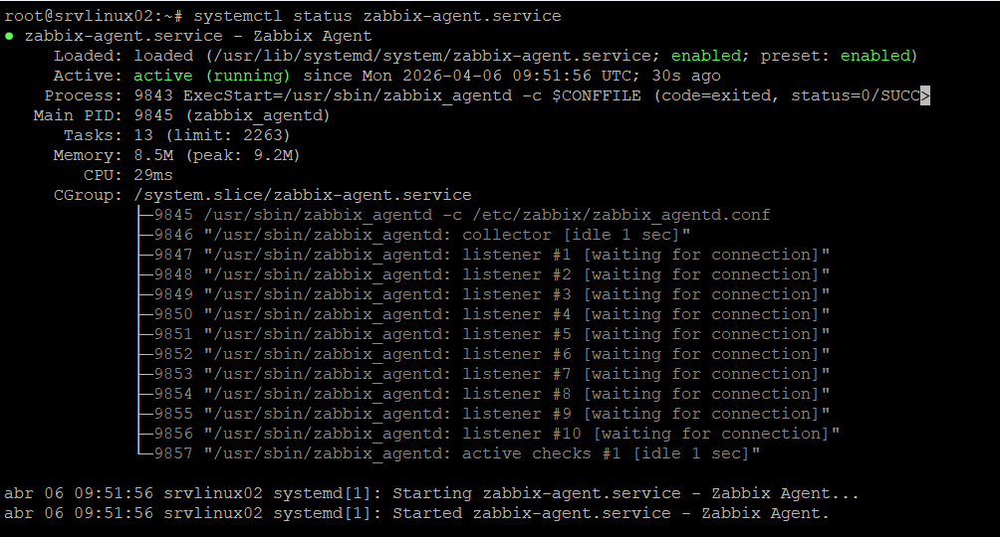

### 10. Crear el host al frontal web de Zabbix

Al panell web, anem a `Recopilacion de datos > Equipos` i premem `Crear equipo`.

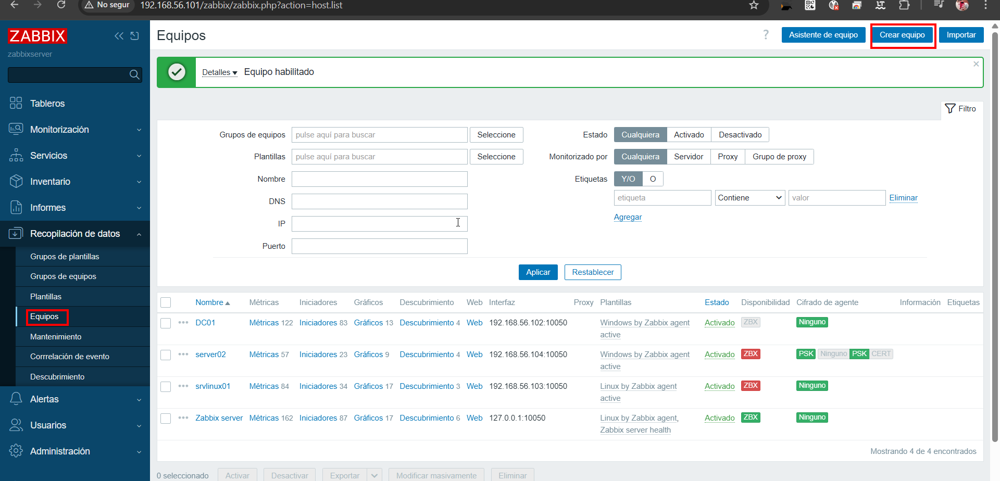

### 11. Omplir la configuracio basica del host

En crear el nou host, omplim:

- `Nombre de equipo`: `srvlinux02`
- Plantilla: `Linux by Zabbix agent active`
- Grup: `Linux servers`
- Interficie d'agent: IP `192.168.56.105`, port `10050`

Fem que el nom del host coincideixi amb el valor configurat a `Hostname`.

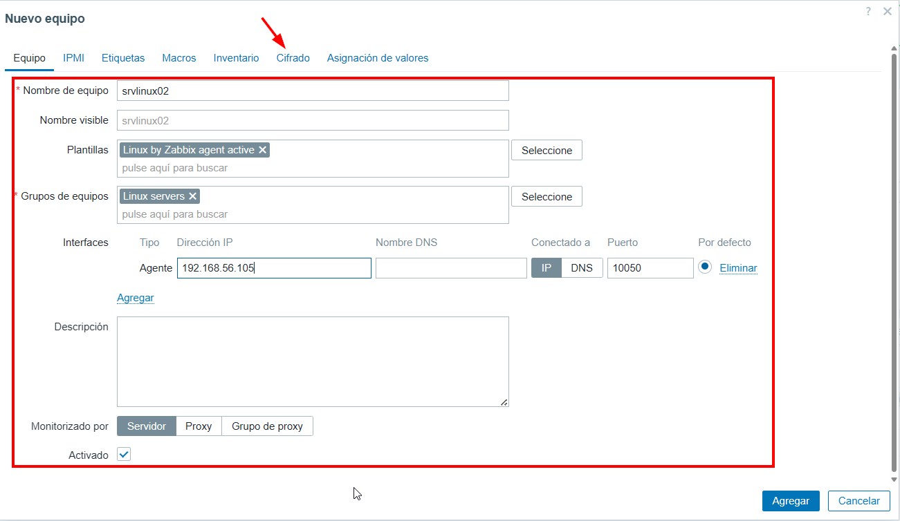

### 12. Configurar el xifrat PSK al host de Zabbix

A la pestanya `Cifrado`, configurem:

- Seleccionem `PSK` per a les connexions al host
- Marquem `PSK` per a les connexions des del host
- Definim `Identidad PSK` amb el mateix valor que `TLSPSKIdentity`
- Enganxem la mateixa clau generada al camp `PSK`

Fem que la identitat i la clau coincideixin exactament entre servidor i agent.

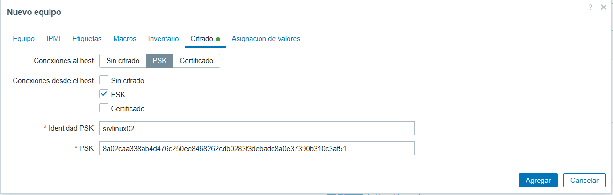

## Resum de configuracio minima

El bloc essencial de `/etc/zabbix/zabbix_agentd.conf` ens queda aixi:

```ini
Server=192.168.56.101
ServerActive=192.168.56.101
Hostname=srvlinux02
TLSConnect=psk
TLSAccept=psk
TLSPSKIdentity=srvlinux02
TLSPSKFile=/opt/encrypted.key
```

## Recomanacions

- Protegim el fitxer PSK amb permisos restrictius.
- Verifiquem que el port `10050/TCP` sigui accessible des del servidor Zabbix.
- Comprovem que el `Hostname` de l'agent i el del frontal web coincideixen exactament.
- Si canviem la clau PSK, l'actualitzem tant a l'agent com al servidor.

## Fitxers inclosos

- `PSK1.png` a `PSK10.png`: configuracio de l'agent a Linux
- `PSK11.png` a `PSK13.png`: alta i xifrat del host al frontal de Zabbix
