# Guia de creació d'un dashboard a Zabbix

Aquest document recull, pas a pas, la creació d'un dashboard personalitzat a Zabbix amb widgets de monitorització, gràfiques, mapes i informació resumida de l'entorn.

## Objectiu

Construir un tauler anomenat `Dashboard Principal` que permeti visualitzar d'una ullada:

- l'hora i la data actual
- gràfiques de CPU, memòria i tràfic de xarxa
- l'estat de disponibilitat dels equips
- mapes i geolocalització
- problemes agrupats
- informació general del servidor Zabbix
- una vista final compacta del sistema

---

## 1. Creació del dashboard

### Pas 1. Accedir a la secció de taulers
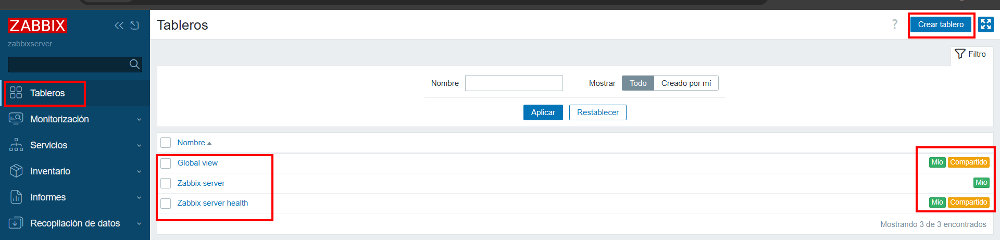

Des del menú `Tableros`, accedim al llistat de dashboards disponibles i fem clic a `Crear tablero` per començar-ne un de nou.

### Pas 2. Definir les propietats del dashboard
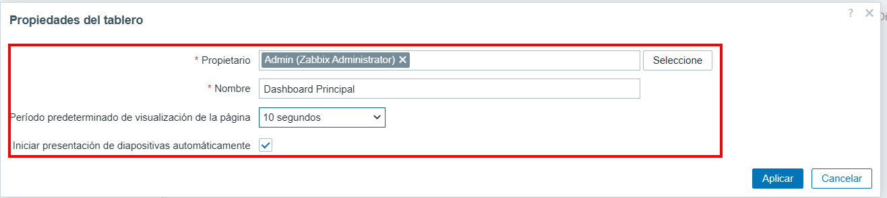

Configurem el propietari, el nom `Dashboard Principal`, el període per defecte de visualització i activem l'opció de presentació automàtica.

### Pas 3. Seleccionar el tipus de widget
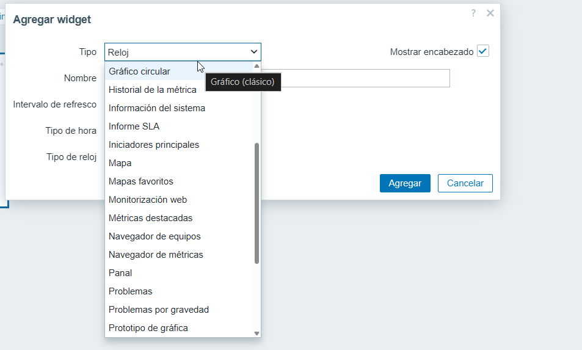

En obrir el formulari `Agregar widget`, Zabbix mostra tots els tipus disponibles. Aquesta captura reflecteix el punt d'inici per escollir cada component del dashboard.

### Pas 4. Configurar el widget de rellotge
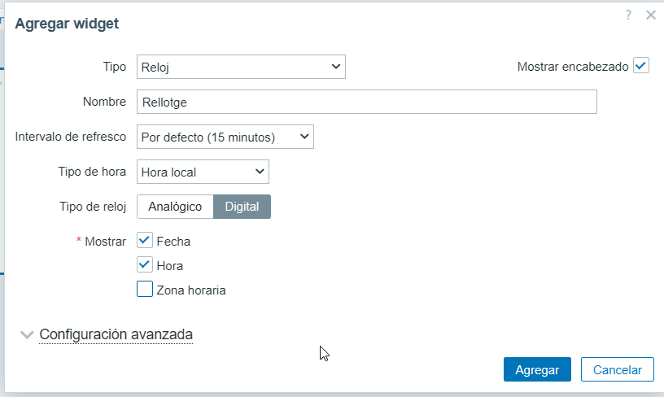

Creem un widget de tipus `Reloj`, amb vista digital i mostrant la data i l'hora locals.

### Pas 5. Primer widget afegit al dashboard
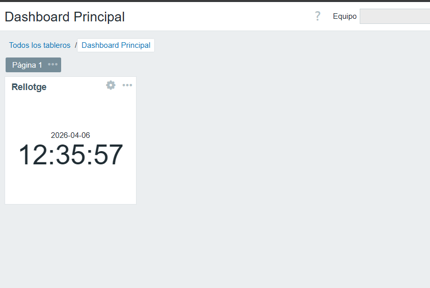

El dashboard ja mostra el primer element, `Rellotge`, que serveix com a referència temporal per a la resta de dades monitoritzades.

---

## 2. Preparació de gràfiques i mapes preferits

### Pas 6. Localitzar mètriques des de dades recents
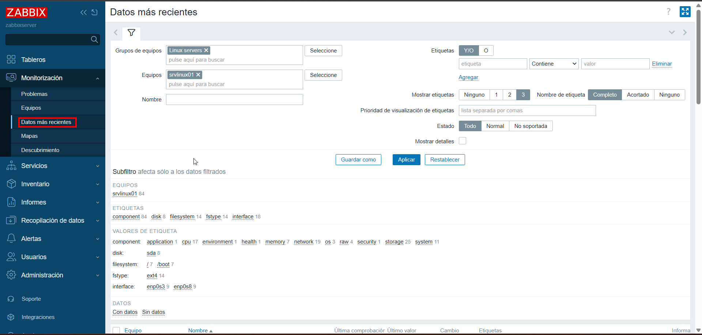

Des de `Monitorización -> Datos más recientes`, filtrem per grup i equip per trobar les mètriques disponibles del servidor Linux.

### Pas 7. Obrir la gràfica d'una mètrica concreta
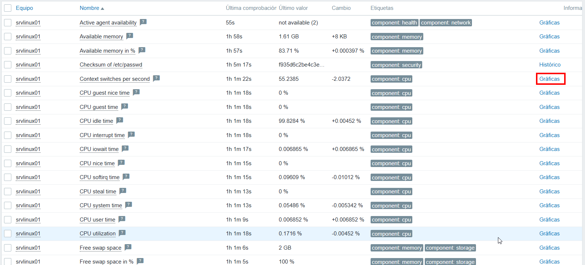

A la columna `Gráficas`, entrem a la representació gràfica d'una mètrica per poder-la revisar i marcar-la com a preferida.

### Pas 8. Marcar una gràfica com a favorita
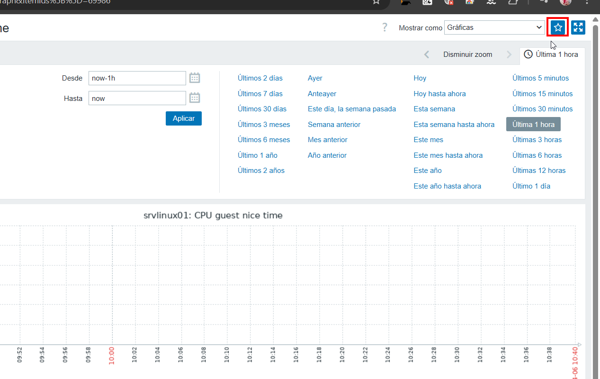

Dins la vista de gràfiques, fem servir la icona d'estrella per desar la gràfica a favorits i reutilitzar-la després al dashboard.

### Pas 9. Crear el widget de gràfiques favorites
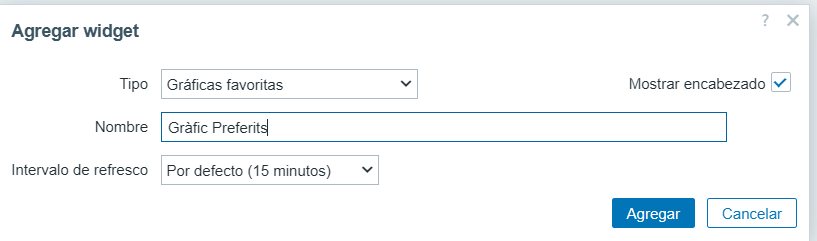

Afegim un widget de tipus `Gráficas favoritas` i li assignem un nom identificatiu perquè mostri el conjunt de gràfiques marcades com a preferides.

### Pas 10. Marcar un mapa com a favorit
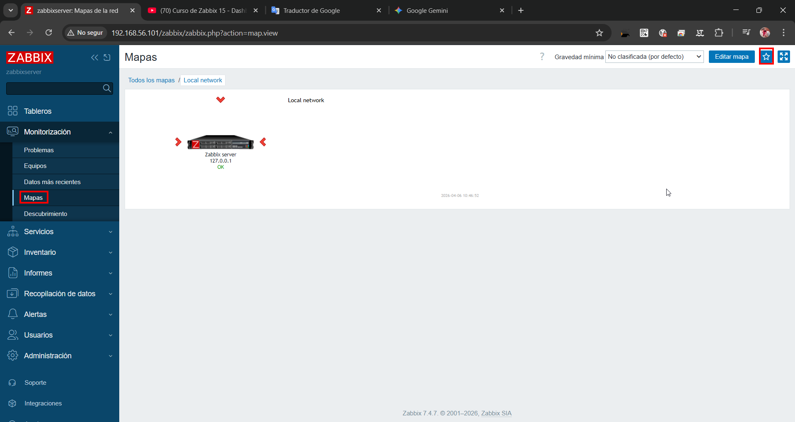

Des de `Monitorización -> Mapas`, obrim el mapa `Local network` i també el marquem com a favorit per poder inserir-lo ràpidament al dashboard.

### Pas 11. Crear el widget de mapes preferits
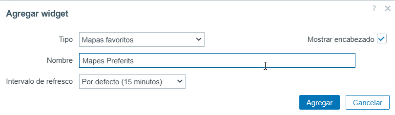

Afegim un widget de tipus `Mapas favoritos` perquè el dashboard inclogui accessos ràpids als mapes destacats.

### Pas 12. Preparar l'inventari dels equips
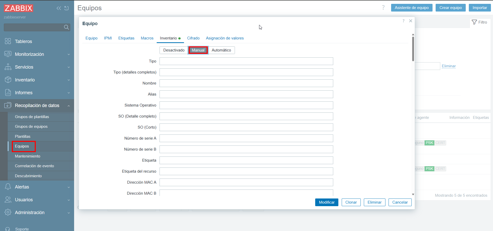

A la fitxa de l'equip, activem l'inventari en mode manual. Aquest pas és útil per completar dades d'ubicació i enriquir widgets com el geomapa.

---

## 3. Widgets visuals principals

### Pas 13. Configurar el widget de geomapa
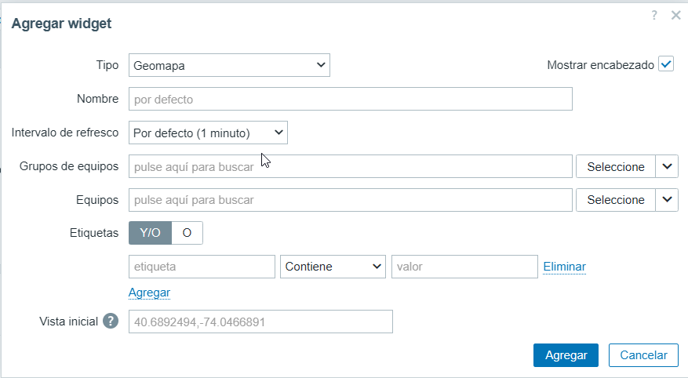

Creem un widget de tipus `Geomapa`, definint grups o equips a mostrar i la vista inicial del mapa.

### Pas 14. Resultat del geomapa al dashboard
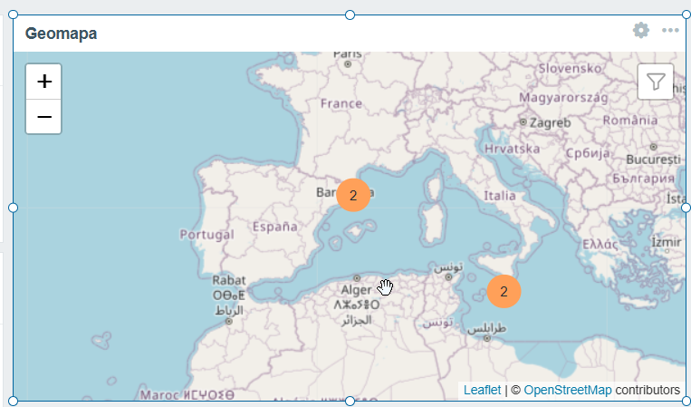

El widget mostra les ubicacions agrupades sobre un mapa basat en OpenStreetMap, facilitant una visió geogràfica dels equips.

### Pas 15. Crear una gràfica de memòria
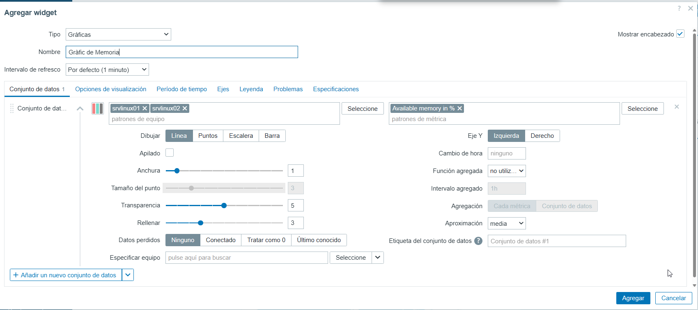

Afegim un widget de tipus `Gráficas` per representar la mètrica `Available memory in %` dels servidors Linux.

### Pas 16. Crear una gràfica clàssica de CPU
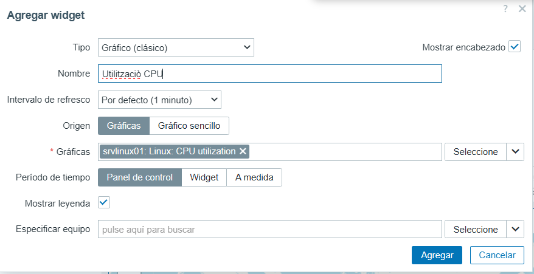

Configurem un widget `Gráfico (clásico)` amb la gràfica `Linux: CPU utilization` per visualitzar la càrrega del processador.

### Pas 17. Crear un prototip de gràfica de xarxa
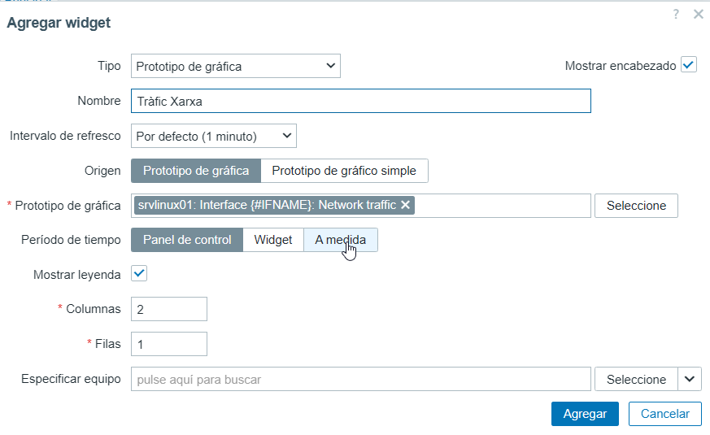

Amb `Prototipo de gráfica`, mostrem el tràfic de xarxa generat per les interfícies descobertes automàticament a l'equip.

### Pas 18. Afegir el resum de disponibilitat dels equips
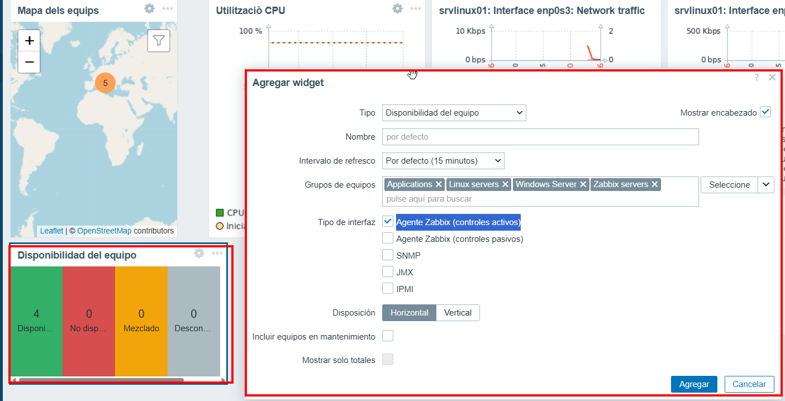

Inserim un widget `Disponibilidad del equipo` per resumir quants hosts estan disponibles, no disponibles, en estat mixt o desconegut.

---

## 4. Widgets de resum i navegació

### Pas 19. Mostrar el valor d'una mètrica destacada
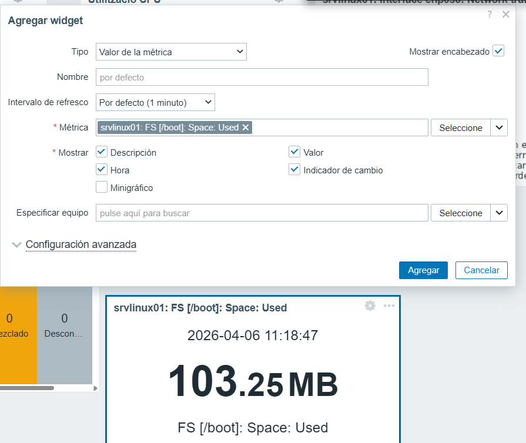

Afegim un widget `Valor de la métrica` per destacar una dada concreta, en aquest cas l'espai utilitzat al sistema de fitxers `/boot`.

### Pas 20. Inserir un mapa directament al dashboard
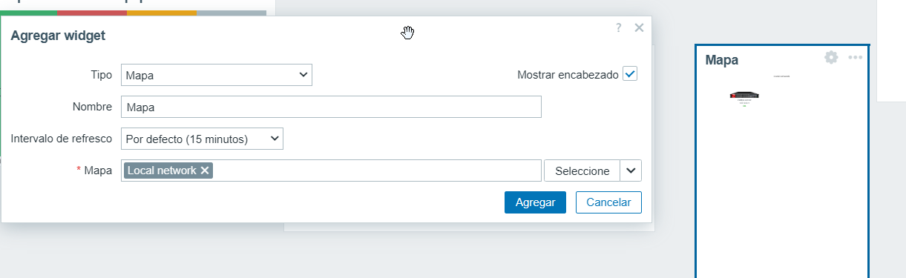

Creem un widget `Mapa` seleccionant `Local network`, de manera que el mapa quedi visible sense sortir del dashboard.

### Pas 21. Crear l'arbre de navegació del mapa
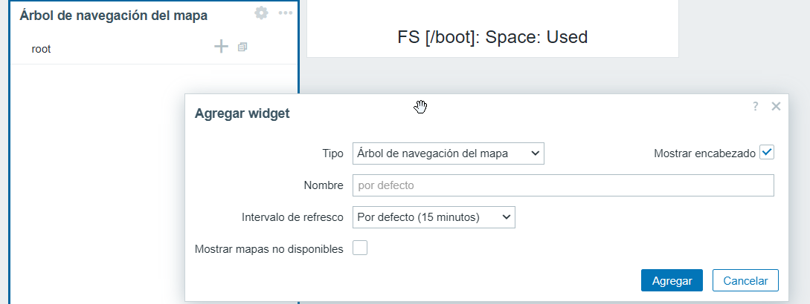

Afegim el widget `Árbol de navegación del mapa`, que permet organitzar i recórrer l'estructura de mapes disponibles.

### Pas 22. Estructurar l'arbre amb el mapa principal
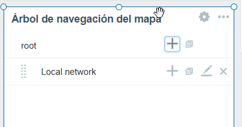

L'arbre de navegació ja conté `Local network` sota l'arrel, cosa que permet una navegació més clara entre mapes.

### Pas 23. Afegir la targeta d'un equip
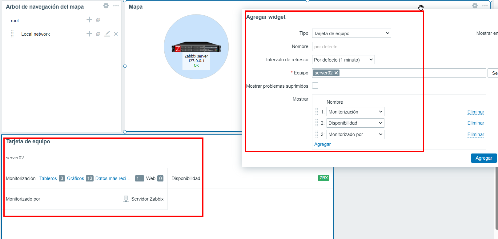

El widget `Tarjeta de equipo` mostra un resum d'un host concret, incloent accessos directes a taulers, gràfiques, dades recents i disponibilitat.

### Pas 24. Mostrar equips amb problemes
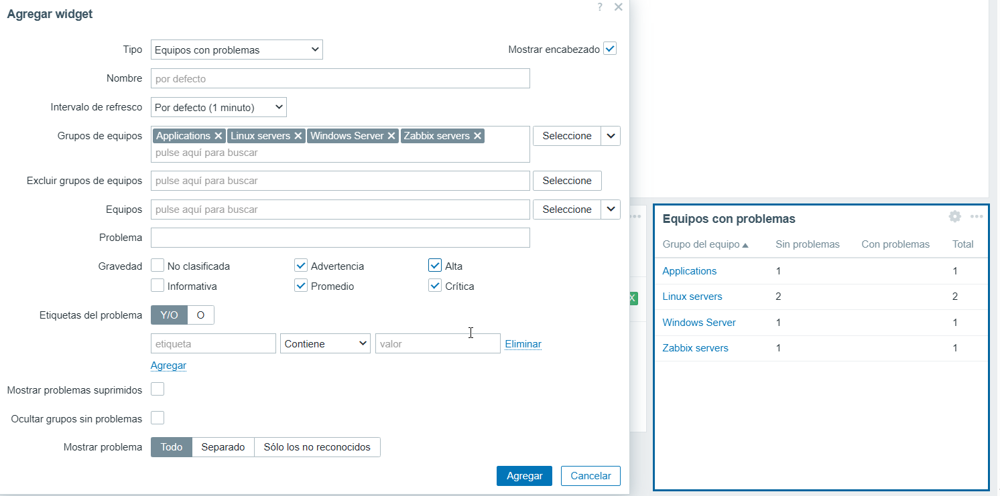

Amb `Equipos con problemas`, agrupem els hosts afectats per grups i gravetat per detectar incidències de forma ràpida.

### Pas 25. Agrupar problemes per gravetat
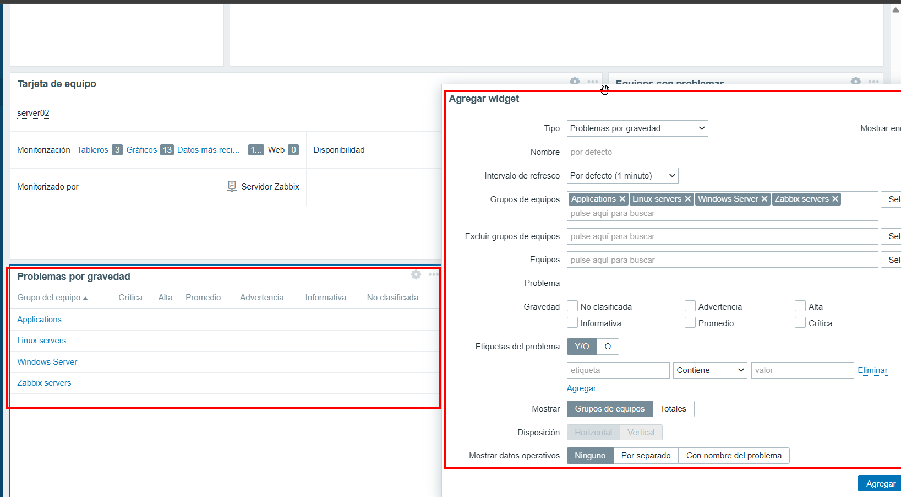

El widget `Problemas por gravedad` resumeix els incidents per severitat i per grup d'equips, millorant la lectura operativa del sistema.

---

## 5. Widgets informatius addicionals

### Pas 26. Afegir la informació del sistema
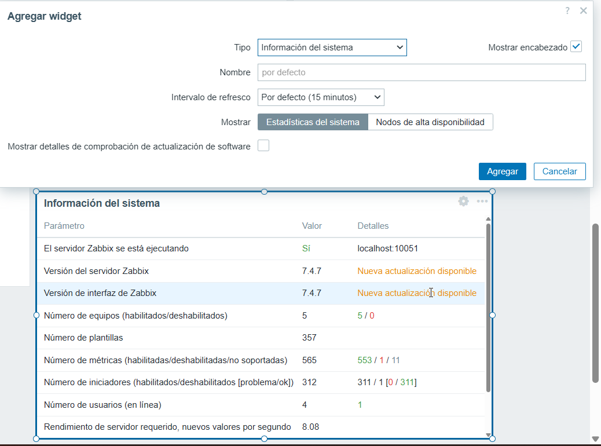

Inserim el widget `Información del sistema` per veure l'estat del servidor Zabbix, versions, nombre d'equips, mètriques i rendiment general.

### Pas 27. Crear el llistat d'equips principals
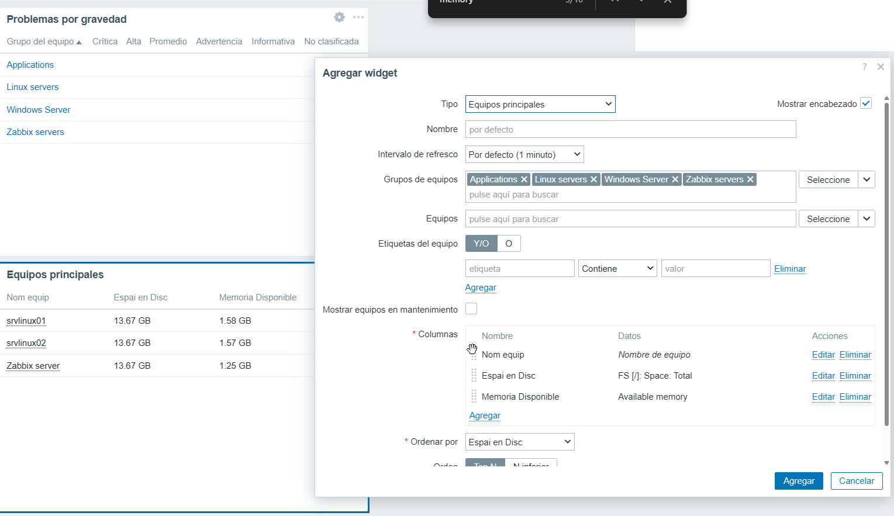

Amb `Equipos principales`, generem una taula resum amb columnes útils com el nom de l'equip, l'espai en disc i la memòria disponible.

### Pas 28. Mostrar una URL dins del dashboard
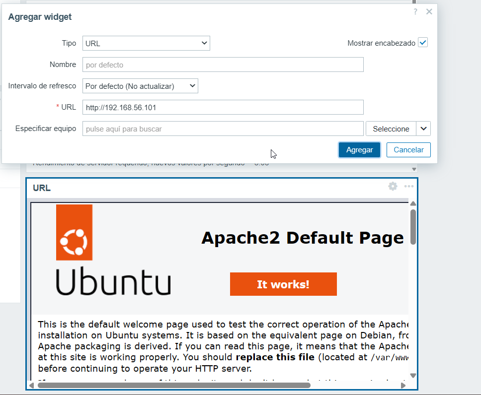

El widget `URL` permet incrustar una pàgina web externa o interna, en aquest exemple la pàgina per defecte d'Apache d'un servidor Ubuntu.

---

## 6. Resultat final

### Pas 29. Dashboard complet
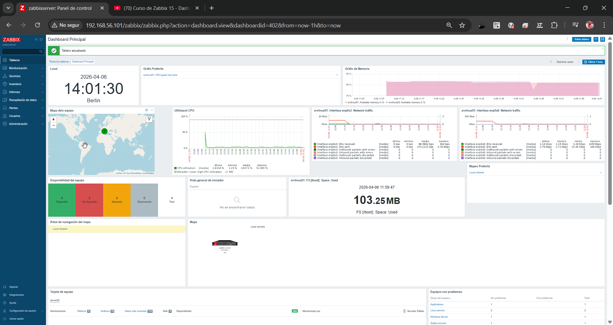

Vista final del `Dashboard Principal`, amb els widgets distribuïts de manera compacta per combinar gràfiques, mapes, disponibilitat, valors destacats i problemes en una sola pantalla.

## Resum

Aquest dashboard de Zabbix queda preparat per oferir una supervisió visual i centralitzada de la infraestructura. La combinació de widgets de temps, estat, gràfiques, mapes i incidents facilita tant el seguiment tècnic del dia a dia com la detecció ràpida d'anomalies.
