# Configuració d'Alertes de Gmail a Zabbix

## Fase 1: Configuració de Google Account

### Pas 1: Accedint a les Contrasenyes d'Aplicació de Google

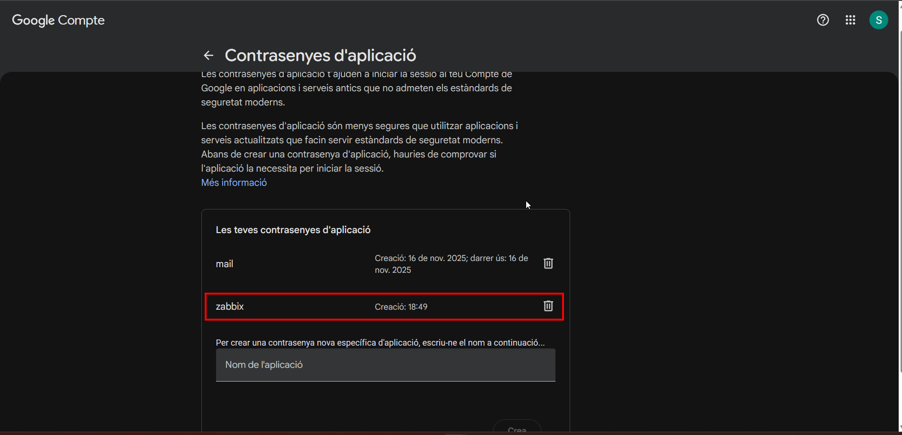

* Accedint a [Compte de Google](https://myaccount.google.com)
* Navegant a **Seguretat** → **Contrasenyes d'aplicació**
* Seleccionant **Correu** i **Windows** (o el teu sistema operatiu)
* Google generarà una contrasenya única per a l'aplicació

### Pas 2: Aplicació Gmail (Zabbix)


La contrasenya generada té aquest format: `xxxx xxxx xxxx xxxx` (16 caràcters)

**Important:** Aquesta contrasenya s'usarà a la configuració SMTP de Zabbix.

---

## Fase 2: Configuració de Zabbix - Tipus de Mitjans

### Pas 1: Accedint a Tipus de Mitjà

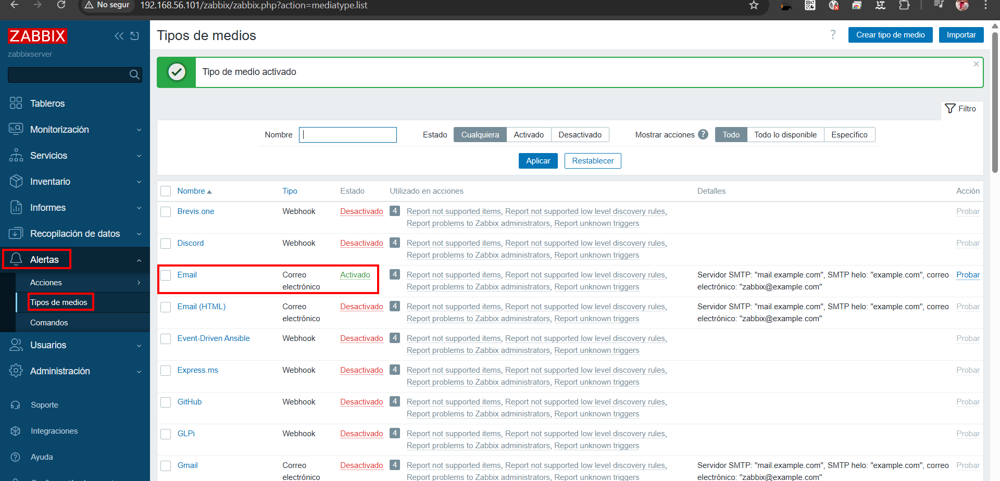

### Pas 2: Creant Nou Tipus de Mitjà - Notificacions Gmail

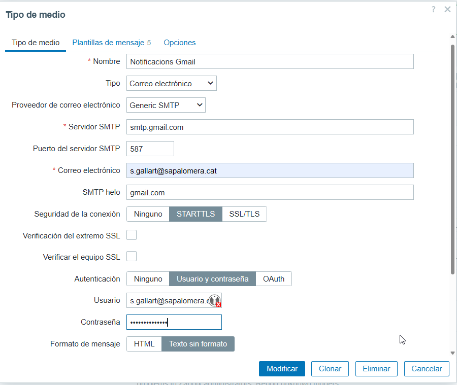

| Paràmetre              | Valor                                                       |
| ---------------------- | ----------------------------------------------------------- |
| **Nom**                | Notificacions Gmail                                         |
| **Tipus**              | Correu electrònic                                           |
| **Providor SMTP**      | SMTP Genèric                                                |
| **Servidor SMTP**      | smtp.gmail.com                                              |
| **Port SMTP**          | 587                                                         |
| **Correu electrònic**  | [s.gallart@sapalomera.cat](mailto:s.gallart@sapalomera.cat) |
| **SMTP helo**          | gmail.com                                                   |
| **Seguretat connexió** | STARTTLS                                                    |
| **Autenticació**       | Usuari i contrasenya                                        |
| **Usuari**             | [s.gallart@sapalomera.cat](mailto:s.gallart@sapalomera.cat) |
| **Contrasenya**        | [Contrasenya d'aplicació de Google]                         |
| **Format de missatge** | HTML                                                        |

### Pas 3: Verificant Tipus de Mitjà Activat

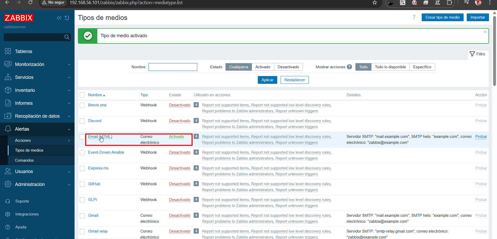

* L'estat ha de ser **Activat**
* Tots els paràmetres han de ser correctes
* Es pot veure el "Servidor SMTP" confirmant la configuració

### Pas 4: Provant el Tipus de Mitjà

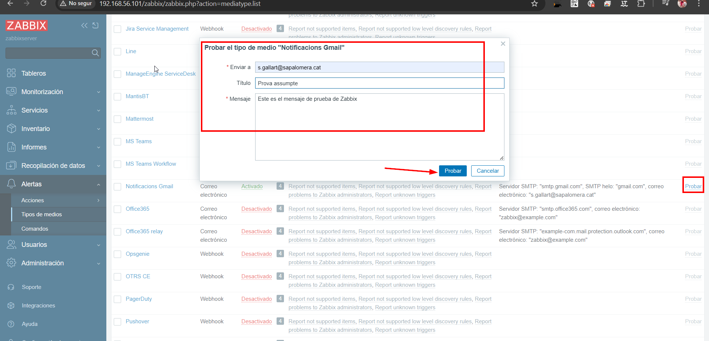

* Fent clic al botó **"Provar"**
* Completant els camps:

  * **Enviar a:** Correu destí (p.ex. [s.gallart@sapalomera.cat](mailto:s.gallart@sapalomera.cat))
  * **Assumpte:** "Prova assumpte"
  * **Missatge:** "Aquest és el missatge de prova de Zabbix"

---

## Fase 3: Plantilles de Missatge

### Pas 1: Accedint a Plantillas de Missatges

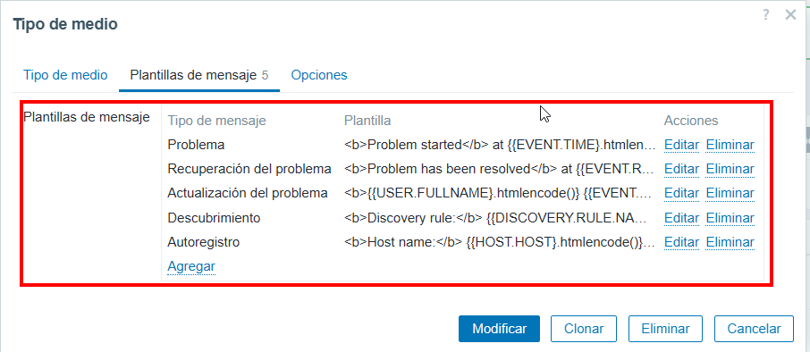

### Pas 2: Plantilles Disponibles

Algunes plantilles comunes inclouen:

| Tipus                          | Descripció                                   |
| ------------------------------ | -------------------------------------------- |
| **Problema**                   | Plantilla per a problemes detectats          |
| **Recuperació del problema**   | Plantilla per a recuperació de problemes     |
| **Actualització del problema** | Plantilla per a actualitzacions d'estat      |
| **Descobriment**               | Plantilla per a descobriments de nous equips |
| **Autorregistre**              | Plantilla per a registres automàtics         |

---

## Fase 4: Configuració d'accions

### Pas 1: Accedint a Accions

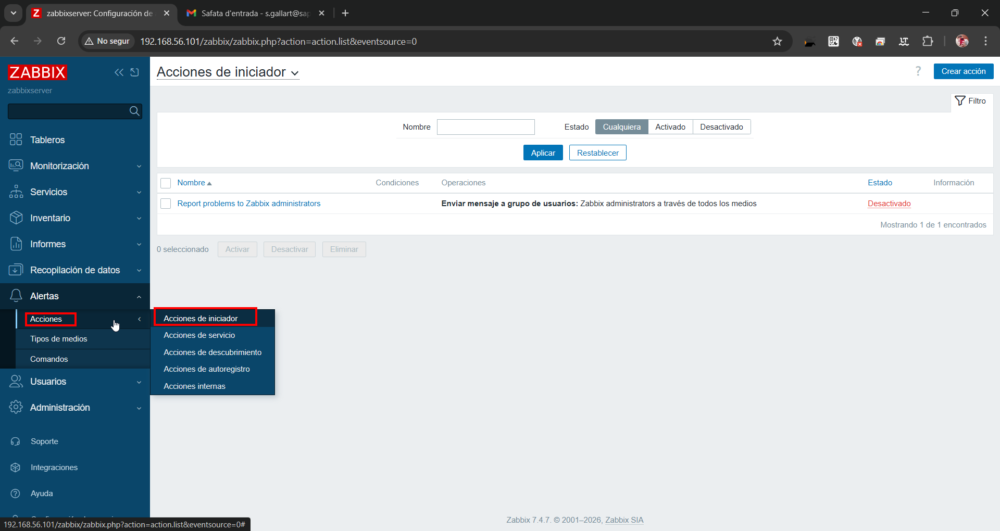

### Pas 2: Creant Nova Acció

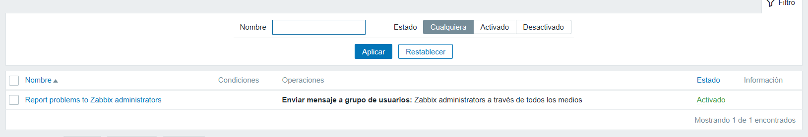

* **Nom:** "Reportar problemes als administradors de Zabbix"
* **Condicions:** Es pot deixar buit o afegir condicions específiques

### Pas 3: Operacions de la Acció

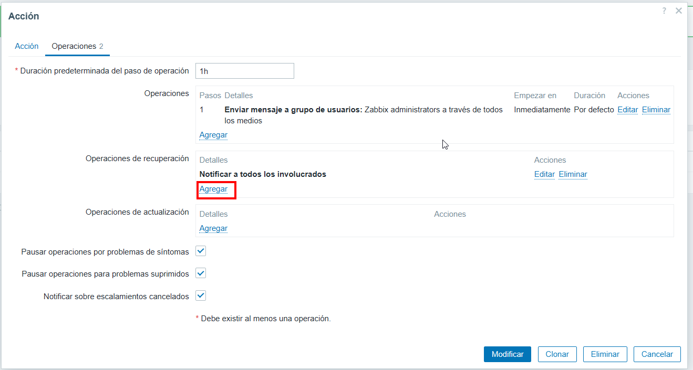

### Pas 4: Configurant Enviament del Missatge

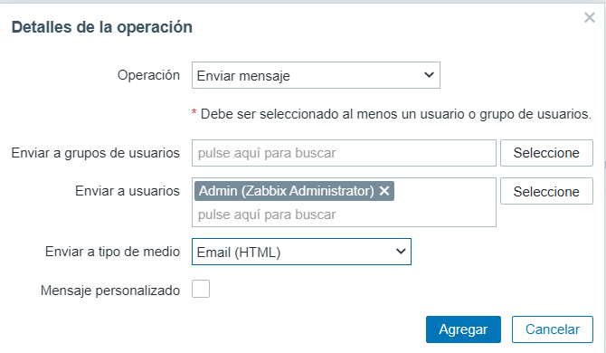

* **Operació:** "Enviar missatge"
* **Enviar a grups d'usuaris:** [Selecciona grup]
* **Enviar a usuaris:** Admin (Administrador de Zabbix)
* **Enviar a tipus de mitjà:** Correu (HTML)
* **Missatge personalitzat:** [Desmarcat]

### Pas 5: Operacions de Recuperació

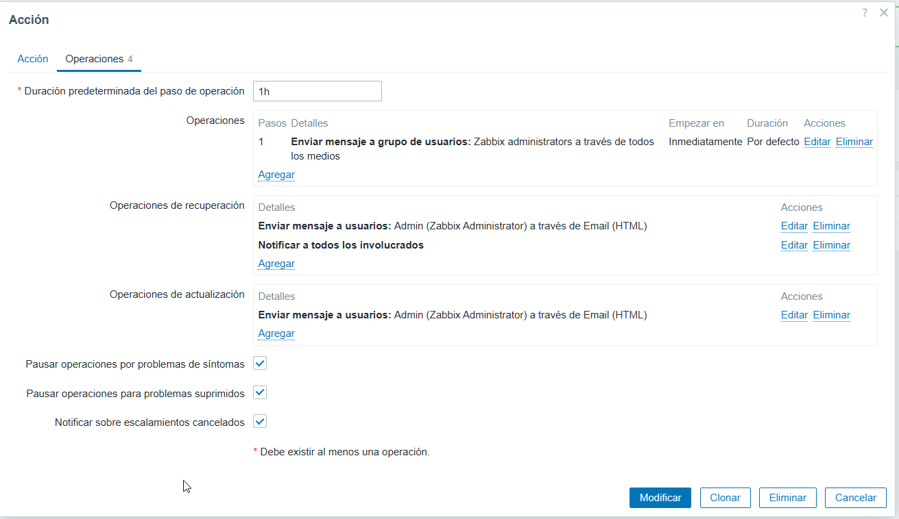

**Operacions:**

* "Enviar missatge a grup d'usuaris: administradors de Zabbix a través de tots els mitjans"

**Operacions de recuperació:**

* "Notificar a tots els involucrats" - via Correu (HTML)

**Operacions d'actualització:**

* "Enviar missatge a usuaris: Admin (Administrador de Zabbix) a través de Correu (HTML)"

**Opcions addicionals:**

* Pausant operacions per problemes de símptomes
* Pausant operacions per problemes suprimits
* Notificant sobre escalaments cancel·lats

---

## Fase 5: Usuaris y Permisos

### Pas 1: Accedint a Usuaris

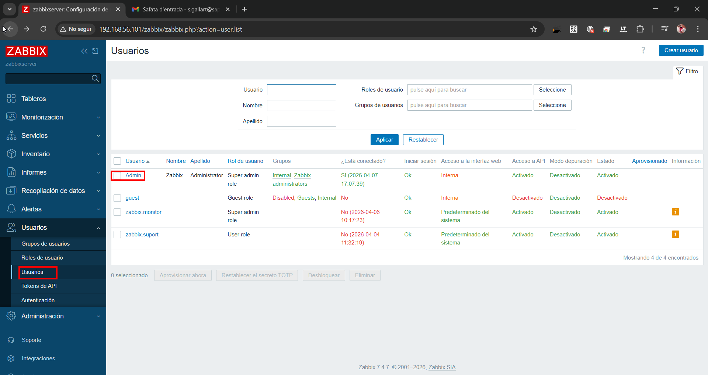

| Usuari         | Nom    | Rol                     | Grups               | Estat      |
| -------------- | ------ | ----------------------- | ------------------- | ---------- |
| **Admin**      | Zabbix | Administrador           | Super administrador | Activat    |
| guest          | -      | Rol d'invitat           | Convidats           | Desactivat |
| zabbix_monitor | -      | Rol super administrador | -                   | Activat    |
| zabbix_suport  | -      | Rol d'usuari            | -                   | Activat    |

### Pas 2: Configurant el nou  mitjà al Usuari

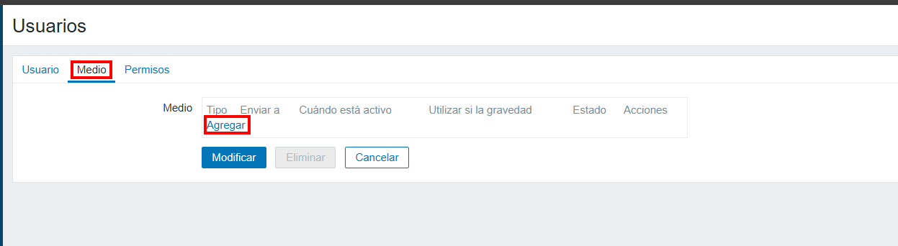

* Fent clic a **"Afegir"**

### Pas 3: Afegint Nou Mitjà al Usuari

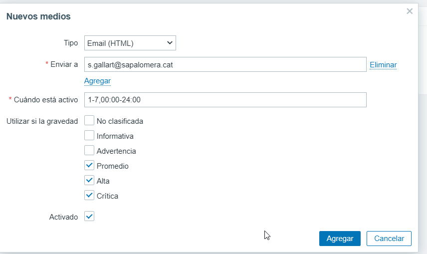

### Pas 4: Confirmació de Mitjà Asignat

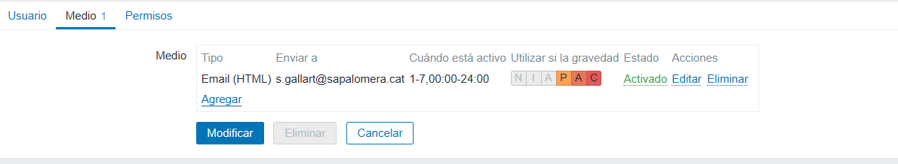

---

## Fase 6: Verificació i Resultats

### Pas 1: Email de Prova Rebut

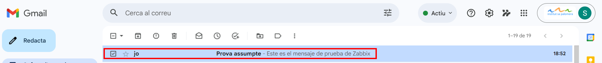

* **De:** [s.gallart@sapalomera.cat](mailto:s.gallart@sapalomera.cat)
* **Assumpte:** "Prova assumpte"
* **Contingut:** "Aquest és el missatge de prova de Zabbix"

### Pas 2: Monitoritzant Problemes Detectats

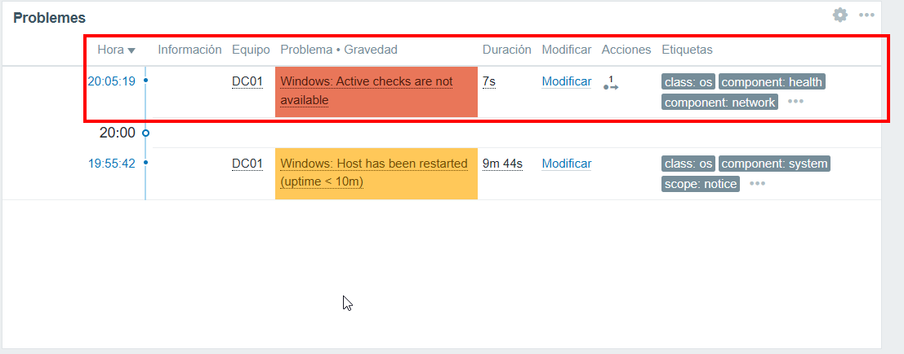

* **Problema 1:** "Windows: Les comprovacions actives no estan disponibles"

  * Severitat: Alta (vermell)
  * Durada: 7s
  * Host: DC01

* **Problema 2:** "Windows: L'host ha estat reiniciat"

  * Severitat: Mitja (groc)
  * Durada: 9m 44s
  * Host: DC01

### Pas 3: Email amb Detalls del Problema

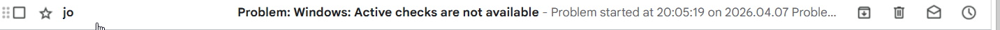

### Pas 4: Contingut del Correu d'Alerta

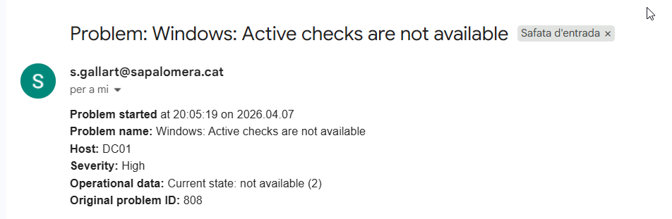

```
Problema: Windows: Les comprovacions actives no estan disponibles
Problema iniciat a les 20:05:19 el 2026.04.07
Nom del problema: Windows: Les comprovacions actives no estan disponibles
Host: DC01
Severitat: Alta
Dades operacionals: Estat actual: no disponible (2)
ID original del problema: 808
```

---

## Recursos Útils

* [Documentació oficial de Zabbix](https://www.zabbix.com/documentation/)
* [Configuració SMTP de Gmail](https://support.google.com/mail/answer/185833)
* [Contrasenyes d'Aplicació de Google](https://support.google.com/accounts/answer/185833)
* [Notificacions de Correu de Zabbix](https://www.zabbix.com/documentation/current/en/manual/config/notifications/media)
