# Preparació del nou servidor amb Ubuntu Server 24.04 per a instal·lar Zabbix

## 1. Selecció de l'idioma
Configuració inicial de l'idioma de l'instal·lador.

*Es tria l'espanyol per facilitar la lectura del procés.*

## 2. Actualització de l'instal·lador
Gestió de versions del programari de base.
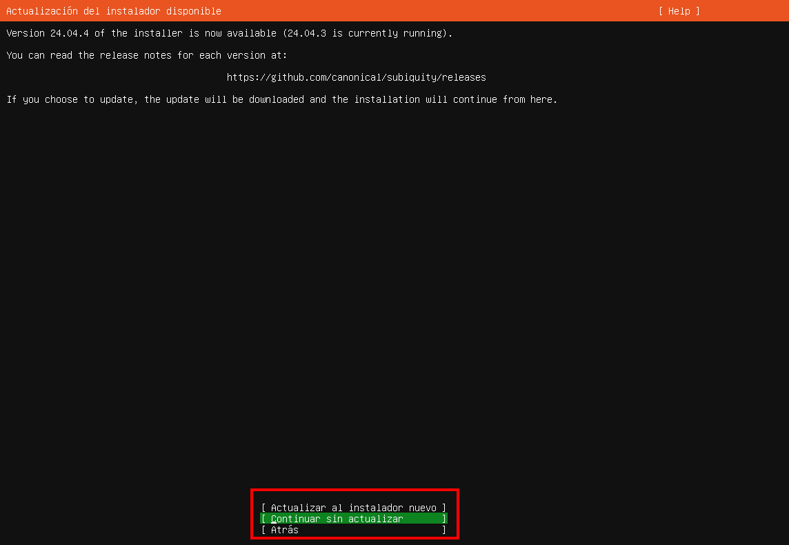
*S'ha decidit continuar sense actualitzar l'instal·lador a la versió 24.04.4.*

## 3. Tipus d'instal·lació
Selecció del paquet de base del sistema.
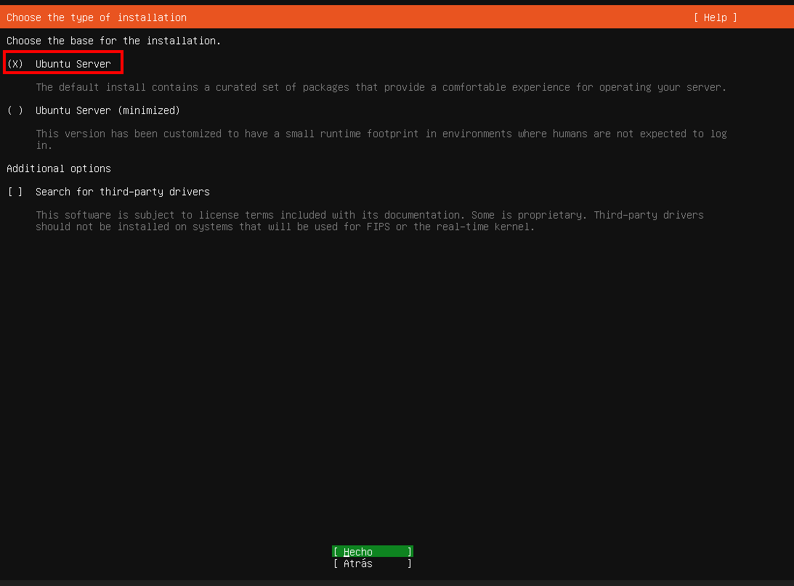
*S'ha seleccionat la instal·lació estàndard d'Ubuntu Server.*

## 4. Configuració del teclat
Distribució de tecles.
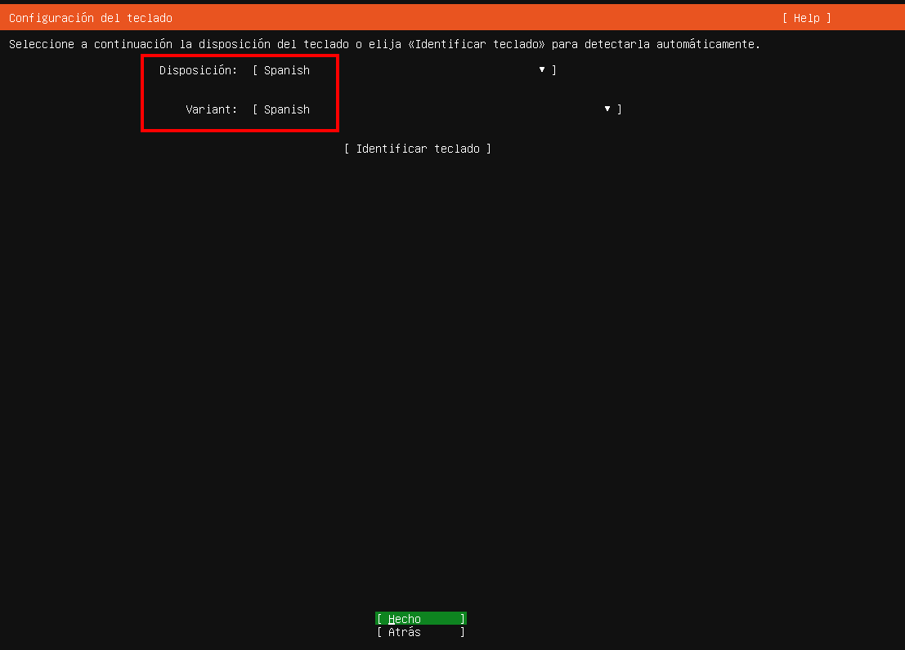
*Configurat en Spanish/Spanish per defecte.*

## 5. Emmagatzematge i Particionat
Configuració del disc dur i LVM.
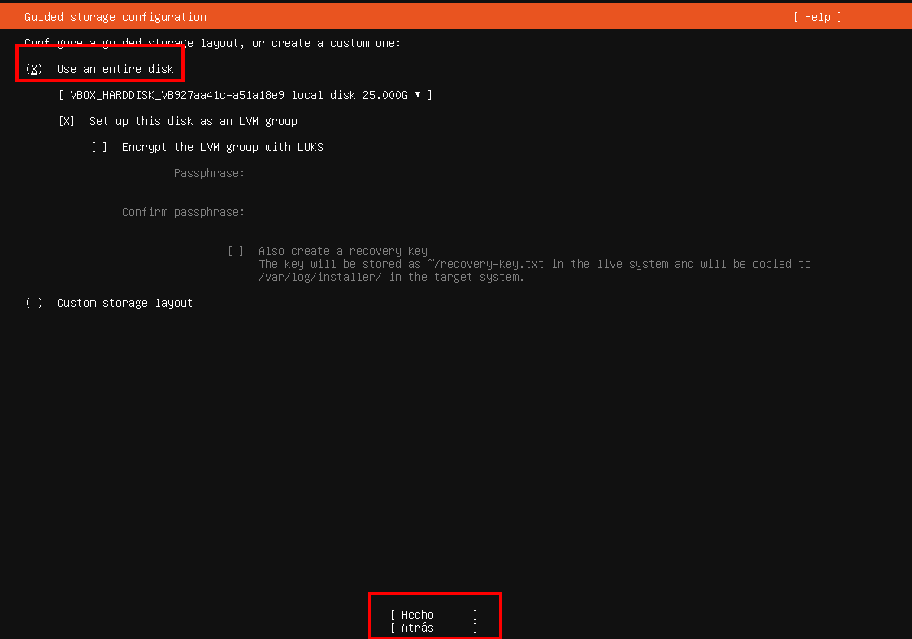
*S'utilitza el disc sencer amb un grup LVM.*


*Resum final de les particions creades, incloent /boot i el volum lògic.*

## 6. Perfil d'usuari
Dades d'accés i identificació de la màquina.
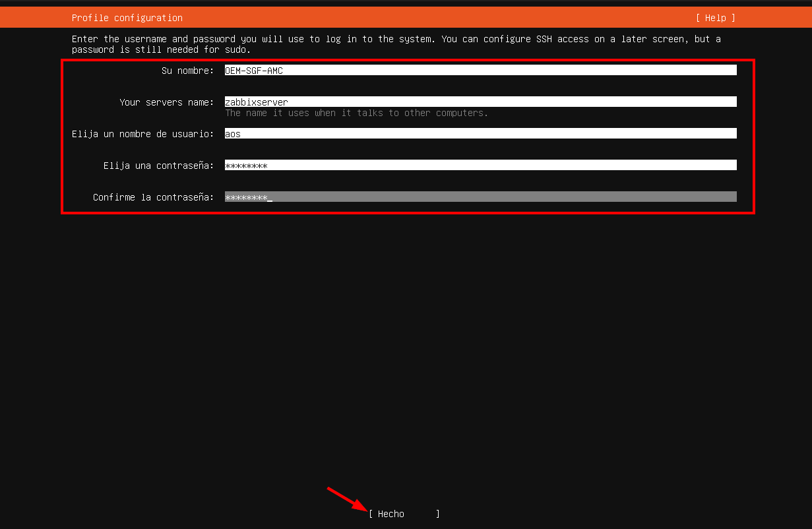
*Nom del servidor: `zabbixserver`. Usuari: `aos`.*

## 7. Accés Remot (SSH)
Habilitació del protocol de comunicació segura.
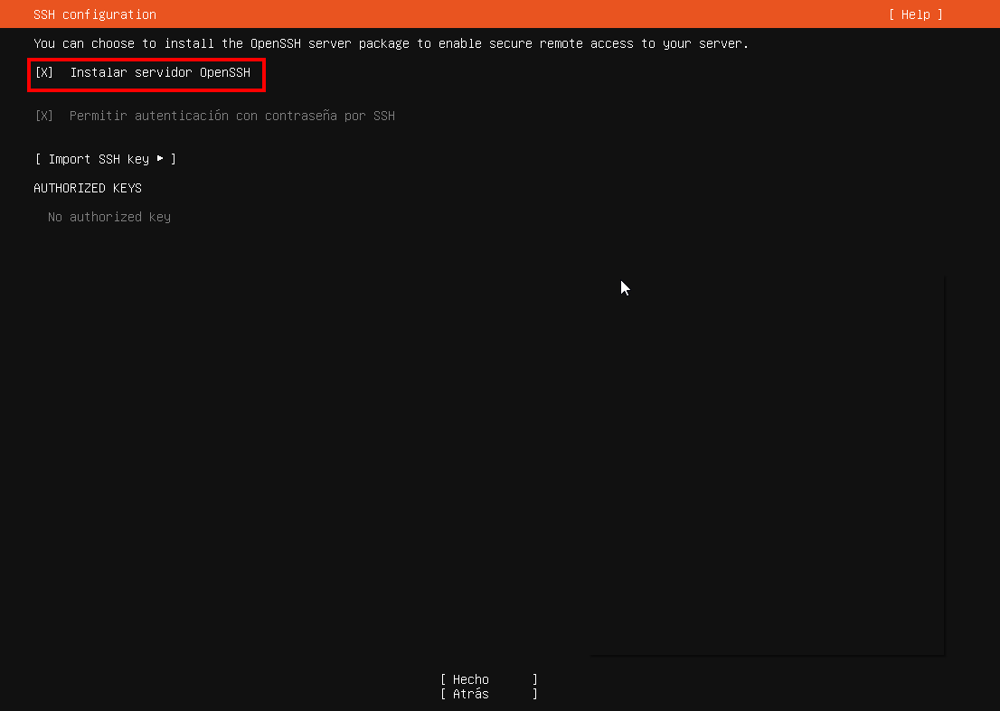
*S'ha instal·lat el servidor OpenSSH per a la gestió remota.*

## 8. Snaps del servidor
Instal·lació de programari addicional.
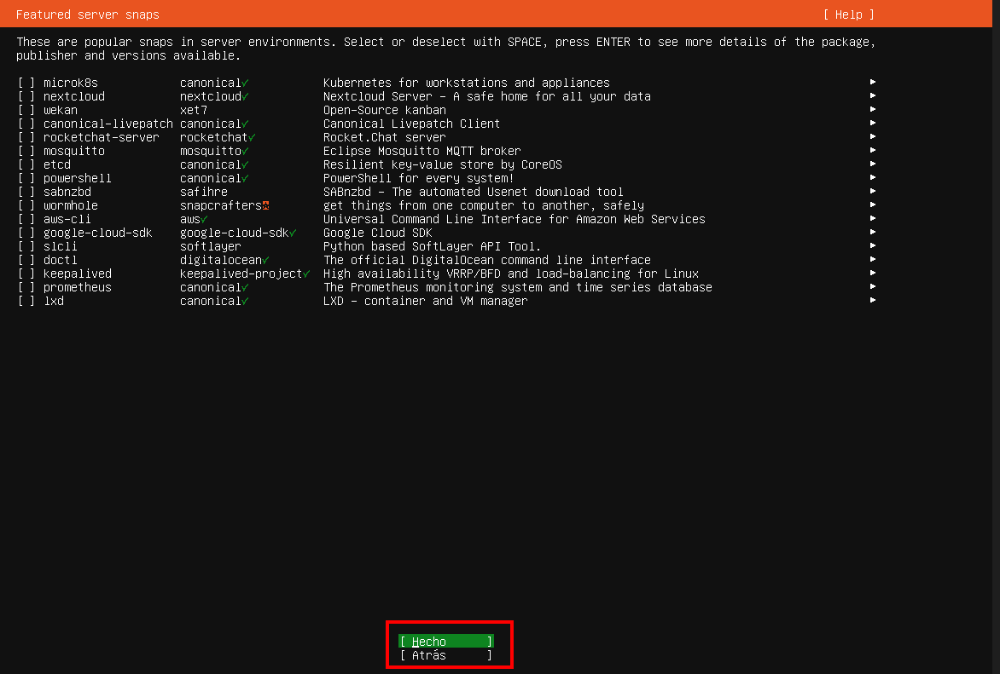
*No s'han seleccionat paquets Snap addicionals en aquest pas.*

## 9. Finalització
Execució de les tasques de fons.
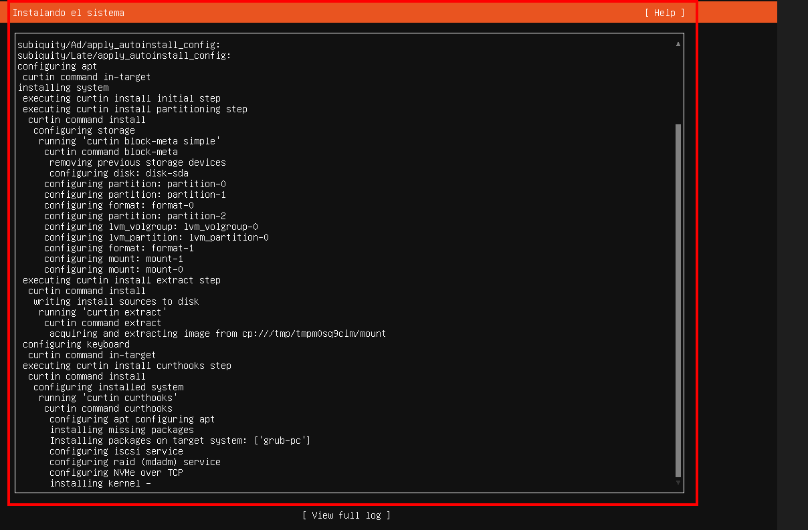
*Vista del log d'instal·lació mentre el sistema s'escriu al disc.*

## 9. Iniciar Màquina
Iniciar sessiò dins de la màquina
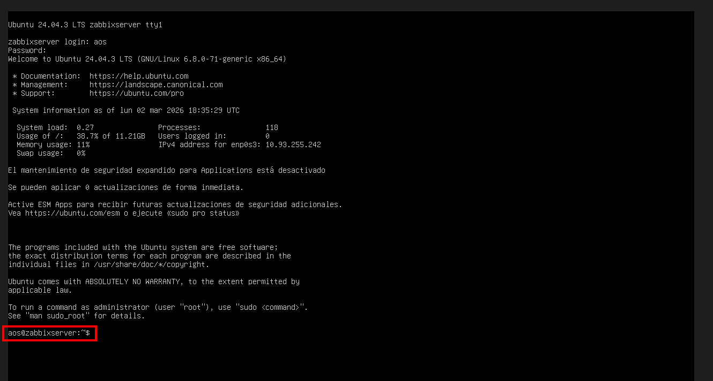
*Entrem dins de la màquina amba les credencials que li hem configurat durant l'instal·laciò*

## 10.Comprovació d'adreça IP
A l'entrar a la màquina executem la següent comanda per consultar l'adreça IP de la màquina:
```bash
   ip a
```
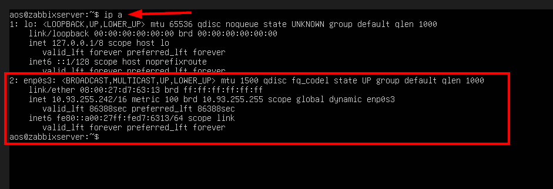
*Comprovem l'adreça IP de la màquina*

## 11.Accès amb Putty
Per facilitat i comoditat accedirem a la màquina mitjançant SSH, ho farem amb la eina Putty
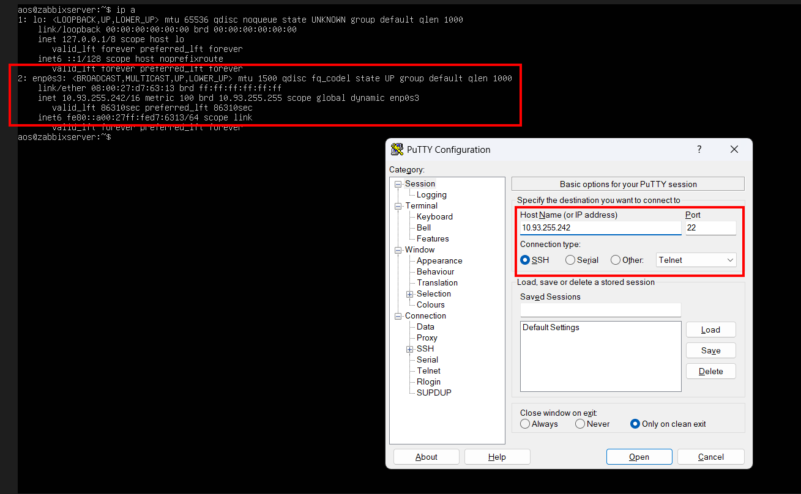
*Dins del putty posem l'adreça IP de la màquina per a connectar-nos*

## 12.Inici de sessiò de la màquina amb Putty
Un cop haguem accedit dins de la màquina haurem d'iniciar sessió

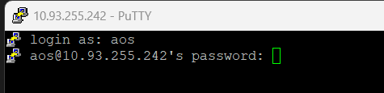

*Iniciem sessiò amb les credencials de l'usuari*

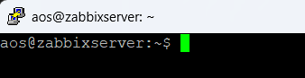

*Demostrem que hem accedit*

## 13.Accedir amb el superusuari i actualitzar paquets
Seguidament accedirem com a superusuari amb la següent comanda:
```bash
sudo -i
```
I Actualitzem la llista de repositoris i el sistema:
```bash
apt update && apt upgrade -y
```
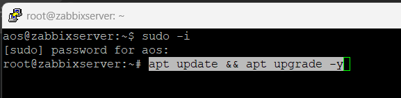
